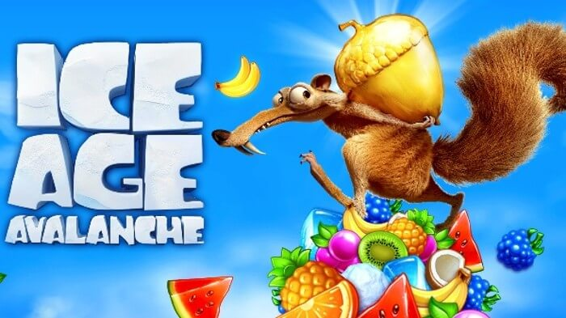
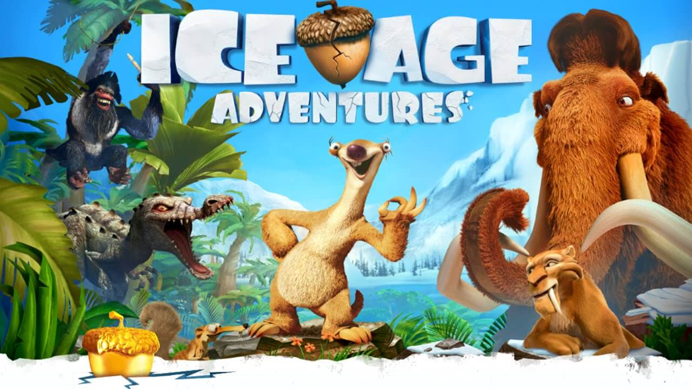
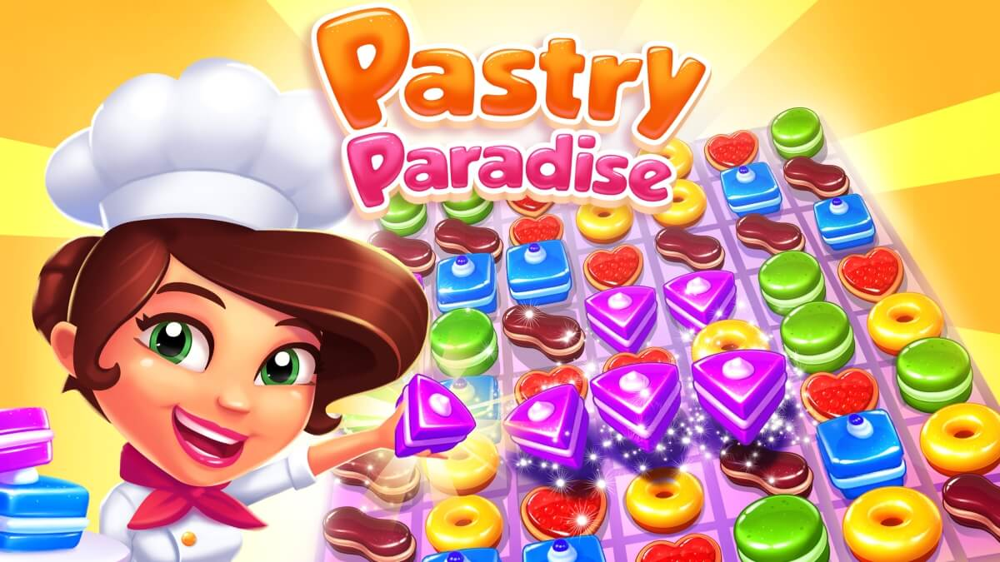
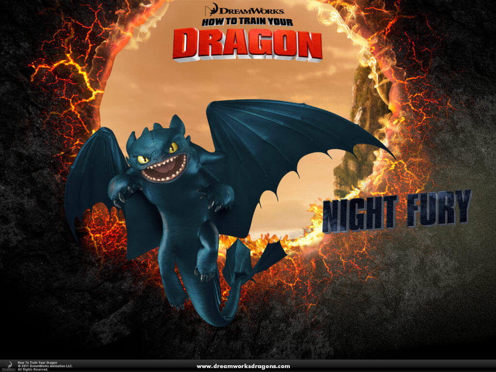

<!-- [gallery type="slideshow" link="none" size="full" ids="2638,2639,2611,2621,2612,2568,2564,110,111,64,100,118,123,126"] -->

## Ice Age Avalanche

Ice Age Avalanche is an epic tale of friendship, fun, adventure and a really, really forgetful sloth for fans of puzzles, matching games, treasure hunting, battles, being a hero, and trying to top your friends. Join Sid, Manny and Diego on an epic Ice Age journey in search of a long-forgotten treasure.

[More](./professional-projects/ice-age-avalanche)

## Ice Age Adventures

Sid needs your help to rescue his friends and save the entire herd.Eliminate obstacles, repair bridges, and defeat enemies to find the lost members of the herd.Save the day with a fun match-3 game and a delightful runner featuring Sid.

[More](./professional-projects/ice-age-adventures)

## Pastry Paradise

Pastry Paradise is a match-3 game in which you have to swap pastries horizontally, vertically, and even diagonally to make matches.

[More](./professional-projects/pastry-paradise)

## Mobile Strategy Game (unpublished)

A mobile strategy game for mobile.

[More](./professional-projects/mobile-strategy-game-unpublished)

## First Person Shooter Prototype

A first person prototype made using C++ and Unreal Engine.

[More](./professional-projects/first-person-shooter-prototype)

## Life Simulation Prototype

A life simulation prototype for mobile.

[More](./professional-projects/life-simulation-prototype)

## School of Dragons

School of Dragons is based on DreamWorks Animation’s How To Train Your Dragon franchise.

[More](./professional-projects/schoolofdragons)

## MathBlaster

Mathblaster.com is the online hub for outer space-based MMO gaming.

[More](./professional-projects/mathblaster)

## Jumpstart

JumpStart includes an assortment of adventure-based games in a 3D virtual world neighborhood.

[More](./professional-projects/jumpstart)

## APOX

APOX is a real-time strategy game that uniquely includes gameplay concepts from first-person shooters.

[More](./professional-projects/apox)

## Pound for Pound

Pound for Pound is a Role Playing Game(RPG) prototype developed for a promotional event.

[More](./professional-projects/pound-pound)

## Cricket Game(unpublished)

A cricket game

[More](./professional-projects/cricket-game-unpublished)

## Wings of Control (unpublished)

An aerial combat in which players will experience intense low altitude air to air combat between aircraft's.

[More](./professional-projects/wingsofcontrolunpublished)

## Pool on the Net

Pool-on-the-Net transforms your PC into a Pool room where you can play popular games like Snooker and 9-ball with friends and other pool players from around the world.

[More](./professional-projects/pool-net)

## Snakes and Frogs(unpublished)

A board game on mobile

[More](./professional-projects/pool-net)

## McKesson Corporation: CMS Enhancements

IBM mainframe applications for an inventory and pricing management system.

[More](./professional-projects/mckesson-corporation-cms-enhancements)

---
