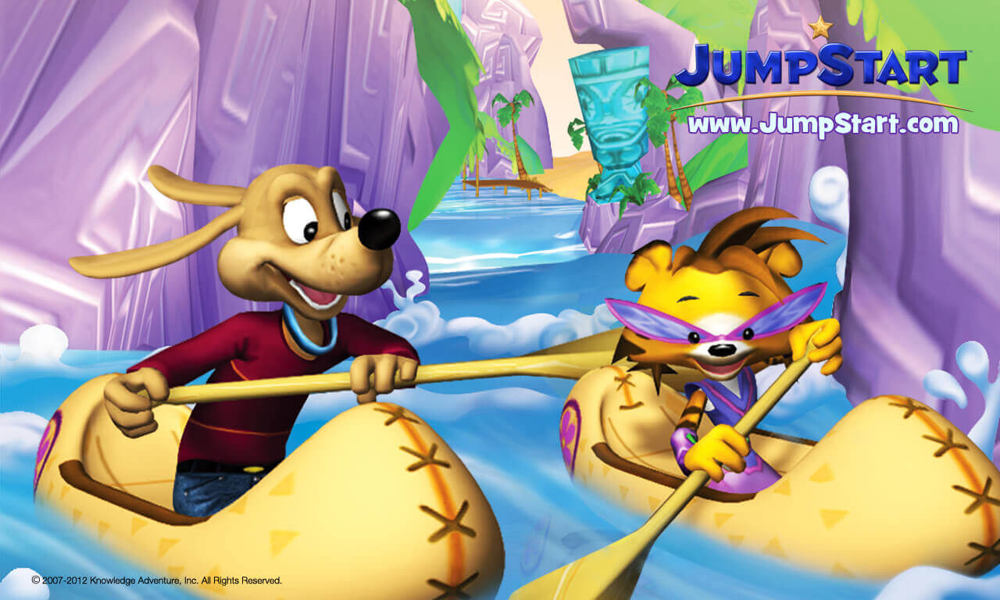
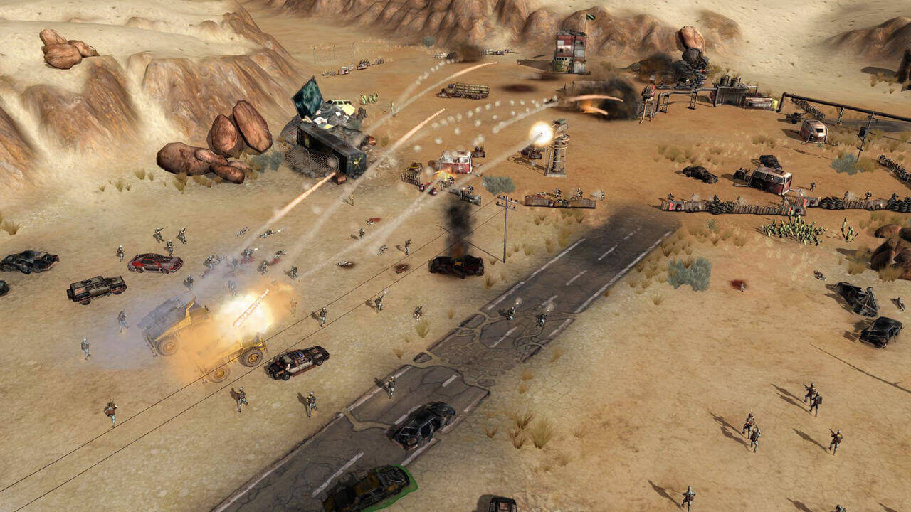
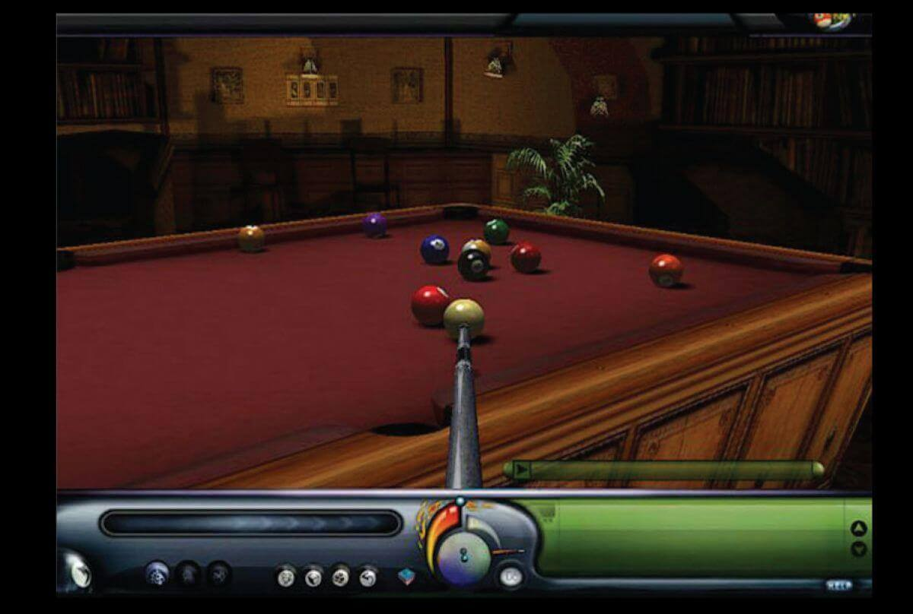

<!-- [gallery type="slideshow" link="none" size="full" ids="2638,2639,2611,2621,2612,2568,2564,110,111,64,100,118,123,126"] -->

## Point of Sale: Vista Cinema Software

Point of sale system used by cinema operators.

[More](./professional-projects/point-of-sale-system)

## Ice Age Avalanche

Ice Age Avalanche is a Match-3 game based on the Ice Age Series.

[More](./professional-projects/ice-age-avalanche)

## Ice Age Adventures

Ice Age Adventures is a city builder game based on the Ice Age Series.

[More](./professional-projects/ice-age-adventures)

## Pastry Paradise

Pastry Paradise is a match-3 game in which you have to swap pastries horizontally, vertically, and even diagonally to make matches.

[More](./professional-projects/pastry-paradise)

## Mobile Strategy Game (unpublished)

A mobile strategy game for mobile.

[More](./professional-projects/mobile-strategy-game-unpublished)

## First Person Shooter Prototype

A first-person shooter prototype made using C++ and Unreal Engine.

[More](./professional-projects/first-person-shooter-prototype)

## Life Simulation Prototype

A life simulation prototype for mobile.

[More](./professional-projects/life-simulation-prototype)

## School of Dragons

School of Dragons is a science themed MMORPG based on DreamWorks Animation’s How To Train Your Dragon franchise.

[More](./professional-projects/schoolofdragons)

## MathBlaster

Mathblaster is a space themed MMO where players have to solve math puzzles to save the universe.

[More](./professional-projects/mathblaster)

## Jumpstart

JumpStart is online world where kids can play adventure-based games to earn rewards.

[More](./professional-projects/jumpstart)

## APOX

APOX is a real-time strategy game that uniquely includes gameplay concepts from first-person shooters.

[More](./professional-projects/apox)

## Pound for Pound

Pound for Pound is a Role-Playing Game(RPG) prototype developed for a promotional event.

[More](./professional-projects/pound-pound)

## Cricket Game(unpublished)

A cricket game.

[More](./professional-projects/cricket-game-unpublished)

## Wings of Control (unpublished)

Aerial combat in which players will experience intense low altitude air to air combat between aircraft.

[More](./professional-projects/wingsofcontrolunpublished)

## Pool on the Net

Pool-on-the-Net transforms your PC into a Pool room where you can play popular games like Snooker and 9-ball with friends and other pool players from around the world.

[More](./professional-projects/pool-net)

## Snakes and Frogs(unpublished)

A board game made for Nokia Symbian devices.

[More](./professional-projects/snakes-frogs-unpublished)

## McKesson Corporation: CMS Enhancements

IBM mainframe applications for an inventory and pricing management system.

[More](./professional-projects/mckesson-corporation-cms-enhancements)
