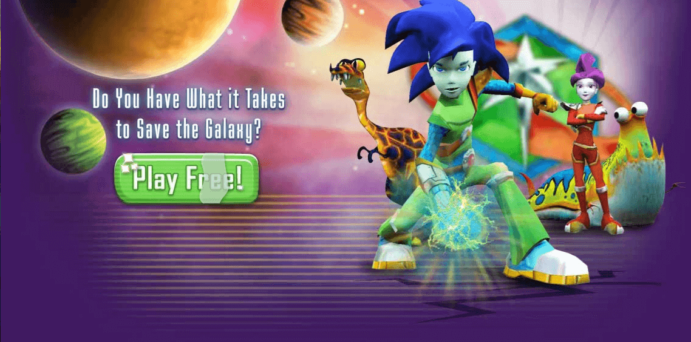

import Video from '../../../../../src/02-components/Video';

## Organization

Knowledge Adventure

## The Game

Mathblaster.com is the online hub for outer space-based MMO gaming. At MathBlaster.com, as recruits at the prestigious
Blaster Academy, kids play arcade-style math games and race through high-speed missions. Kids work with others to save
the universe by using math on levelled missions.

## Technology

Unity3D, C#

## Role

-   Sole Developer for Alien Battle game, a button-mashing game to be played with Mutts. Allowed designers to easily
    modify the AI to have different behaviours and difficulty for Single Player mode. Added concept of XP and Belts
    which would be displayed in the player's pod.

-   Sole developer for MuttVille, a game that allows players to visit their BFFs’ Mutts and interact with them. Players
    receive points and credits for interacting with their BFFs’ larva and Mutts. Players can buy and change the
    furniture and interact with their Mutt.

-   Implemented parties to allow players to create parties or join parties hosted in other players pods.

-   Added Leaderboard, for players who are playing the math content.

-   Added trading and gifting gameplay.

## Screenshots

## Video

<Video src="https://www.youtube.com/embed/a__LRh7ozwA" title="Jumpstart Video" />

## Website

[Mathblaster.com](http://www.mathblaster.com)
