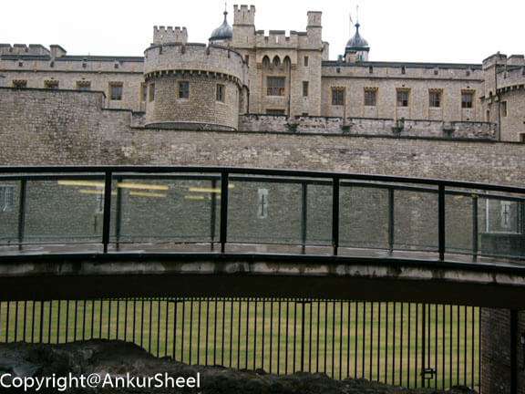
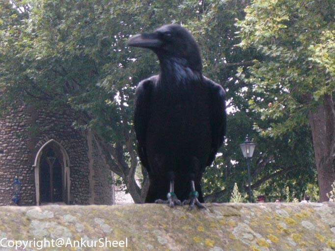
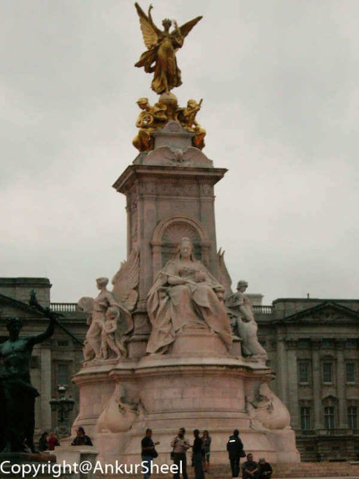

After a bit of walking from the tube station to the Tower of London, I reached a long line of other tourists. Don't people have anything better to do, than make me stand in long lines? Well, after standing for an hour in the line in which by the way, I heard a lot of gibberish because nobody was speaking in Hindi or English ( at least nothing I could understand) and paying about 17 pounds for all that fun, I finally got my ticket.

After another long line, I finally entered the Tower of London. As soon as I entered, this huge guy in a redcoat and booming voice beckoned us for an overview of the place. He had a really awesome moustache. I think I will go for that look the next time. Anyway, he led us to the chapel, and here I am wondering when did I sign up for church :) Half an hr later after hearing the names of probably all the famous and infamous people that were imprisoned/buried in the Tower Of London, we were finally left to wander on our own. My memory is a little rusty, but I can remember that it was fun walking around in the tower and seeing the inscriptions made by the prisoners, the weapons of yore, their defences etc. In some of the outside crevasses, there were some wax statues of guards. At least, that's what I thought initially until one of them needed a break and moved his gun to a more comfortable position. Probably, his shift was getting over because I managed to see a smaller version of changing of the guard. I say a smaller version because only 1 guard got replaced.

The pseudo highlight - I got some really good shots of ravens. A couple of them even posed for the camera. How sporting of them. _Wrong highlight_

The actual highlight - The replicas of the crown jewels and the Kohinoor diamond. The British have plundered so much gold and jewellery from other nations it's not even funny. Of course, they disagree :) I thought of mentioning it but then decided that I am too young to die ;) Lot of security, armed gates and (un)surprisingly walking, I got to see the famous crown jewels. What a dazzling sight. The biggest bummer was that they don't let you take pictures in most of the places so you guys will have to go for yourself to see if I am telling the truth or just yanking your chain

Somehow, the timepiece on my hand caught my eye. After shaking it a lot, I finally came to the conclusion that I had spent more than half a day and if I wanted to visit any other place I would have to postpone my plan to steal the jewels. Oh well, maybe next time. Only if I felt hungry at lunchtime like other people, I would have noticed that it was way past lunchtime.

Next on my list was the St Pauls Cathedral. I can just see the shocked faces "Ankur going to a cathedral. Where did the sunrise from? " To clarify, I would like to say I met a very beautiful girl and went with her but in reality, I went because it's supposed to have very beautiful architecture. Aaah, the nods of understanding. Its also supposed to have a great service for the religious among you. It didn't look too far on the map, so I decided to take the _gyarah no ki bus_. A mile or so in, I noticed that the street names were on the opposite side of the map, so I retraced my steps. I think I should have taken advice from Joey(from the TV series Friends) and stood on the map to see if I needed to go left or right. Unfortunately, this was before the time of smartphones and cheap GPS devices so after a really long walk I reached the cathedral. Yay, you say. Not so fast. It was closed. Ironically, I had spent all my time trying to find my way out of the tower. Though I did see a throng of people coming out after the service.

I wasn't going to go back and being laughed at for just seeing 1 place on the whole day, so with map in hand, I started towards Trafalgar Square. A nice walk along the Thames and I was at my destination. Very beautiful and lots of people. A nice place to come with friends or that special someone. Since I was alone I didn't spend too much time there, just clicked a couple of snaps and was off to meet the queen for tea. After all, that's why I had skipped lunch.

London seems to be a walkers paradise. I Reached Buckingham place, but, unfortunately, the queen was also running late and I didn't feel like waiting. It was already 7, so I decided to walk to the London Eye. Over there, I finally grabbed a hot dog and took the tube back home. Nope, didn't go on the London Eye.

