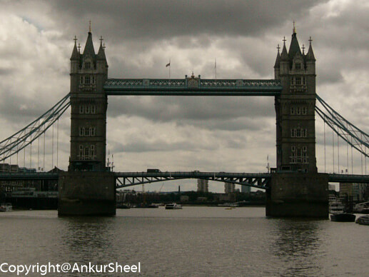
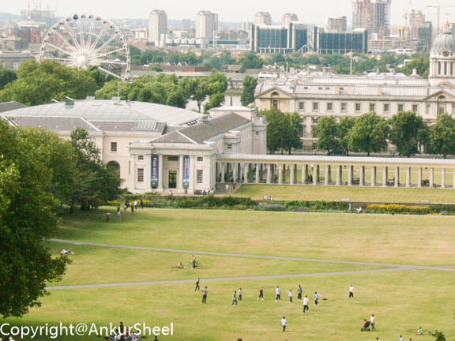
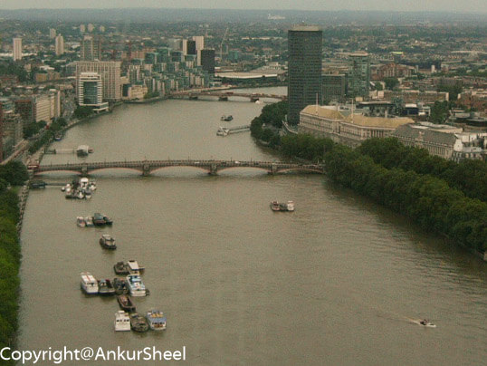

By about 1030, I got ready and started off to the End of the world i.e. Greenwich. It seemed like a sunny day so I
decided to lessen my load by leaving my jacket at home this time. The longer but scenic route was to take a ferry and as
I had ample time(not), I took it. I was told it would take 45 mins but looks like the Britishers not only took the
Kohinoor but also the concept of IST with them before leaving India. One and a half hours of listening to the tour guide
on the ferry and plenty of pics(of the water mostly), I finally made it to land.

With the lonely planet as my guide, I walked(I seem to be doing a lot of this), to the Greenwich Park. It is really
large and well maintained. Groups of people just chilling out or playing soccer or cycling. You get the picture,
hopefully. Anyway, I reached the national maritime museum, which had info about maritime history and other related
stuff. How surprising, given the name of the museum and what can I say except that it was very informative :) Oh did I
mention that the building was 3 floors. Unfortunately, no pictures allowed.

At the other end on the top of a hill was the Royal Observatory, which was a must-visit, so back to the walking. En
route was the queen's house which I decided to skip. Mainly because she was in London. Well, the Observatory contains
the GMT line so I can now finally say that I have been to the end of the world and back. Here, I learned a lot more
about watches and astronomy than I cared for. Luckily, my English is decent otherwise I would have said that I almost
became a watchman rather than a watchmaker. So after a deluge of info, I decided to rest, at the riverfront. It was very
relaxing and I am sure I looked like a complete tourist at that point in time.

So with Greenwich out of the way, I headed back to London. To save time I decided to take the tube this time. I wasn't
sure if I had enough money loaded on my travel card but luckily I found a recharge station. All's well that ends well. I
was in London by early evening and the London Eye was waiting. I got a jumbo hot dog because I finally started to feel
hungry and ended up dropping half the onions and sauces. I need a lot more practice to eat them. A long line and 16
pounds later, I was on the Ferris wheel. It was worth it and I have the pictures to prove it as well.

