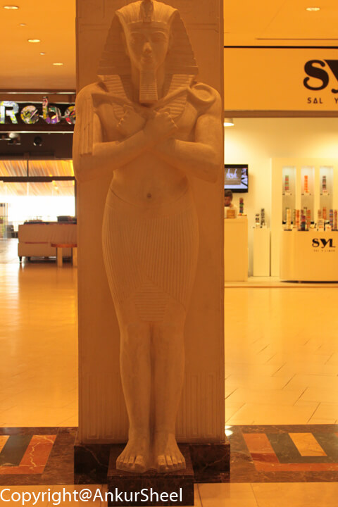
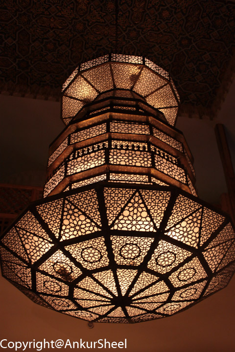

After the Dolphinarium, I and Gunjan decided to head to the Wafi Mall which is about 2 kilometres away from the creek
park. Being naive tourists, we thought it was not far and decided to walk. Big mistake. By the time, we reached, both of
us were red. It felt as if we had just spent the whole day walking. Fortunately, we felt a lot better after entering the
mall. _Note to self:_ Dubai is not for walking. :-) Wafi Mall is not just a mall. It is, in fact, a part of the Dubai
tourism scenery. At the entrance, the concept is clear to you at first glance. The motifs of pharaohs, pyramids and
hieroglyphics are all around you. Immediately next to the Wafi is the Raffles Hotel in the shape of a pyramid.

The centre mainly consists of luxury shops with brands from designers around the world. You can shop until you drop and
get wrapped up _(in clothes)_ like the ancient pharaohs. Not much was affordable unless you could pay like the pharaohs.
Did pharaohs have to pay? I wonder, but I digress. Probably, that's why it felt as if most of the shoppers were actually
tourists. On the plus side, Gunjan finally found a body shop, and I found a Starbucks to relax my tired legs. Wafi
Gourmet is a Lebanese restaurant chain in Dubai that sells a lot of Lebanese delicatessen items and is also a
restaurant. The variety, the spread, the choice and the sheer opulence of the offerings at Wafi Gourmet is amazing.

In the underground floor of the Wafi is a real gem – the Souk Khan Murjan market built in a traditional Arabic style.
One might argue that this shiny brand new place lacks the charm of the old souks but I don’t think the two are
comparable. The shops at Khan Murjan in Dubai offer mainly handicrafts from various areas of the (Arabic) world such as
Iran, Iraq, Turkey, Morroco, Syria etc. The souk is further split into areas by the countries it represents.
Unfortunately, a lot of of the beautiful heavy wooden doors were shut. In the centre of the souk, there is a restaurant,
a marble and wood courtyard in the open air with traditional Lebanese, Moroccan, Turkish, Syrian, Egyptian foods and
drinks.

