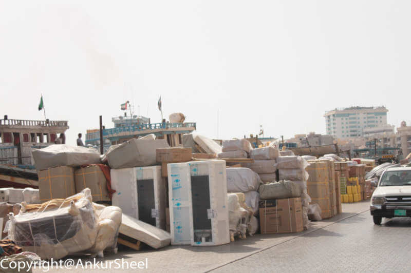

Dubai has been a trading hub since the 19th century and various merchants have set up their first shops here. Gunjan
wanted to visit the local Indian/Pakistani market for shopping and we soon found ourselves at the Textile Souq/Meena
Bazar. This is an open Souq, close to the Dubai Museum. Contrary to the shopping malls, Meena Bazaar has a different
charm altogether. You will feel as if you are back in India, since its probably one of the few places you can hear the
blaring horns of cars stuck in traffic and walk in the narrow by-lanes and a crowded main-road. The only Hindu temple in
Dubai is also located along one of the alleys.

You will also find strangers asking you to follow them if you are interested in copies of branded bags and watches. If
you get lured, you’ll find yourself sitting in a small room searching for the perfect branded bag from a heap of fake
branded bags. Here is where your bargaining skills will be put to a test. :-) It still might be expensive, but, nothing
close to what you might have to pay for the original. From Indian and Pakistani stores selling traditional clothing and
high ended fashion Boutiques to inexpensive knockoffs of the top brands, you’ll find something to spend on at Meena
Bazaar.

By the time Gunjan finished picking up a few goodies, we were both starving and decided to go for some typical Indian
food i.e. gol-gappas and chola-bhaturas at PuranMal. Once we were done hogging, we followed the direction of the cool
breeze and ended up by the beautiful creekside with the traditional wooden Dhows (wooden boats) jostling for attention.
The Dubai Creek is a natural sea-water inlet which cuts Dubai into two parts

-   the old part of the city known as Deira; and

-   the relatively modern part i.e. the Bur Dubai.

Throughout the creek, one can still see the loading and unloading of trading goods. The surprising part is that even
though there are no warehouses where the goods are unloaded and are just left on the dock, there have been no incidents
of robberies.

An Abra/Water-taxi costs only Dhs1 for a one-way commute and is probably the cheapest form of transportation that you
can get in Dubai. It is also a unique way to cross the Dubai Creek to go to the Deira Gold and Spice Souq from Bur
Dubai. After about a 15-20 minutes ride, the Abra dropped us just a small walk away from the Spice Souk. Stores in the
Spice Souk sell a variety of fragrances and spices. I was not too impressed by it since it felt very similar to I.N.A
market in Delhi. But, if you have never been to a spice market, this is another place you must not miss.

The other must-visit place is the Deira Gold Souq, even if do not plan to buy anything. The sheer magnitude of gold
hanging inside the shop windows is something to be seen to be believed. The part that astonished me the most was the
apparent lack of security in and around the stores.

