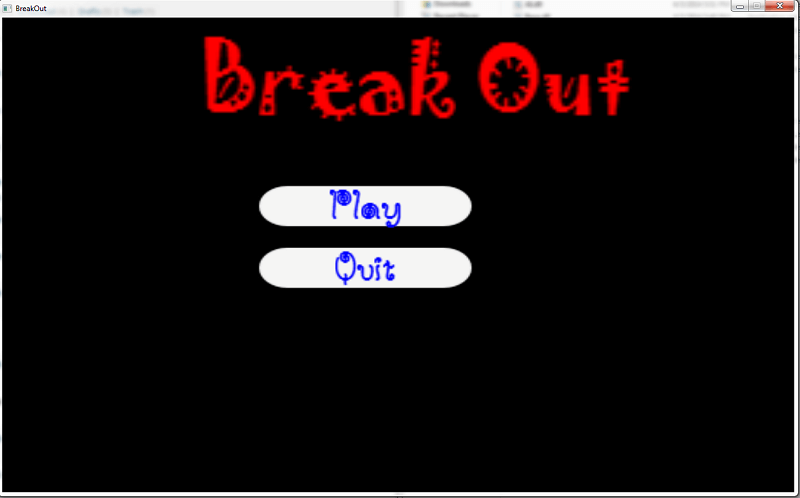

content\posts\2014\2014-04-05-breakout-clone-v1-0\index.mdx content\pages\cv\personal-game-projects\files The first
release of the Breakout clone is finally here.

The [Installer](../../../pages/cv/personal-game-projects/files/Breakout_setup_v1.1.exe) will install directx and the
visual studio 2010 re-distributable.

If you would prefer to run the game through a zip file, you can download it
from [here](../../../pages/cv/personal-game-projects/files/Breakout.zip). You will have to make sure that you have the
visual studio 2010 re-distributables as well as the latest DirectX installed on your machine.

Try it out . Incase, you face any problems while installing or running the game, let me know and I will try to come up
with a solution.

Looking forward to hearing your comments on the game  :-)

## Screenshots

