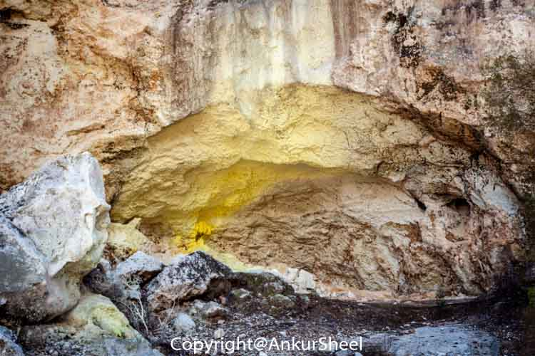

For our last day during our trip to Rotorua we decided to see Wai-o-Tapu whimsically named as the Waiotapu Thermal Wonderland, a stunning geothermal area.

Our first stop was the Lady Knox Geyser, an artificial catalyzed geyser that exploded every day at 10:15 A.M. The reason it erupts at the same time everyday is because the eruption isn’t a natural phenomenon but is initiated with atleast a handful of washing powder.

 There are 3 walks (35 mins, 45mins and 75mins) you can take depending on the time you have to see the different pools. Naturally, we went for the longest one.

  

The mud pools are listed on Wai-O-Tapu’s website but you can see them free of charge. Look for the Mud Pool signs off Waiotapu Loop Road and take a short drive to the car park and viewing area. The mud is active here so it’s worth the detour.

 

Have you been to Wai O'Tapu? How was your visit? Let me know in the comments.
