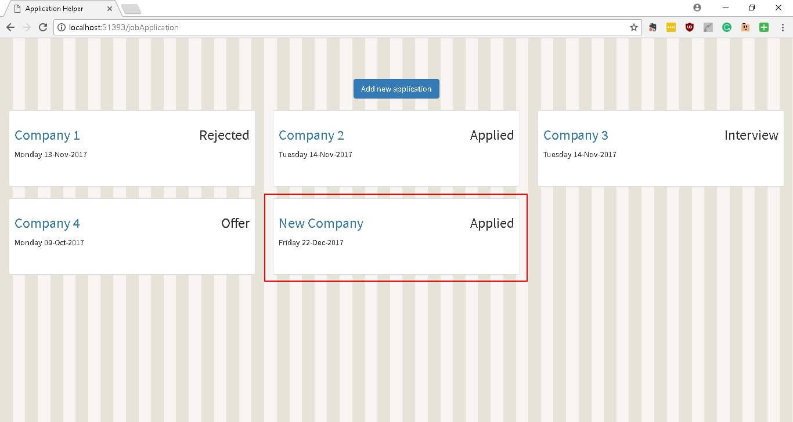

You can see the all the related updates [here](./tags/jah)

## v 0.0.3

This update adds the ability to add new applications.

## Screenshots

## Next up

The next update will deal with updating an existing application.
