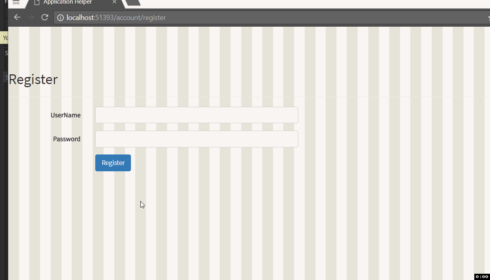
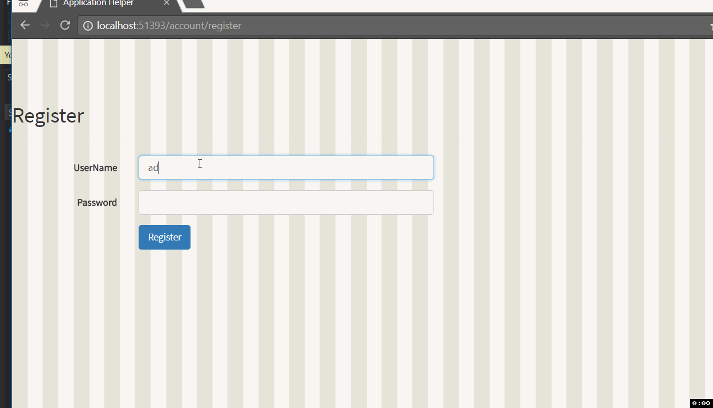
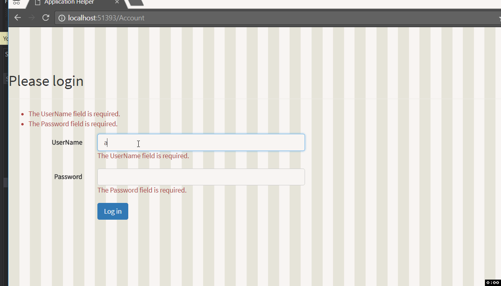
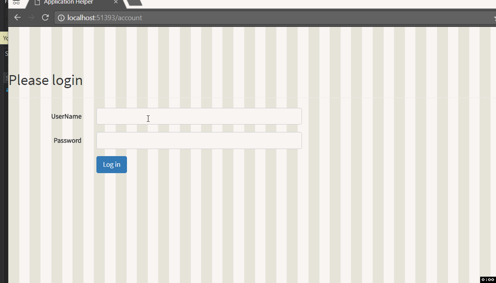

You can see the all the related updates [here](./tags/jah)

## v 0.0.7

-   Register Account page.

-   Login Page.

-   Error if trying to view applications without logging in.

## Screenshots

## Next up

In the next update, we will add support so that a user can access job applications only that are created by them.
