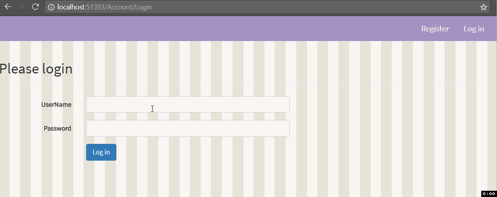

You can see the all the related updates [here](/tags/jah)

## v 0.0.8

-   Mapping applications to user.

-   Ability to logoff after logging on.

## Screenshots

## Next up

In the next update, we will be deploying to azure before adding more functionality.
