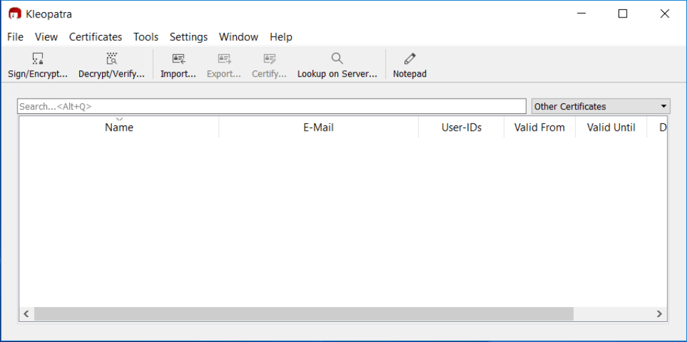
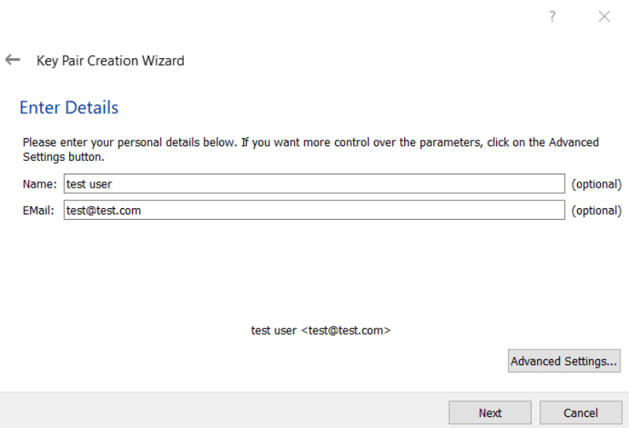

Did you know that by default you can check in code as anyone in your git repository? All you need to do is run
`git config.username = {username}` and `git config.email={email}`and you can trick git into thinking you are someone
else. For a better understanding of what kinds of problems this can create, go and read Mike Gerwitz’s article,
[A Git Horror Story](https://mikegerwitz.com/papers/git-horror-story). Luckily, Git allows you to resolve this issue
pretty easily - by letting you sign commits using GPG(GNU Privacy Guard).

The GitHub help article [Signing commits using GPG](https://help.github.com/articles/signing-commits-using-gpg/) is a
pretty good guide on how to set it up. But, it requires you to use the git bash console. So, what do you do if like me
you are on a Windows machine and would prefer to use a GUI? Don't fear this guide will tell you what you need to know.

Using Gpg4win with Git needs a little bit of configuration so let's start configuring it.

## Setup Kleopatra

-   Download [Gpg4win](https://www.gpg4win.org/) and install it using the installer.

-   Go to the Start menu and start Kleopatra

-   Click on File -> New Key Pair

-   Click on Create a Personal OpenPGP key pair

-   Enter details and click next.

-   Review and Create the key. This will show a popup asking you to enter a passphrase to protect the key.

-   Enter a passphrase and click Ok

-   At this point, the key pair should be created. Click on Finish.

_You can create a backup of the key and save it somewhere safe._

-   You should now see the key in Kleopatra

-   Keep a note of the Key-ID. We will need it in a minute.

_This is D1E4471 in the screenshot above._

-   Double click the key to see the certificate details

-   Click on export and copy the public gpg key.

_Make sure you copy everything including `-----BEGIN PGP PUBLIC KEY BLOCK-----` and
`-----END PGP PUBLIC KEY BLOCK-----`_

## Configure Git to Sign Commits

-   Update the global git config to use the signing key. _Remember the Key-ID from above - You will need it here._

-   Enter `git config user.signingkey D1E4471` in your git console

If you want to set it on a global level, use `git config --global user.signingkey D1E4471`instead

-   Instruct git to sign every commit automatically.

-   Enter `git config commit.gpgsign true` in your git console. If you want to set it on a global level, use
    `git config --global commit.gpgsign true` instead.

-   Instruct git to sign every tag automatically.

-   Enter `git config tag.gpgsign true` in your git console. If you want to set it on a global level, use
    `git config --global tag.gpgsign true` instead

-   Tell git use the gpg4win version of gpg.exe

-   Enter `git config --global gpg.program "C:\Program Files (x86)\GnuPG\bin\gpg.exe"` in your git console.

You might need to tweak the location of the program if you installed it in a custom location

To check that it works, commit some code to a repository which has been set up to use signing. You should be prompted
for the passphrase you entered earlier.

## Configure Kleopatra to cache the passphrase for a longer time

-   Run Kleopatra. Click on _Settings -> Configure Kleopatra_

-   On the configure page click on _GnuPG System -> Private Keys_ and scroll down to the Options controlling the
    security section.

-   Set the cache time. _86400 seconds is equal to 1 day._

## Configure Github to show verified commits

-   Follow the steps at
    [Adding a new GPG key to your GitHub account](https://help.github.com/articles/adding-a-new-gpg-key-to-your-github-account/)
    so that Github can show the verified commits. _Use the public gpg_ key that you had copied earlier.

To check if it works, push the signed commit. You should see the Verified tag in the commit history on Github.

The commit should have a verified tag which you can click to see additional details

## Conclusion

Now all the commits will have a verified tag. Do you sign your commits? Let me know in the comments
