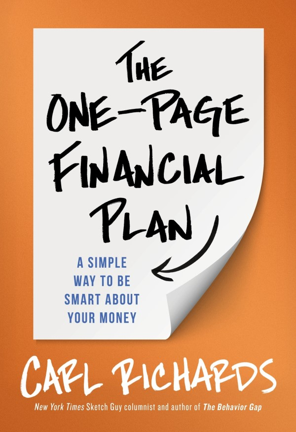

_Cross posted from [Discoveries In Bookland: The One Page Financial Plan](https://www.discoveriesinbookland.com/blog/one-page-financial-plan)_

## What I read

The One-Page Financial Plan: A Simple Way to Be Smart About Your Money

[Buy it on Amazon](https://www.amazon.com/One-Page-Financial-Plan-Simple-Smart/dp/1591847559)

224 pages

Author: [Carl Richards](https://behaviorgap.com/)

## Summary

Most intelligent people prefer to do nothing rather than make the wrong decision. When confronted with a long list of options, people just want to be told what to do. This makes creating a financial plan overwhelming. Others don't want to own up to their past mistakes. Some just want to live for today and don't want to create plans or have goals. Others have a goal but no idea on how to reach them. Others are so focused on the goal that they forget to enjoy their life and end up being disappointed.

All of these people need a financial plan. It is the best way to give ourselves more time. After all, if we don't know what our goals are and where we are today, how can we get to where we want to be tomorrow.

A one-page financial plan is different from traditional financial plans because it represents only 3-4 things that are most important to us and some action items to achieve our goals. In his book The One Page Financial Plan, Carl Richards shares the steps to make an excellent one-page financial plan customized for us. He also shares some tips and tricks to get on top of our finances.

## Key Quote

<Quote quote="Before you can plan, you have to know why you're planning" />

## Key Takeaways

### What makes a good financial plan?

A good financial plan is a way to get clear on what's important to us and achieve our goals. It needs to answer the question "** What's the stuff that matters?**".

Although we might think of goals as only being financial, a good plan will not only have activities that have a monetary benefit but detract us from the other forms of human capital - energy, time and skill. It can prevent us from making our goals seem unattainable because we have inflated the numbers.

<Quote quote="Life isn’t just about retirement" />

A good financial plan should not be set in stone because circumstances change, and life doesn't always go as planned. Because a sound financial plan is not a plan for the rest of our life, it should be a way of evaluating whether we are on track to meet our goals or if we need to make adjustments. If we are not adjusting our plan, we are probably ignoring issues that might become problems in the future.

### Creating our One Page Financial Plan

Before we start making our financial plan, we need to keep a few things in mind. The conversations associated with making a financial plan can be emotional and therefore :

-   We need to pick a time when we have energy and are feeling fresh.
-   We need to have the conversation (with our partner) in a neutral place and not in a place with memories associated with it.
-   We should not bring up past mistakes

<Quote quote="Knowing your values can make it easy to say no to things that distract us from what's most important" />

The first step of creating a one-page financial plan is to know where we are today and where we want to be. Answering the following questions can help us figure out the 3-4 things important to us.

**Why is money important to us?**

This question uncovers our deepest desires and fears and reveals why we have the goals we have. It helps us understand our values which will help us make better financial decisions by clarifying which strategies to employ. Although the purpose of asking "**Why**" isn't to come up with specific goals or actions, we should still strive for specifics.

**How do we spend our time and money?**

The way we spend our money and time can be a good indicator of what we value. By asking this question, we might also realize that we are spending money and/or time on things that don't matter.

**What are our major financial goals, and How badly do we want them?**

The critical goals will involve a sacrifice. This sacrifice is always worth it for the right goal, so if the goal is suitable for us, we will be willing to make the sacrifice. If we think the goal is not possible, it may not be the right goal for us.

<Quote quote="Don't be committed to the guess, be committed to the process of guessing" />

The next step is to set some specific goals that we want to achieve. It is difficult to have clear goals when we don't know what the future is and make assumptions. But it is still essential to take our best guess at each goal even if we don't get it exactly right. Unfortunately, most people don't guess because they are afraid of making the wrong guess. Along with how much it will cost, we also need to guess when we would like to achieve it. We should make sure we set goals for how we want to live next year, following 5 years and the next 10 and not just for retirement.

Once we have specific goals, we need to rank each goal by its importance.

It is important to remember that we shouldn't obsess about them although we have created specific goals.

We need to ask ourselves, "**If we were to retire today, how much money would we need per month to live the way we had hoped?**"

### How to deal with **disappointments**?

<Quote quote="It wasn't the story I wanted to tell, but it was the truth" />

There are times when life won't go as planned, and circumstances can derail our best-laid plans. Remember that problems are never quite as bad as it seems and we can always make some changes to get back on track. By remembering what's important to us and focusing on things that we can control, we can gain clarity.

We also need to remember that our irrational decisions and lousy money calls are not failures but something we can learn from.

### Why do we need to save?

<Quote quote="Save as much as you reasonably can. Spend less than you earn" />

One of the biggest reasons that we don't save is our need for instant gratification. We need to buy very few things right now, but we believe we need them because we want them. To justify our purchase, we look for evidence and omit anything that doesn't support the purchase.

We need to save because we will eventually end up in debt if we spend more than we earn. There are a few tools in the toolbox that we can use to take back control of finances.

-   Budgeting
-   72-hour test
-   Eliminating Debt
-   Automate Savings

### Budgeting

<Quote quote="You can't plug holes if you don't know they exist" />

Most of us dislike budgeting is because it requires discipline, which is hard, and people tend to avoid hard things. Some of us also think that it is about denying ourselves pleasure. But, spending a lot of money on something is not necessarily bad as long as it aligns with our goals and values. This makes budgeting a process of separating what is important(to us) from what isn't.

Budgeting helps us cultivate the awareness to save and spend according to our values.

**How do we get started with budgeting?**

<Quote quote="Track everything you spend" />

The basic rule of budgeting is to track everything we spend because that is the only way to know where our money goes. Nothing will change until we change our behaviour, which can only happen if we are aware and take responsibility for all the unnecessary purchases.

The tools don't matter. Use whatever tools that work for you.

In the beginning, review your spending at least once a week.

Automating any long-term savings goal will remove the question of whether you should spend the money or save it.

### 72 Hour test

<Quote quote="Do no not give into your urge for instant gratification" />

This is a great tool to stop impulse buying. Instead of buying something immediately, we should wait for 72 hours or keep it in our shopping cart if we buy online. Most of the time, we will forget about it.

It is important to remember that we are not saying "No". We are just not giving in to our urge for instant gratification.

### Eliminate Debt

<Quote quote="People who understand interest earn it. People who don't pay it" />

Getting rid of debt is one of the best investments we can make because it is an investment with a guaranteed return.

Once you have eliminated debt, you should put all one time windfalls into savings.

### Automate Savings

<Quote quote="You could have the best investing strategy in the world, but if you don't have any money to invest, it won't help you" />

Automating any long term saving goals that we have decided on will remove the question of whether we should spend or save our money.

### Investing

<Quote quote="Investing is one of those cool, rare things where we actually get rewarded for being lazy. Once you get it right, the less you do, the better" />

There is a correlation between risk and reward, but when it comes to investing, we want to take on **_systematic risk_** based on the assumption that regardless of whether the stock market is up or down, it will continue to grow. One way of doing this is by spreading our risk by diversifying our portfolio. After all, any plan needs to account for the reality that markets go down and up.

We should try to keep our costs as low as possible because the more we pay for our investments, the less we will keep.

A default portfolio is good to get started, but it doesn't take into account our situation, goals, and ability to stick with a plan when the markets are crashing or even how much risk we can handle.

We should rebalance once a year, and if we can, we should automate the process.

When it comes to investing, the key is to stick with it, or it will be a wasted effort.

### How do I hire a financial advisor?

It can be worth hiring a good financial advisor to help us make unemotional decisions about our portfolio and provide a check and balance to our choices.

A good financial advisor will be asking us a lot of questions to figure out why money is important to us and what our goals are before telling us what we should do.

They are open about conflicts of interest. A conflict of interest doesn't mean it's something terrible, but it is essential to be aware of it. There are a few questions that we can ask to uncover a conflict of interest.

**How much do I pay you?**

Ideally, it will be a clear stated amount, and we will know exactly how much we need to pay and when.

**How are you compensated?** or **Do you get paid (or win) anything based on the products you recommend to me?"**

### Do I need life insurance?

<Quote quote="It's the surprises that cause the heartburn" />

Life is full of risks, but we should only get insurance for the risks we want someone else to take care of. If someone else depends on us, we should get a life or, preferably, term insurance. Term insurance simply means that we lock in the cost for a specified period. Once the period is over, the policy lapses, and hence we want to get the longest policy that we think we will need based on our age.

Before deciding how much we should insure for, we need to separate the economic need from the emotional loss. The goal is to have as much as we need but not more. A good rule of thumb is that it should be 25 times the amount we will need to replace.

### Can I afford to buy a house?

<Quote quote="I never sat down to figure out what it would take to make this work. I just wanted to believe our real estate agent, despite the fact that he was making money on the deal" />

We should not assume that we must own a house.

We should not buy a house if we buy it solely for tax purposes or because of what we think the house might be worth someday.

There are a few questions that we can ask ourselves to see if we can afford to buy a house

-   Have we saved enough for a down payment?
-   Can we afford it after factoring in additional costs like property taxes, home-owner association fees and utilities?
-   Can we qualify for a loan?
-   How long do we plan to live in the house?

If it's less than 5 years, it is not worth it. 5-10 years and we can consider it. More than 10 years and the numbers will probably be in our favour.

### Other Quotes

-   A big part of being human involves irrationality.
-   The calendar and the checkbook never lie - old saying
-   It can be fun to imagine ourselves striking it rich by hitting on the right stock at the right time. But the odds that it'll happen are so small that I wouldn't plan on it
-   We won't have enough money to reach all of our goals.

## Recommendation

No matter your age, if you are just getting started with getting your financial life in order, this book is a refreshing read. By taking away a lot of the complexity of getting started with a financial plan and reducing it to a few questions, it makes it very easy to get started.
