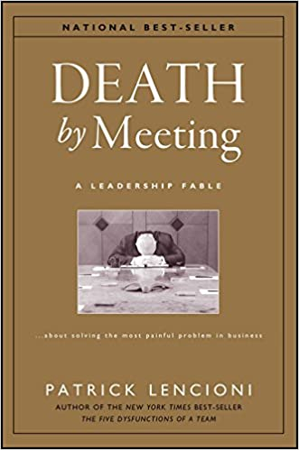

<!-- markdownlint-disable-file MD036 -->

## What I read

Death by Meeting: A Leadership Fable...About Solving the Most Painful Problem in Business

[Buy it on Amazon](https://www.amazon.com/Death-Meeting-Leadership-Solving-Business/dp/0787968056)

260 pages

Author: [Patrick M. Lencioni](https://www.tablegroup.com/)

## Summary

Meetings are critical for making decisions. But we dread meetings because most of them are bad. In "Death by Meeting", Patrick Lencioni shows us how we can change the bad meeting culture. He draws a comparison between meetings and movies and how it's surprising that even though meetings have more potential to be more interesting, they are not. He offers practical advice to make our meetings more engaging and effective.

The book is divided into 2 distinct parts - a business fable and a practical description of the model. Most of the book is a fictional story that presents common scenarios with meetings at the workplace and the solutions in an easy to digest framework. The model extracts the lessons and drive the point home,

## Key Quote

<Quote quote="It is at once shocking and understandable that intelligent people cannot see the correlation between failing to take the time to get clarity, closure, and buy-in during a meeting, and the time required to clean up after themselves as a result" />

## Key Takeaways

### Why do we hate meetings?

<Quote quote="Meetings are a puzzling paradox. On one hand, they are critical. Meetings are the activity at the centre of every organization. On the other hand, they are painful. Frustratingly long and seemingly pointless" />

Most of us hate going to meetings because they are boring and ineffective.

Meetings are boring because they lack drama or conflict. Most leaders think that they are helping by avoiding tension and ending meetings on time, but they are the root cause of bad meetings. This reduces employee interest and ensures that the unresolved issues will result in unproductive personal conflicts or, dare I say, politics.

Meetings are ineffective because they lack structure, and most of them don't allow the participants to engage in productive debates.

It should come as no surprise that bad meetings lead to bad decisions. But there is a more intangible cost that manifests itself in the form of anger, lethargy or cynicism.

### Good meetings

<Quote quote="Good meetings result in good decisions by extracting the collective wisdom of a team" />

On the other side of the spectrum, good meetings result in higher morale and faster and better decisions, leading to better results. Although they can seem to be unproductive, they accelerate decision making by eliminating the need to revisit issues again and again.

### How to make a meeting enjoyable?

There is a simple formula to make meetings enjoyable - Get people hooked in the 1st 10 minutes, then mine for ideological conflict and drive it to a conclusion.

<Quote quote="There has to be something ultimately at stake." />

We have to get peoples attention at the beginning. Luckily, this isn't too hard. People are generally used to be being bored at meetings. In the 1st 10 minutes of a meeting, the participants need to understand and appreciate what is at stake. People are looking for a reason to care, and the leader's job is to give them that reason.

<Quote quote="When a group of intelligent people come together to talk about issues that matter, it is both natural and productive for disagreement to occur." />

To make meetings less boring, leaders need to provoke relevant and constructive ideological conflict. This leads to more passionate and provocative discussions, which keep the people engaged. Leaders need to look for places where people have different opinions and then force them to communicate what they think until they have said all there is to be said. They can minimize the discomfort by reminding the participants that what they are doing is good.

<Quote quote="A consensus is usually not achievable" />

Once the leader decides that all of the information has been aired, it's time to decide. The leader takes the final decision only if no one has made a compelling enough argument for making a decision. Everyone needs to understand that everyone must support it once a decision has been made regardless of their original position.

### How to make a meeting effective?

<Quote quote="When properly utilized, meetings are actually time savers" />

Contrary to what we might think, the length of a meeting has nothing to do with its effectiveness. We need to have multiple types of meetings which each have their purpose, format and timing.

There are 5 types of meetings that we should have.

-   Daily Check-in
-   Weekly Tactical meeting
-   Monthly Strategic
-   Ad-hoc Strategic
-   Quarterly off-site review

### Daily Check-in

<Quote quote="We have to do what we have to do" />

This is a 5-10 minute meeting every morning. There is no agenda because everyone just reports on their activities for the day.

It clarifies how the priorities are translated into action daily. But, more importantly, it is a quick forum to ensure that nothing falls through the cracks on a given day and people are not stepping on each other's toes.

**Challenges**

If we are just getting started with this type of meeting, it is important not to cancel any, even if some members are missing. We should also commit to doing them for 2 months before evaluating whether they are working or not.

### **Weekly Tactical**

<Quote quote="What do we need to talk about today so that we can make as much progress as possible this week?" />

This is a weekly meeting to focus on tactical issues that must be addressed for short term success. It runs for 45-90 minutes. The agenda is decided during the meeting and is based on what everyone is working on. To ensure that we know where to focus, the agenda should be based on our activities and the metrics.

The main goal is to identify and remove any obstacles and make sure everyone needs to be on the same page.

**How to come up with a real-time agenda?**

-   A sixty-second report by each participant on the three primary activities. We want to keep it short because too much information would be distracting.
-   A 5-minute report of any critical information and the key metrics for success.
-   Based on the above, set the real-time agenda.

**Challenges**

We need to limit the conversation to issues that have an impact on tactical issues and goals. Trying to deal with the strategic issues in a weekly meeting just results in distractions. It's almost impossible for people to shift from a tactical mindset to a strategic one. It means that we won't deal with any of the short term issues that need to be resolved to keep the business moving.

If someone raises a too big issue, put it on the list for the next monthly meeting. Complex issues need time, and there is just not enough time in this meeting to dive into a big problem and have a complete and satisfying conversation.

### Monthly Strategic

<Quote quote="Complex topics deserve enough time for brainstorming, analysis, even preparation" />

This is a monthly meeting to focus on strategic issues. Agendas are critical for these meetings so that people can think about the topics beforehand. We can pick between 1-3 topics as long as we choose the right ones. There is no set time for this meeting, but we should schedule about 2 hours per topic.

**How to pick a topic?**

The most important topics should be prominent. But, if they are not, we can follow these steps before the meeting.

-   Everyone writes down 1 issue that they think would be good to discuss and gives a 60-second pitch of why their idea should make the cut.
-   Everyone gets 2 votes which can be used on 1 idea or split between 2. But, we can't vote for our idea.
-   Appoint someone to be in charge of organizing the research for each topic.

**Challenges**

We shouldn't put too many items on the agenda. Sometimes only 1 topic matters, and we need to have the discipline to limit ourselves to it.

We need to learn to distinguish between topics that can be addressed by a subset of the team and those that are critical to the entire team.

### **Ad Hoc Strategic**

This is similar to a monthly strategic, but it is only for a critical issue raised in a weekly tactical that cannot wait for the next Monthly Strategic.

**Challenges**

We need to know how to identify the rare strategic issues that deserve immediate attention and not have an ad-hoc meeting for every issue that comes up.

### Quarterly off-site review

<Quote quote="Effective off-sites provide executives an opportunity to regularly step away from the daily, weekly, even monthly issues that occupy their attention, so they can review the business in a more holistic, long-term manner" />

A quarterly off-site review is a chance to get away from the grind and review things from a distance. It should be scheduled for 2 days.

The primary purpose is to reflect on and discuss the state of the organization.

**Examples of Topics**

-   Anything that has a long-term impact that cannot be discussed in the weekly or monthly meetings
-   Giving each other feedback
-   See if our strategy still makes sense
-   Figuring out who our best people are and how to manage the stragglers.
-   Competitive and Industry Review

**Should we get a facilitator?**

The advantage of getting a facilitator is that it allows the leader to participate in the discussions without playing a more supporting role. But we need to find someone who is a good fit. Someone who takes the time to learn the business and helps without proving how smart they are.

**Challenges**

Many off-site meetings contribute little lasting benefit to an organization. We have to remember that the purpose is not to entertain the attendees but to step back from the daily distractions. We should also be careful to not over-structure the meetings and provide the attendees with presentations and white papers.

## Other Quotes

<Quote quote="The company's culture would come to mirror those meetings" />

<Quote quote="Bad meetings start with the attitudes and approaches of the people who lead and take part in them" />

<Quote quote="The only thing more painful than confronting an uncomfortable topic is pretending it doesn't exist" />

<Quote quote="Bad meetings at the executive level usually indicated a huge gap between performance and potential" />

## Recommendation

This book was a compelling read and read more like a fictional story. I think everyone who is frustrated with meetings should read this book. It provides realistic and straightforward steps to make meetings more engaging.
