## Problem

The Graphql endpoint for the API is accessible only to authorised users. Although it is required from a security perspective, it makes testing the API through [Insomnia](https://insomnia.rest/) a little tedious. What if we could automatically insert the bearer token every time we made a request using Insomnia?

## Solution

Let's start by creating a new environment. Although not entirely necessary, it makes authenticating on different environments easy. _Note: You can give the environment better names such as Dev, Staging, Production etc_

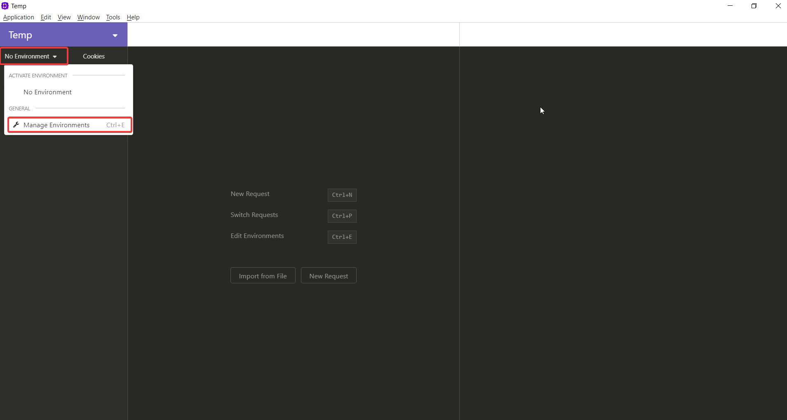

Now, let's add some environment variables specific to that environment

-   baseUrl : The base URL for all the endpoints
-   email: The email used to login
-   password: The password used to login

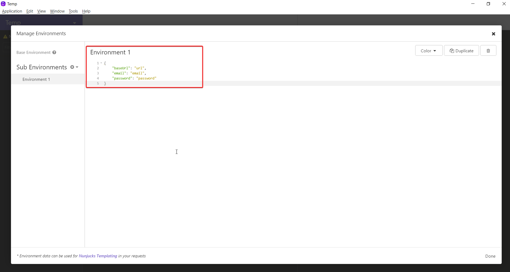

Let's make insomnia use the environment.

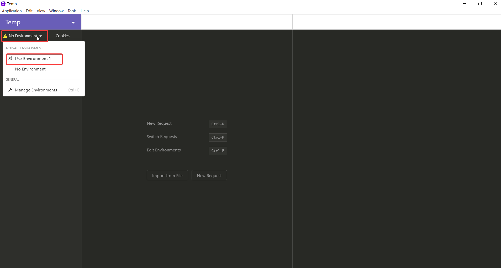

Assuming that the endpoint to get the access token is `LoginUser` add a new post request called `GetAccessToken`.

_Remember the environment variables from earlier. We can use them so that no matter what environment we are on, everything will just work._

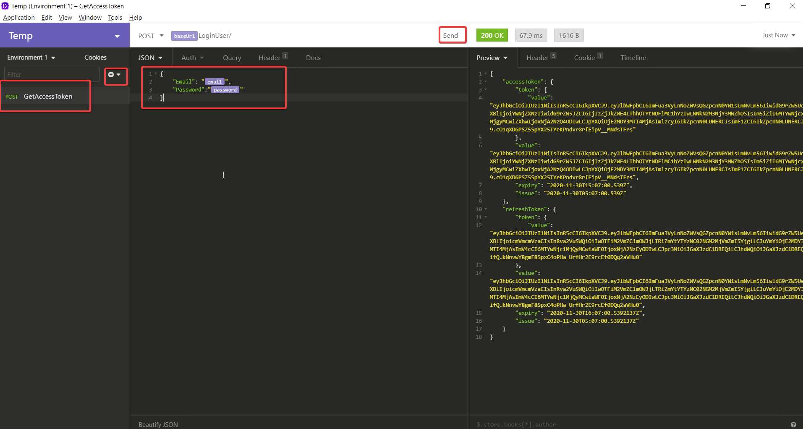

Let's add a new Graphql query and try to send the request. We get a **401 Unauthorized** error because we haven't passed in the bearer token.

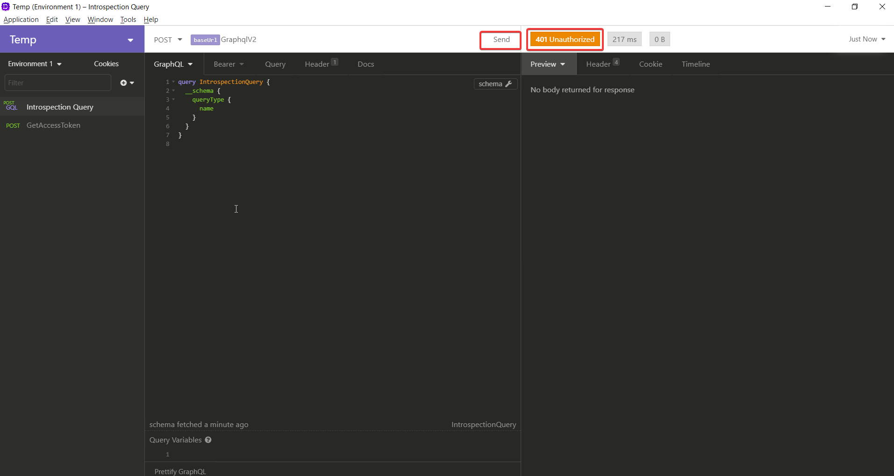

To set the bearer token, we can click on the **Bearer** tab and enter _Response ⇒ Body Attribute_ for the token.

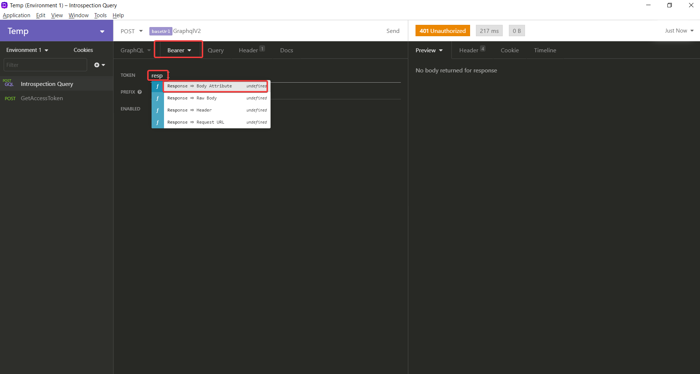

To edit the tag, click on it.

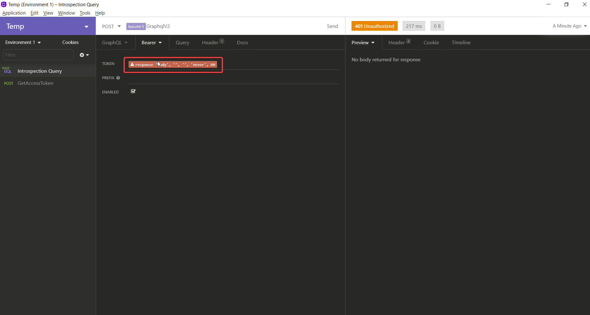

In the **Edit Tag** screen select _Post GetAccessToken_ for the request

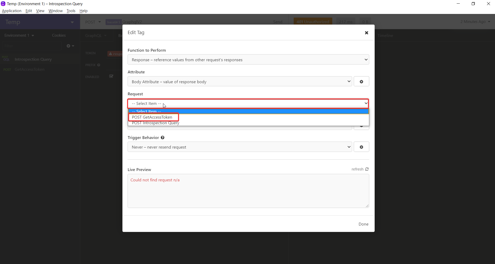

Set the trigger behaviour to **Always** so that the request is made every time and you get a new token

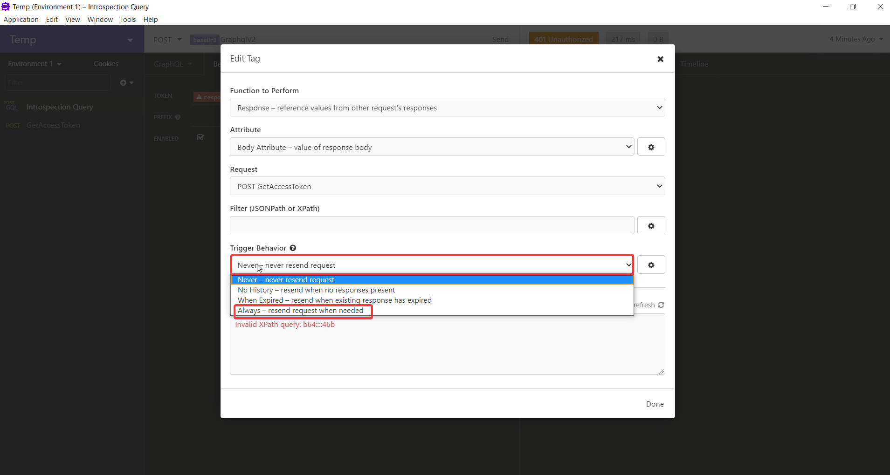

For the filter, enter `$.accessToken.value`. The value will be dependent on the response that you get from _GetAccessToken_. If you have set it up correctly, you should see a token in the **Live Preview**.

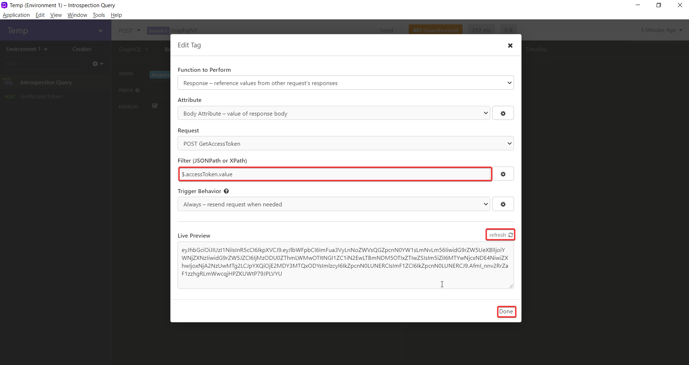

Now, if you try to resend the request, you should get back a **200 OK** response.

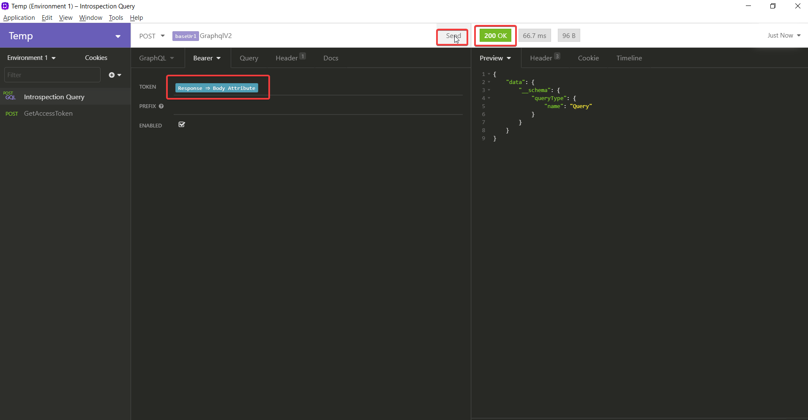

## Conclusion

By automatically generating access tokens every time we make a Graphql request, we can easily test our API using Insomnia
