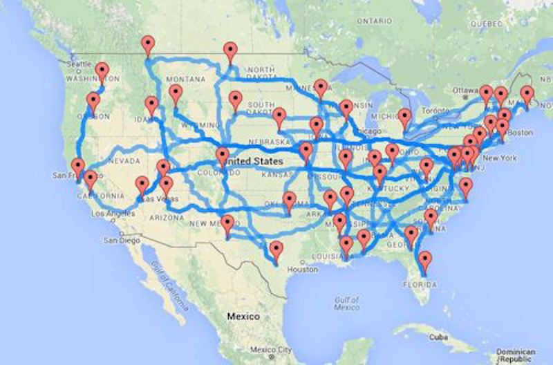
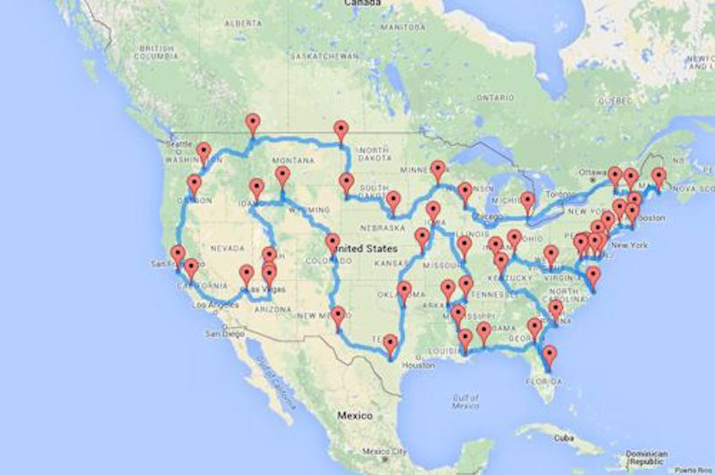
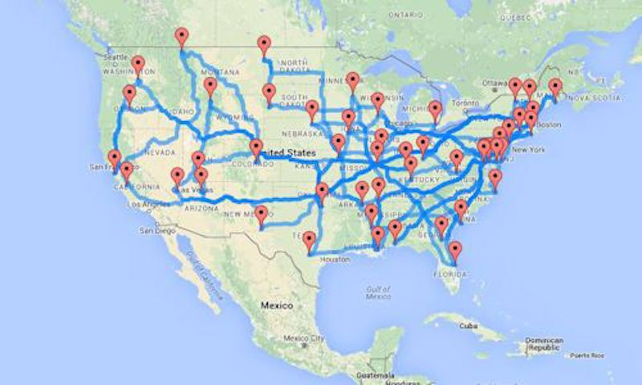
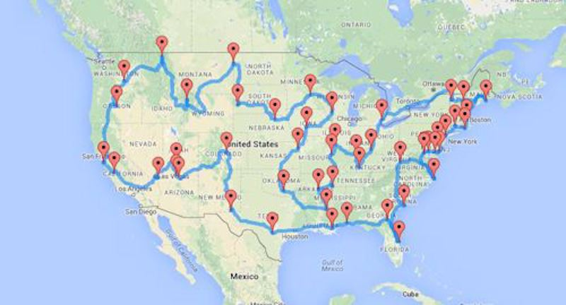
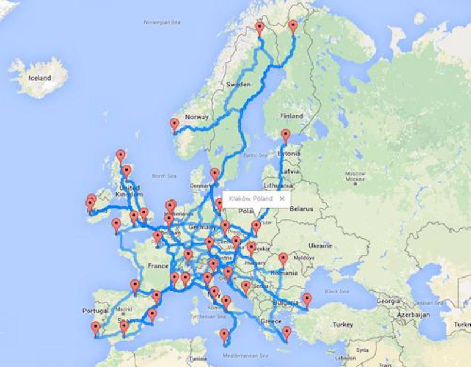
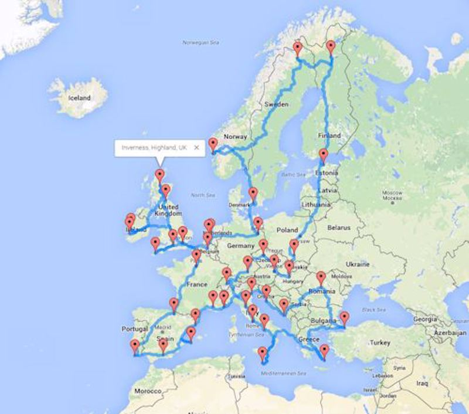

Based on Randy Olson's article "Computing the optimal road trip across the U.S."

It employs a genetic algorithm to solve the Traveling Salesman problem. It calculates optimal routes by utilizing Google Maps to measure distances between waypoints. The end result is an HTML file that presents the chosen route along with directions.

[Source Code](https://github.com/AnkurSheel/RoutePlanner)

## USA Cities

[list of waypoints](./route-planner-travelling-salesman-problem/us-cities-waypoints).

## USA Landmarks

[list of waypoints](./route-planner-travelling-salesman-problem/us-landmarks-waypoints)

## Europe

[list of waypoints](./route-planner-travelling-salesman-problem/europe-waypoints)
