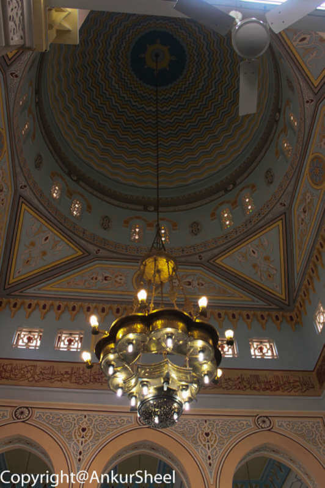
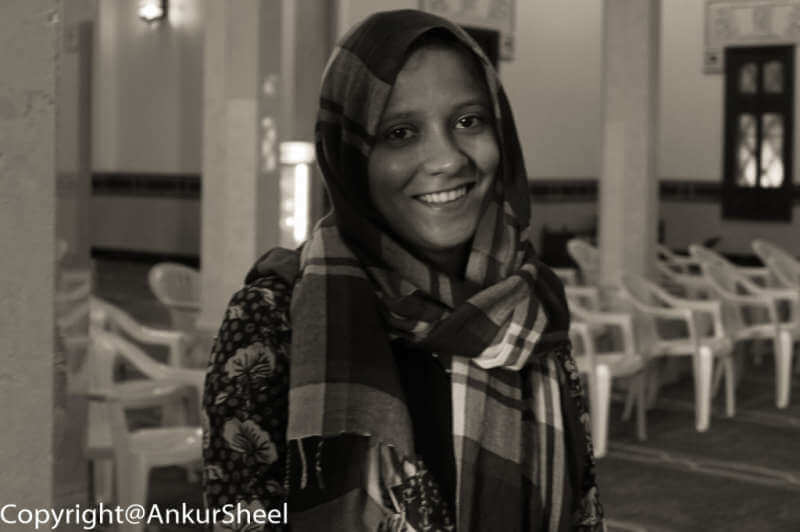
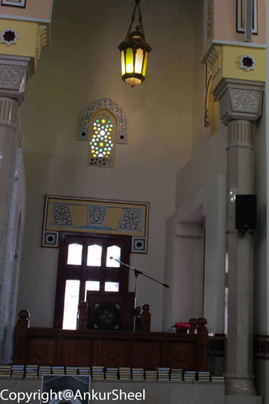
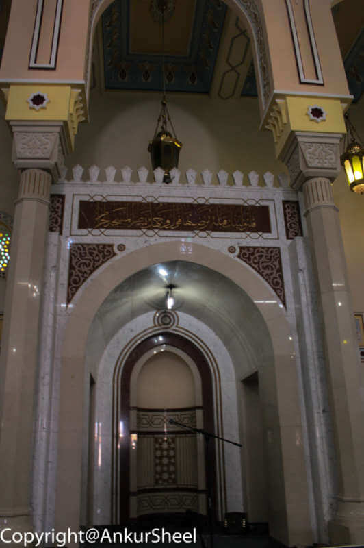
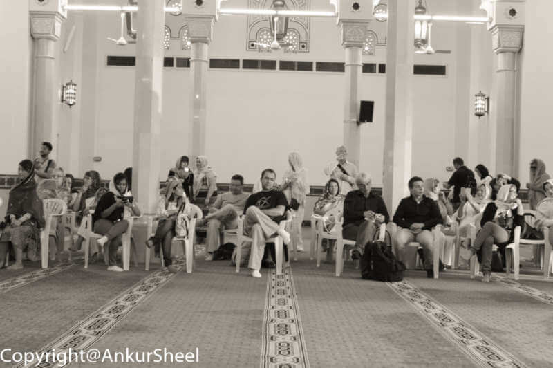
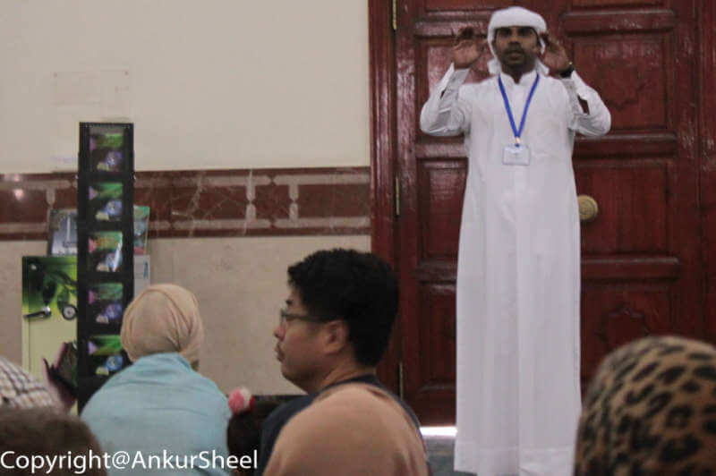

One of the things that Gunjan and I have always been curious about is – what’s inside a Mosque? Although I have visited a Dargah before, we finally got to see an actual mosque, i.e. the Jumeirah Mosque in Dubai.

A few ago, under their “Open doors. Open Minds” philosophy, the Sheikh Mohammed Centre for Cultural Understanding (SMCCU) opened the doors of the Jumeirah mosque to the public and non-muslim guests (including women). This is the only mosque in Dubai that is open to the public.

The guided tour is held 6 days a week and start at 10:00 am. There are no reservations, but visitors are accepted on a first-come-first-served basis. So for a change, we decided to get up early in the morning, took a cab and reached the mosque a little before time.

At sharp 10.00 am, our hostess for the day walked in and sold the tickets to all of us, post which she started the tour. She also handed out scarves to ladies who had not brought one to cover the head. Some who were showing legs were given abayas, the long black robes worn by Muslim women.

Inside, the mosque was one large, beautifully painted room, carpeted from end to end with parallel lines. At one end of this room was a small seating space for the Maulavi, a loudspeaker and a picture of Mecca. At the front was a board with six times displayed on it. The first was the time of sunrise, and the others referred to the other prayer times throughout the day. Muslims are required to pray five times a day. On the carpet were striped lines woven into the design of the carpet to evenly line up the praying men.

Our hostess then got us all seated. A few chairs were arranged for those who could not sit easily on the floor. We gathered in the large open area and faced the same direction, i.e. toward Mecca, Saudi Arabia. She started by explaining the 5 Pillars of Islam.

Our hostess also had one of her colleagues demonstrate the entire way to pray and explained the significance and meaning of the stances and the actual prayer.

-   **Shahada (Belief):** This is a declaration that they believe in only one God, Prophet Muhammad as God’s messenger.

-   **Salat (Prayer):** Muslims are supposed to offer 5 daily prayers at specific times, i.e. dawn, noon, afternoon, evening and night. These prayers are recited facing towards Mecca.
-   **Zakat (Donation):** Every Muslim has to donate 2.5% of their net surplus wealth each year to benefit the poor, needy, debtors, etc. She also explained the various rules and the process followed for these donations.
-   **Sawm (Fasting):** All Muslims have to fast during the holy month of Ramadan. They must abstain from food and drinks from dawn to dusk. She also explained the reasons for fasting and the behaviour expected from Muslims during this period.
-   **Hajj (Pilgrimage to Mecca):** Every Muslim (man and woman) has to make this pilgrimage at least once in their lives.

She explained that the praying men are evenly lined up and stand shoulder to shoulder because everyone is equal in the eyes of God. She also mentioned that people can pray wherever they want. They don’t have to go to a Mosque. However, a man gets extra points for going to a mosque, but a woman gets the extra points no matter where she prays. Women are given the option to pray at home since they have household responsibilities. If the women choose to come to the mosque for prayer, they have a separate room.

According to the Quran, men and women have to both wear and behave modestly in public places. She said a burqa is worn by women for their safety, comfort in the heat and respect. According to her, the Quran does not ask women to cover their faces. Still, women started covering their faces in the deserts to protect themselves against sand storms, heat, etc. She showed us quite a few samples of the face attire, including the attire initially worn by the Bedouins. She also said that in Islam, women are equal to men and not inferior.

We did learn a bit about the Emirate’s approach to Islam. Officially, it supports a moderate interpretation of Islam. Examples include:

-   not forcing women to wear coverings outside of the church. Most women wear such garments in Dubai but don’t wear them in other places.
-   most Emiratis don’t have more than one wife.
-   the government distributes guidelines for religious sermons, and texts of sermons are submitted for approval. As our hostess explained, it keeps a radical _imam_ (the mosque leader) from stirring up trouble by going off on his own agenda.

She then opened the floor for a Q & A session. This went on for a while as everyone had numerous questions. Overall the session was very informative and helped dispel at least some misconceptions about Muslims and Islam.

So whenever you are in Dubai next, a visit here is recommended.
