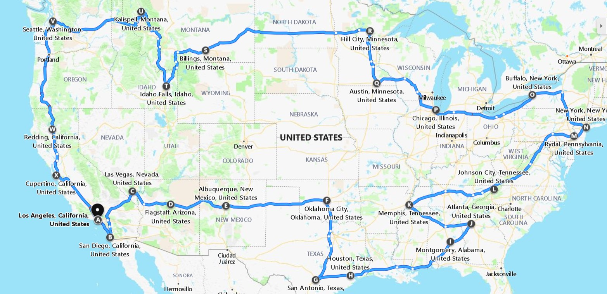

An itinerary of a road trip I took with my parents across the USA after graduating in May 2010.

- Los Angeles
  - Universal Studios
  - Disneyland
  - HollyWood Walk of Fame
  - HollyWood Sign
  - Griffith Park
  - Rodeo Drive
  - Santa Monica Pier
  - Mullholland Hwy
- San Diego
  - US Midway Museum
  - Old Town
  - Seaworld
  - San Diego Zoo
  - Legoland
- Las Vegas
  - Grand Canyon
- Flagstaff
  - Sedona
- Albuquerque
  - Meteor Crater
- Oklahoma City
- San Antonio
  - Fort Worth Stockyards
- Houston
  - Nasa Space Center
- Montgomery
- Atlanta
  - World Of Coca Cola
- Memphis
  - CNN Center
- Johnson City
  - Graceland
- Philadelphia
- Washington DC
- New York
- Buffalo
  - Niagara Falls
- Chicago
- Austin, Mn
- Hill City
  - Corn palace
- Billings
  - Mount Rushmore
- Idaho Falls
  - Yellowstone National Park
- Kalispell
- Montana
  - Glacier National Park
- Seattle
- Redding
- Cupertino
  - Napa Valley
