From the national parks, we move back to the cities and reach Seattle.

The highlight was a visit to the Boeing factory. Unfortunately, they don't allow anyone to take pictures at their facility :-(. So you will have to make do with the other pictures.

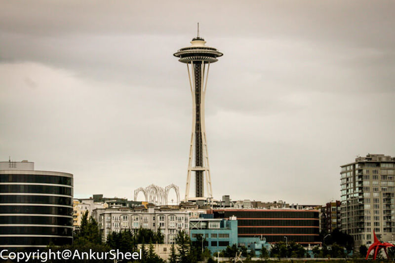

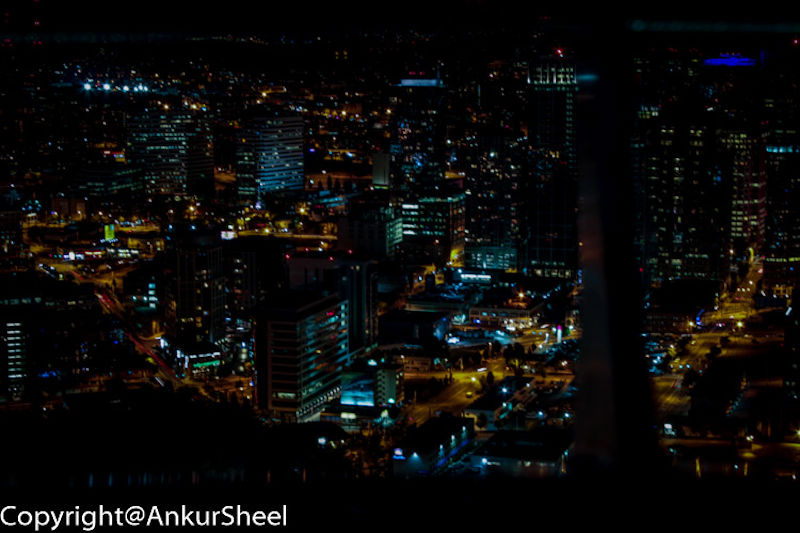

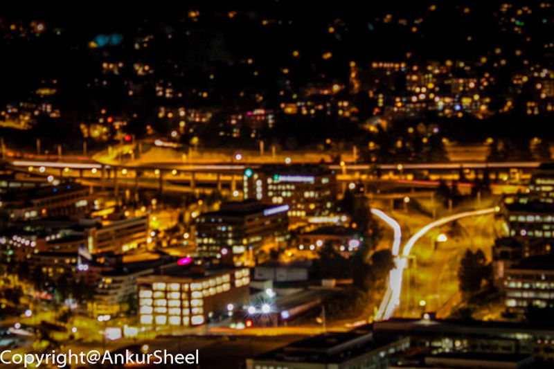

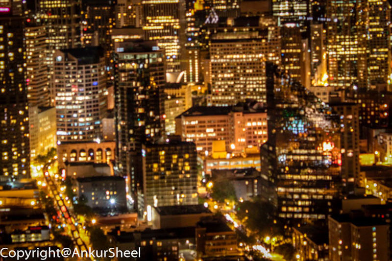

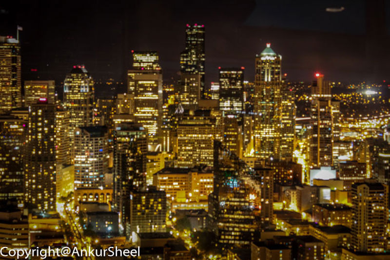

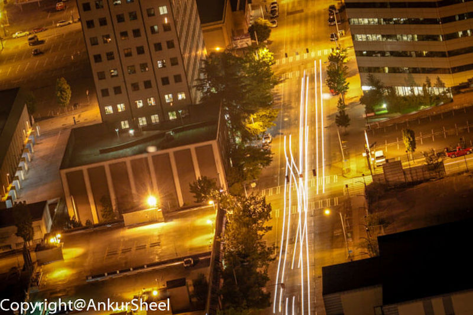

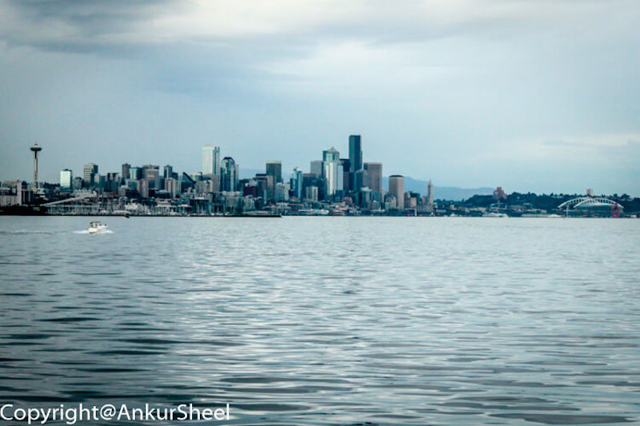

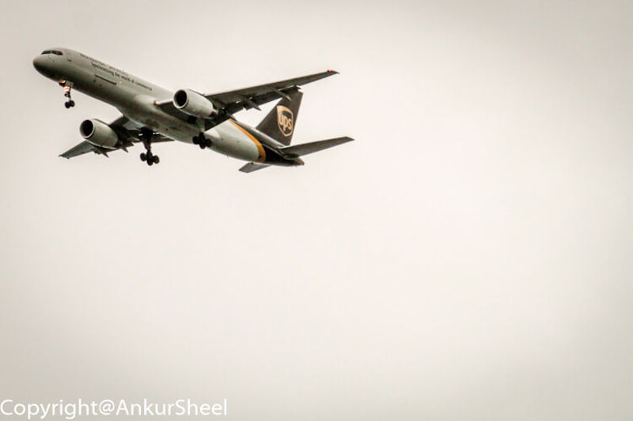

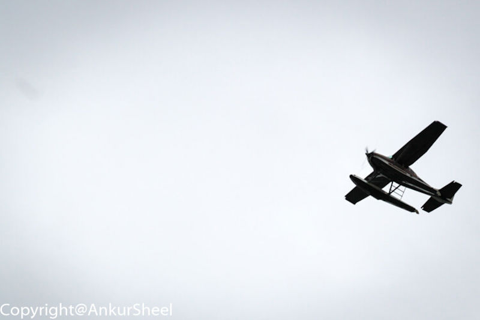

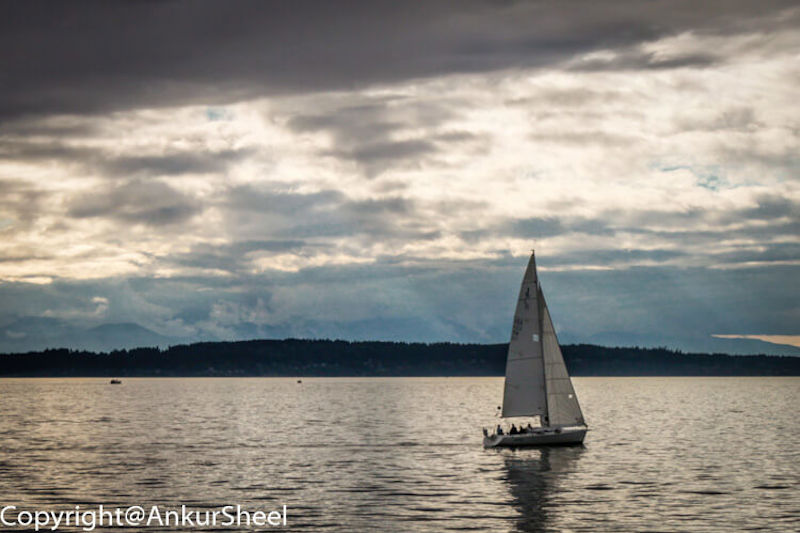

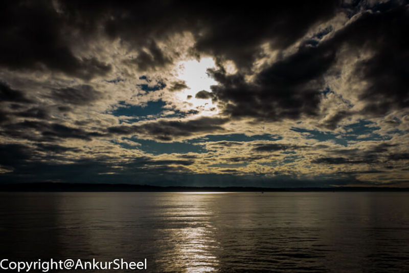

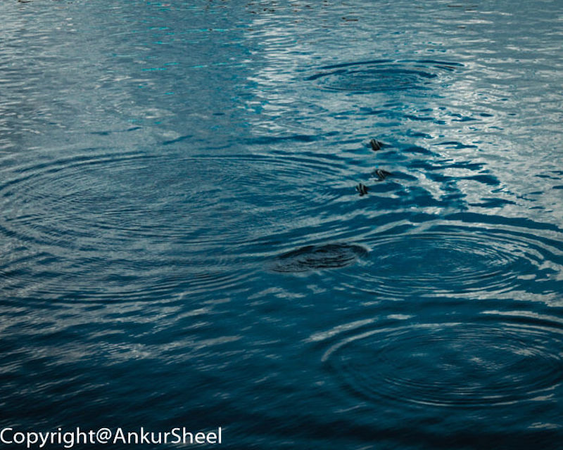

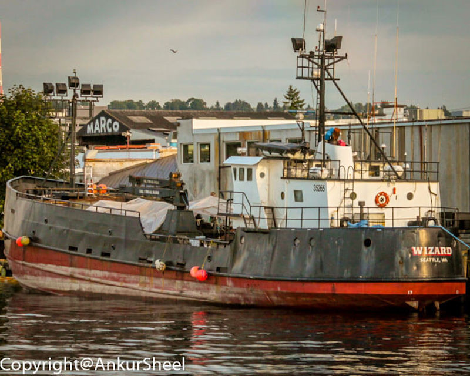

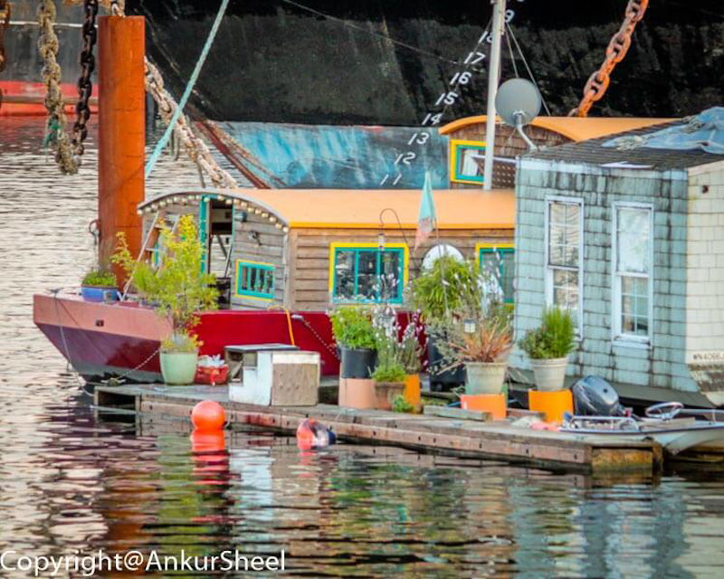

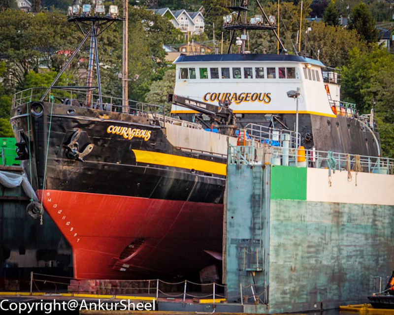

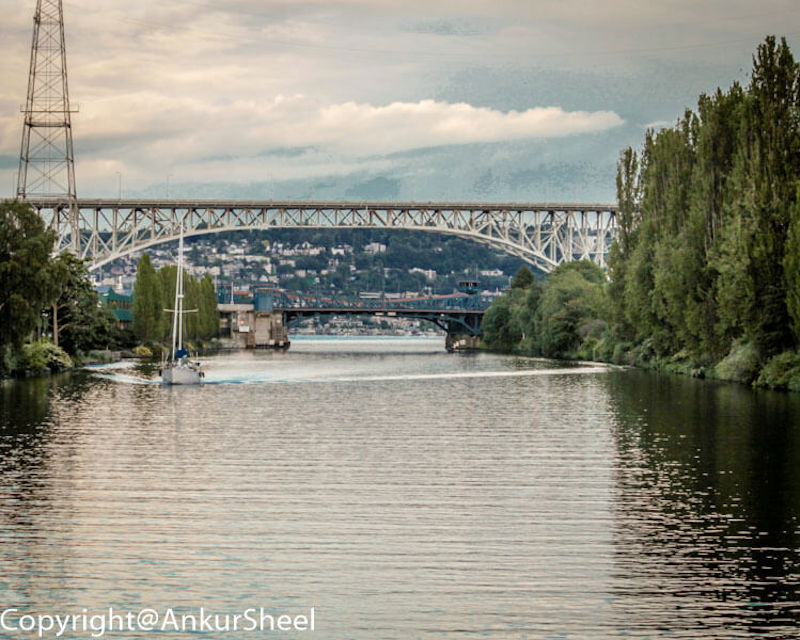

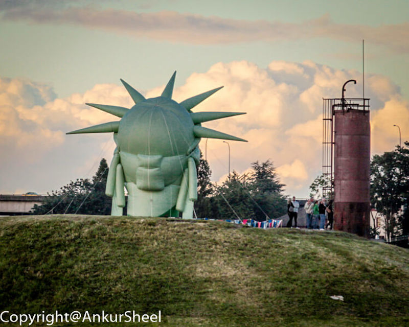

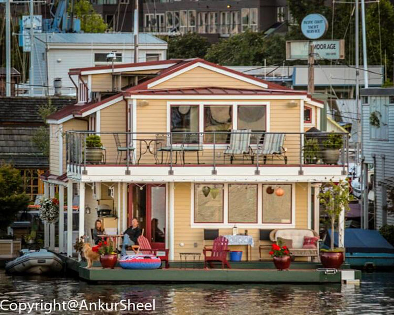

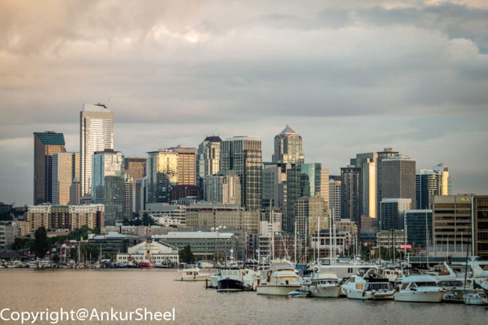

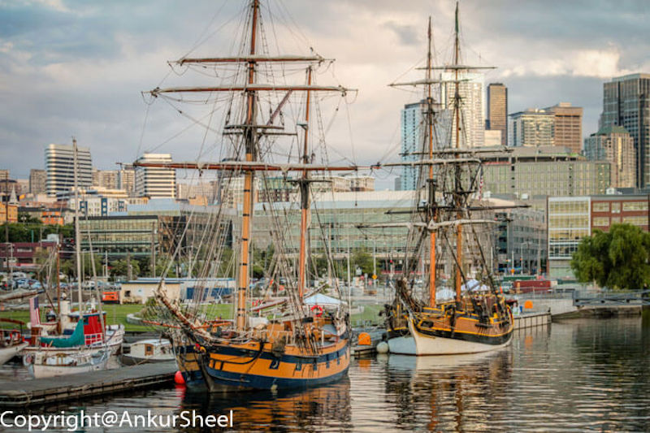
