In the previous part of our journey, we had just left Cable Bay for Cape Reinga.

_In case you are just joining us, you can read the previous post [here](./new-zealand-escapes-northland-part-1)._

Luckily, we were able to make it to Cape Reinga just in time to see the sunset.

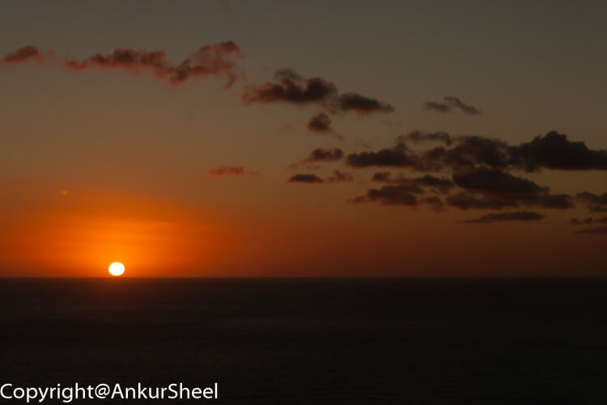

For the Maori people, Cape Reinga is sacred. It's where they believe their recently passed loved ones' spirits depart from. Many Maori make the journey to the top of New Zealand to say goodbye and make their peace.

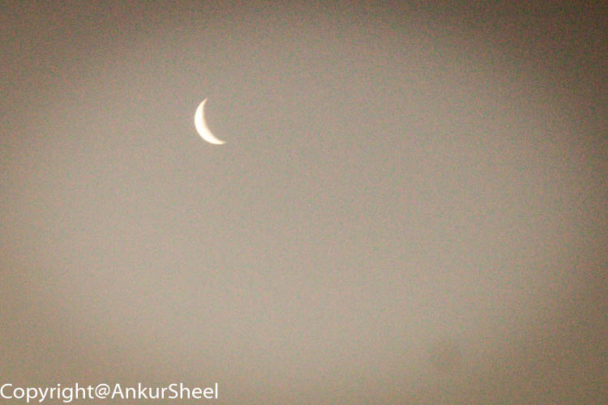

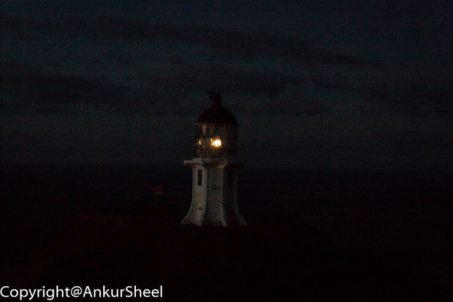

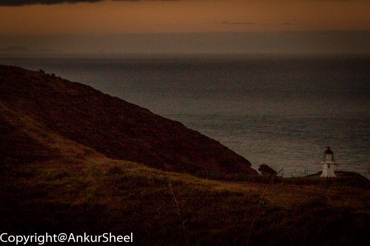

Apart from the views, you can also see how far you are from a bunch of places.

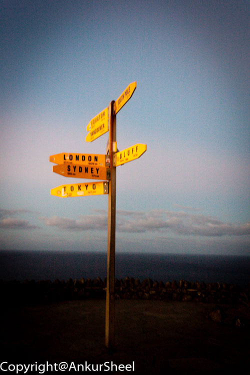

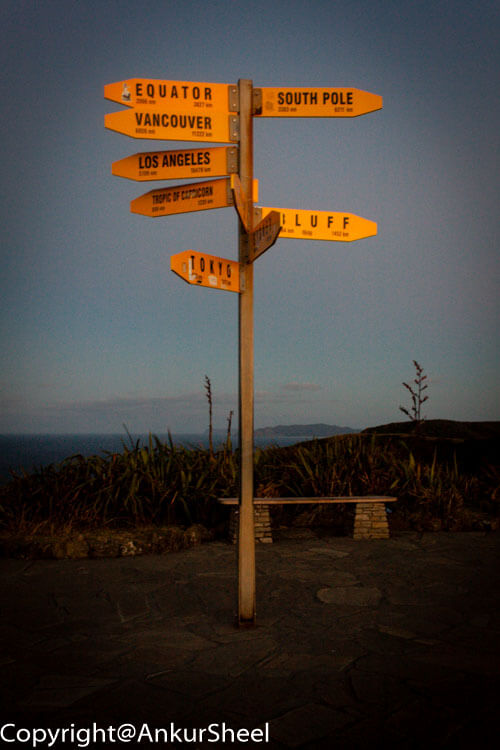

The next day we started on our journey back but before that, we made a quick stop at the 90-mile beach. Despite its name, the 90-mile beach is just 88 kilometres (55 miles) long. This beach is officially a highway but is only suitable for 4WD vehicles.

A special treat is to bodyboard down the dunes. Unfortunately, we did not have enough time to try this out. Maybe next time.

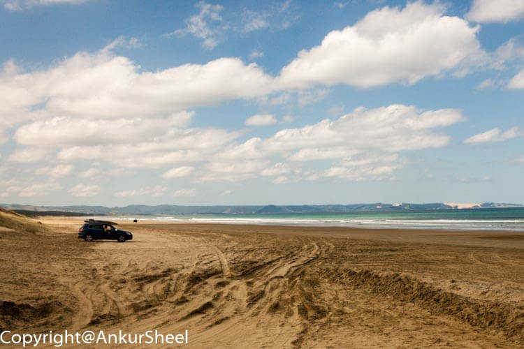

Our last stop before reaching Auckland was KawaKawa or the "_Train town"_ because the Bay of Islands Vintage Railway runs down the middle of its main street.

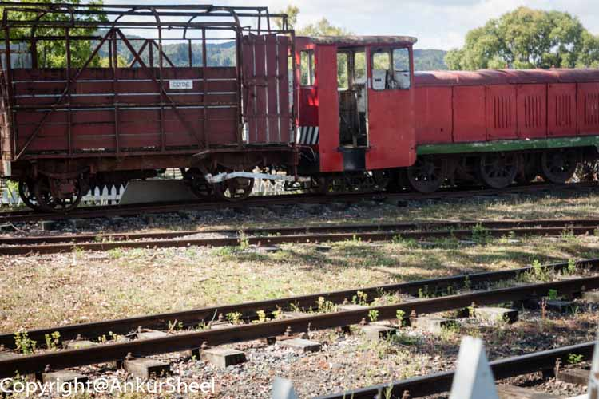

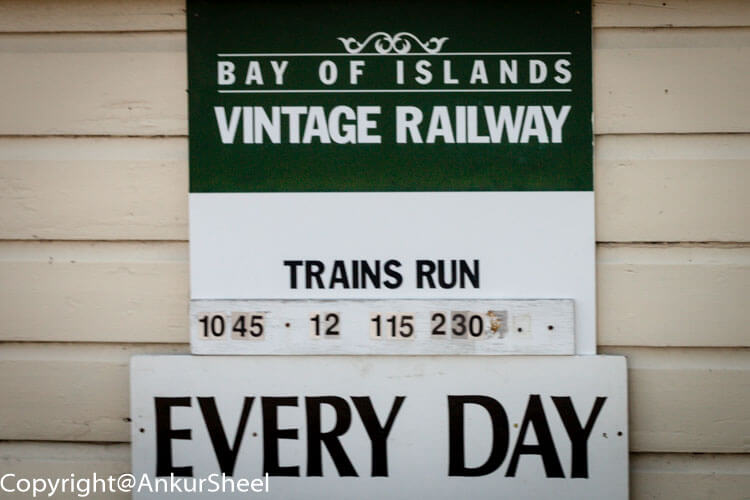

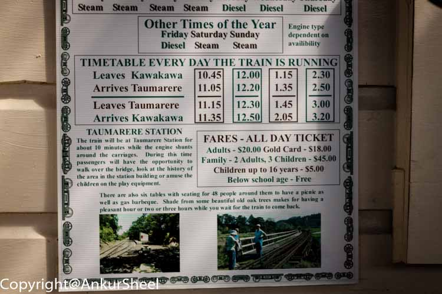

The town is also famous for its Hundertwasser toilet block, designed by Austrian artist Friedensreich Hundertwasser. However, we were unable to understand what the fuss was all about.

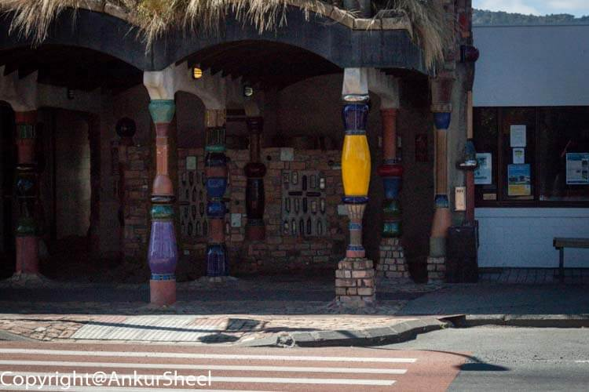

We did appreciate the wall art and finding a nicely decorated couch in the middle of the parking lot.

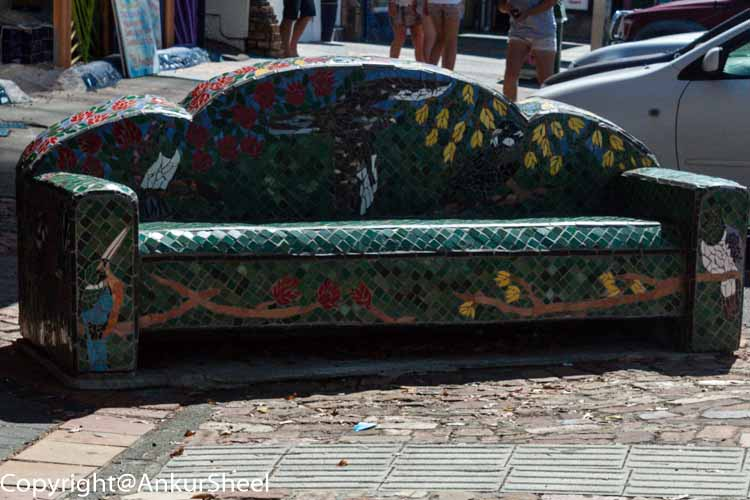

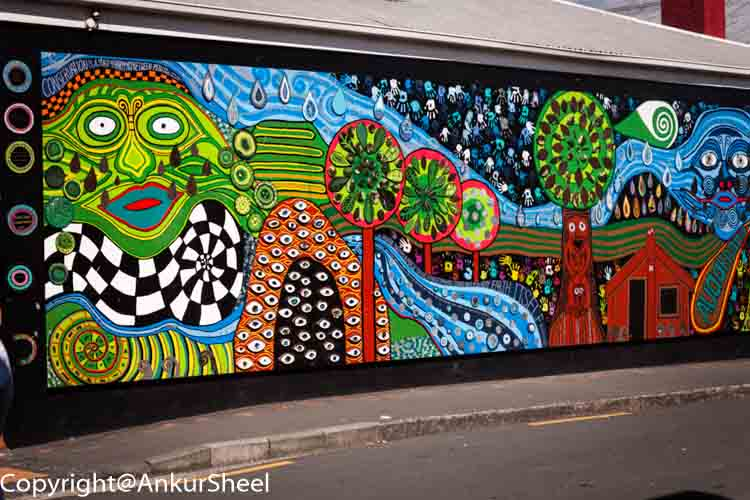

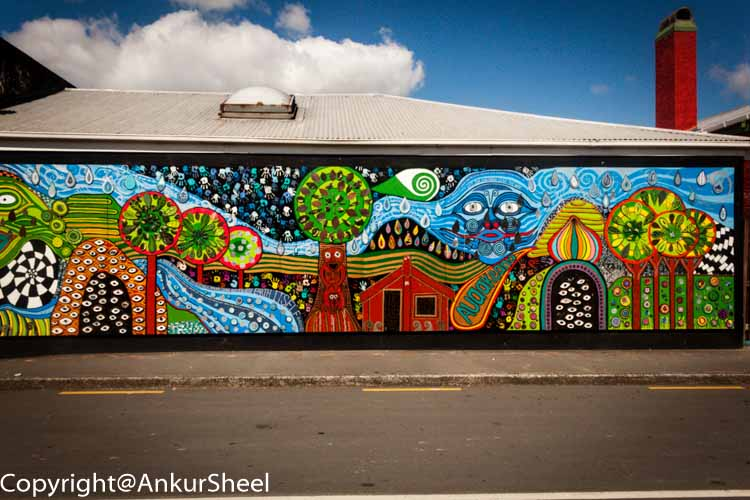

And now we are at the end of our trip - back to Auckland.

Have you been to these places? How was your experience? Did you do anything differently? Let me know.
