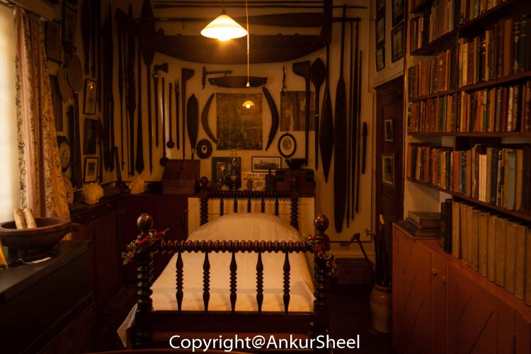
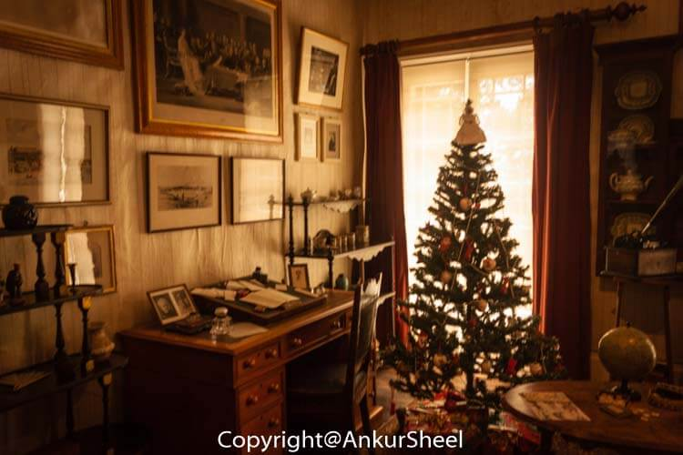
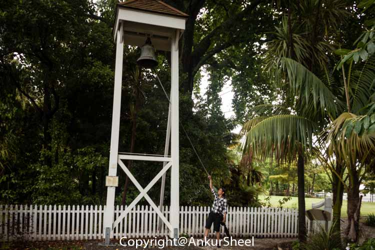
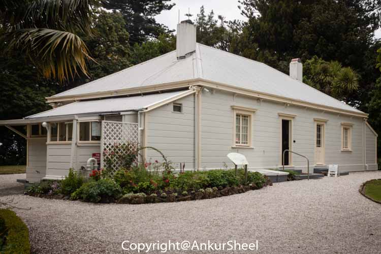
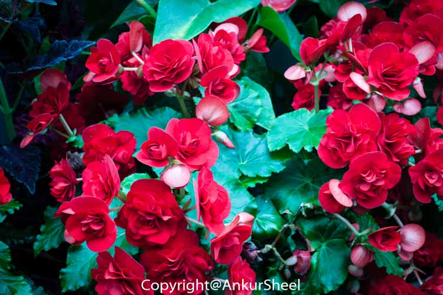

Tauranga is New Zealand's fifth-largest city has been a popular lifestyle location. There are quite a few things to do here over a weekend, including several waterfalls, walks, cruises and watersports.

We start with a 3 km walk to take in a selection of heritage sites. Some of the highlights below

From the Elms Mission house, we reach Robbins Park, which house the 28 bed rose garden, which has recently been nominated as one of the best in New Zealand.

Next was the Marshalls Animal Park. I did not find much to do here. However, it's a nice place to visit if you have kids and want them to get acquainted with farms and wild animals.

Have you been to Tauranga? What all did you do there? Let me know.
