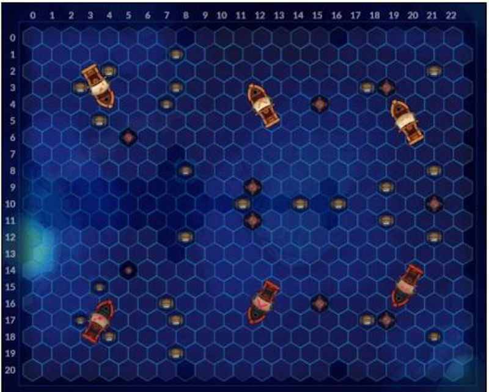

Every couple of weeks, there is a contest hosted by the folks at [codingame.com](http://www.codingame.com). This time around, it was a game based **Pirates of the Caribbean** and was named **Coders of the Caribbean.**

If you just want to look at my statistics for this contest, you can just scroll to the bottom but, then you would miss seeing all the things I did wrong. 😊

## Preamble

For the contest, you were in command of 1-3 pirate ships on a hexagonal grid. The goal was to avoid running out of rum by collecting barrels of rum placed around the map. Like all other codingame contests, the game was turn-based. Each turn consisted of you reading the world state information from stdin and outputting your action to stdout. This would be repeated till one player lost all their ships by running out of rum.

There are multiple leagues:

-   Wood 3
-   Wood 2
-   Wood 1
-   Bronze
-   Silver
-   Gold
-   Legend

To pass each league, you need to beat the boss of that league. Everyone starts from Wood 3, and depending on how good their bot fares, they move to the higher leagues. Also, as you move to the higher leagues, extra rules might apply.

## What Went Right

-   I had already participated in a previous contest at codingame, which gave me a base to start from. For other postmortems click [here](/tags/codingame).
-   Existing Tools
    -   Working with web IDE (especially with C++)is a bit clunky, but on the forums, I found a google chrome plugin that allowed me to sync a local file to the web IDE. This allowed me to work in Visual Studio, which made for a much faster workflow. The plugin can be found [here](https://www.codingame.com/forum/t/codingame-sync-beta/614/65).
    -   I found another tool on the codingame forums that allowed me to test my ide code against other players without submitting my code. The code also allows comparing the ide code with the submitted code. The plugin can be found [here](https://www.codingame.com/forum/t/introducing-cg-spunk/1895).
    -   I already had a setup that allowed me to combine multiple files into a single cpp file which codingame requires.
    -   From earlier contests, I had a python script to help download the game data, parse it and put it into a txt file consumed by my program. This allowed me to step through and debug the AI to see that my AI was failing to win because of some bug instead of just relying on the stderr stream.
-   Using source control to keep track of the AI. I cannot even stress how helpful it was to go back a version or two because the new logic was performing even worse than a few iterations before. This was especially true when I tried to add support for avoiding mines.
-   I spent the first day setting up the framework for the game. This included classes to encapsulate the Ships, Barrels etc. This allowed me to work in isolated areas and easily remove pieces of code that were not improving the AI.
-   Continuous refactoring enabled me to keep my code readable and isolated the areas I had to work on.
-   I added unit tests in a few places, which gave me some peace of mind that my code was doing what I expected.

## What Went Wrong

-   Being in New Zealand for the contest from a time zone perspective sucks. The contest starts and ends when you are sleeping.
-   I did not get to spend as much time as I would have liked on this. With work and other personal commitments, I could only spend a few hours on the problem.
-   I wasted a lot of time trying to get the hexagonal grid working.
-   Even after getting the grid to work, I was unable to fine-tune the movements of my ships.
-   I was stuck on Wood 2 for a very long time. Most of the approaches I tried were not good enough to beat the boss.
-   When I added mines, my AI became significantly worse. I think this was because I could not get the movement right.
-   I was unable to reach the Gold league.

## What would I do differently

-   Try to simulate the game so that I can test everything locally before submitting my code and also be able to use more complex AI techniques.
-   Port the referee code over to C++ so that I have a working simulation.

## Other Notes

-   This was a fun contest, although with a very steep learning curve. Hexagonal grids are not easy to implement. [Amit's page on hexagonal grids](http://www.redblobgames.com/grids/hexagons/) is a gold mine of information and implementation and really helped with understanding the concepts.
-   It would be great if, once the contest has ended, links could be provided to tutorials for the various AI techniques that were successful.

## Rankings

**League**: Silver

**Global Rank**: 808/3623 (22%)

**New Zealand**: 6/15

**India**: 5/47

Feel free to follow me at codingame using this [URL](https://www.codingame.com/servlet/urlinvite?u=1506970).
