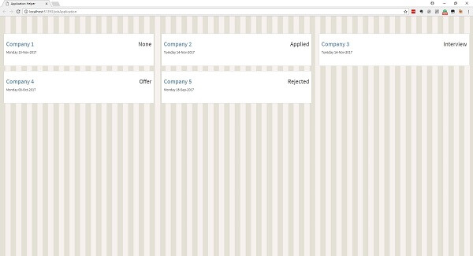

You can see all the related updates [here](/tags/jah)

As promised in the [previous post](./new-side-project-jah/), this is the project's current status.

-   v 0.0.0

    -   Setting up a project structure for the separation of concerns and to enable unit and integration testing.
    -   Added a test hello controller for web and API projects to append "Hello" to the passed-in string.
    -   Decoupled web host from the application.
    -   created initial database migration.
    -   added web and API endpoints to get a list of job applications.

-   v 0.0.1

    -   Added an HTML view to display all the job applications

-   v 0.0.2
    -   Automatically initialize the database with temp data if its empty

This is how the webpage looks currently.

## Next up

Adding the ability to add new applications.
