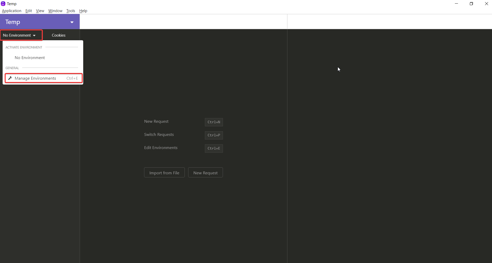
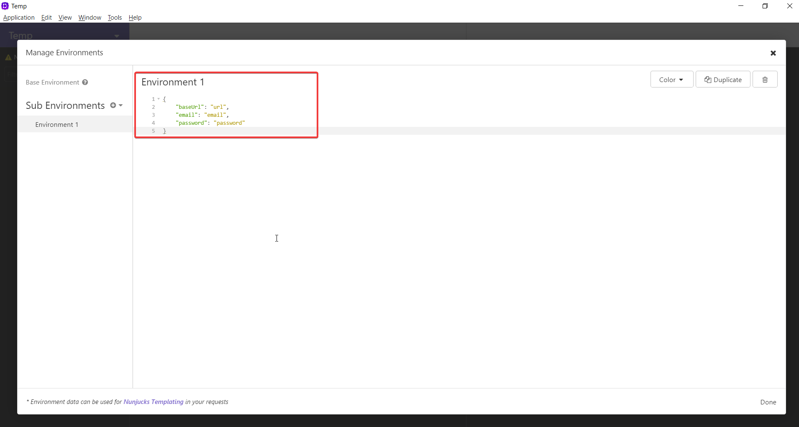
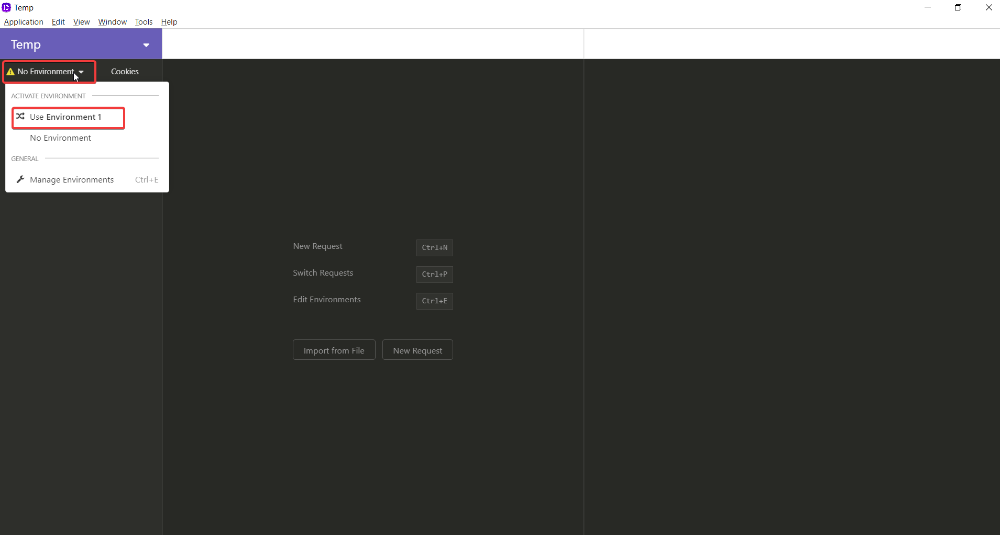
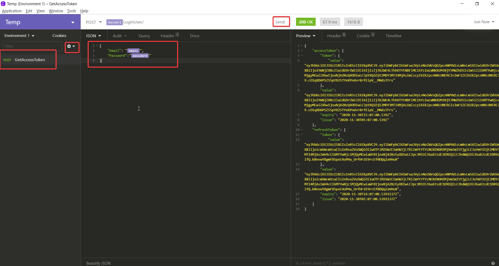
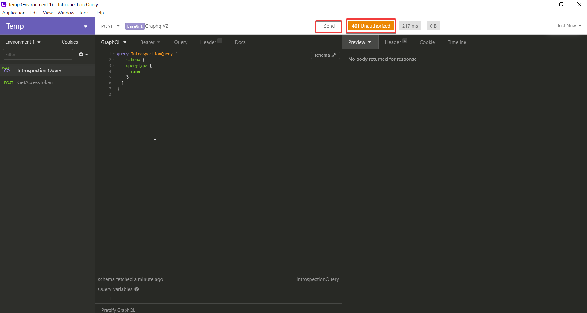
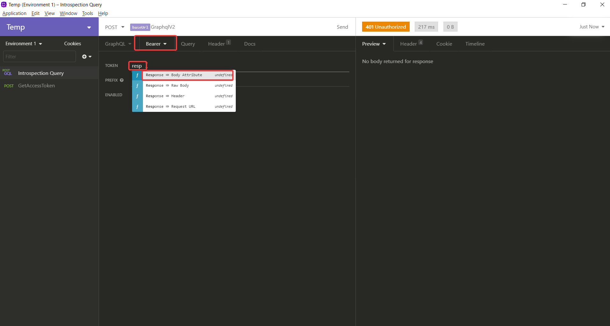
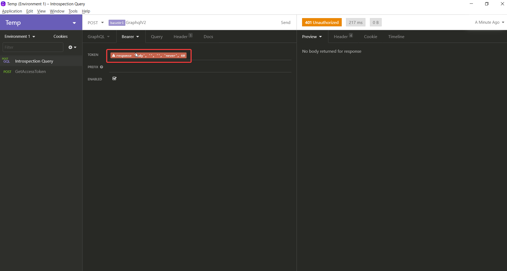
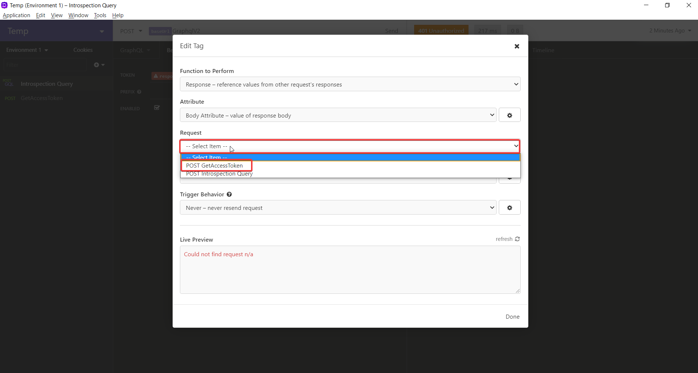
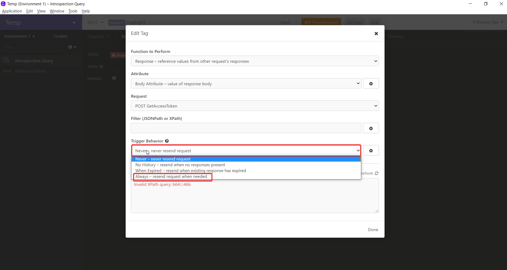
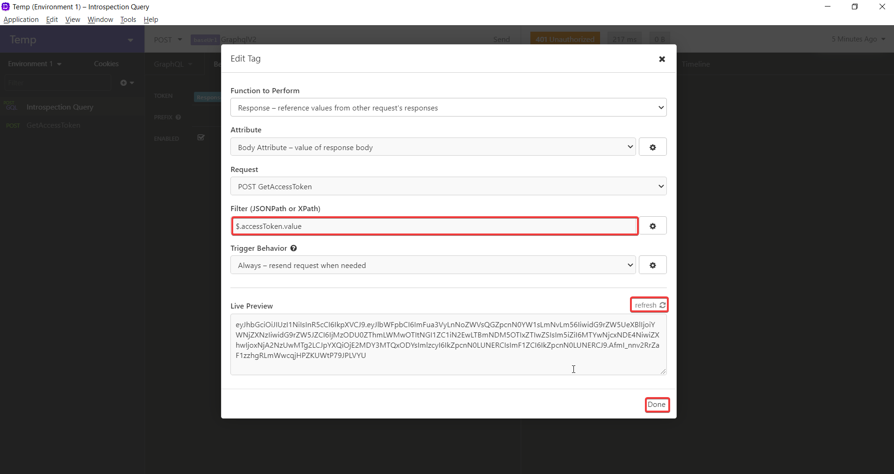

## Problem

The Graphql endpoint for the API is accessible only to authorised users. Although it is required from a security perspective, it makes testing the API through [Insomnia](https://insomnia.rest/) a little tedious. What if we could automatically insert the bearer token every time we made a request using Insomnia?

## Solution

Let's start by creating a new environment. Although not entirely necessary, it makes authenticating in different environments easy. _Note: You can give the environment better names such as Dev, Staging, Production etc._

Now, let's add some environment variables specific to that environment.

-   baseUrl: The base URL for all the endpoints
-   email: The email used to login
-   password: The password used to login

Let's make Insomnia use the environment.

Assuming that the endpoint to get the access token is `LoginUser`, add a new post request called `GetAccessToken`.

_Remember the environment variables from earlier. We can use them so that no matter what environment we are in, everything will just work._

Let's add a new Graphql query and try to send the request. We get a **401 Unauthorised** error because we haven't passed in the bearer token.

To set the bearer token, we can click on the **Bearer** tab and enter _Response ⇒ Body Attribute_ for the token.

To edit the tag, click on it.

In the **Edit Tag** screen, select _Post GetAccessToken_ for the request.

Set the trigger behaviour to **Always** so that the request is made every time and you get a new token

For the filter, enter `$.accessToken.value`. The value will be dependent on the response that you get from _GetAccessToken_. If you have set it up correctly, you should see a token in **Live Preview**.

If you try to resend the request, you should get back a **200 OK** response.

## Conclusion

We can quickly test our API using Insomnia by automatically generating access tokens every time we make a Graphql request.
