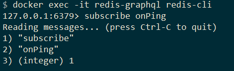
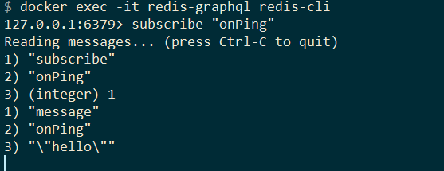

GraphQL offers us real-time capabilities to notify us when a specific event happens.

In this tutorial, we will add subscriptions to our graphql server. We will create an `onPing` event that will send notifications whenever we ping the server with an input string.

We will also use Redis that runs in a docker container, and see how we can listen to the events in a Redis command shell.

## Running Redis using docker

```bash
docker run -d --name=redis-graphql -p 6379:6379 redis:6.0-alpine
```

## Adding a Subscription

We will add a new class Subscription which will have our `onPing` event.

```csharp
public class Subscription : ObjectType
{
    protected override void Configure(IObjectTypeDescriptor descriptor)
    {
        descriptor.Field("onPing")
            .Type<NonNullType<StringType>>()
            .Resolve(ctx => ctx.GetEventMessage<string>())
            .Subscribe(async ctx => await ctx.Service<ITopicEventReceiver>().SubscribeAsync<string, string>("onPing", ctx.RequestAborted));
    }
}
```

-   **_Line 5_**: The topic for the subscription.
-   **_Line 7_**: Gets the message payload.
-   **_Line 8_**: Subscribes to the pub/sub system

To use subscriptions, we need to add the WebSockets middleware to our request pipeline.

```csharp
// Startup.cs
public void Configure(IApplicationBuilder app, IWebHostEnvironment env)
{
    app.UseWebSockets();
}
```

_Note: Middleware order is important with .NET Core, so this middleware needs to come before the GraphQL middleware._

Next, We need to register our subscriptions and set up the Redis subscription provider in the Startup class.

```csharp
public void ConfigureServices(IServiceCollection services)
{
    var options = new ConfigurationOptions
    {
        EndPoints = { "localhost:6379" },
    };

    services.AddGraphQLServer()
            .AddSubscriptionType<Subscription>();
            .AddRedisSubscriptions(_ => ConnectionMultiplexer.Connect(options));
}
```

_Note: Redis is on port 6379 by default._

## Publishing the event

Our mutation needs to use `ITopicEventSender` to send messages to the underlying pub/sub system.

```csharp
public class Mutation : ObjectType
{
    protected override void Configure(IObjectTypeDescriptor descriptor)
    {
        descriptor.Field("ping")
            .Type<NonNullType<StringType>>()
            .Argument("payload", des => des.Type<NonNullType<StringType>>())
            .Resolve(
                async ctx =>
                {
                    var input = ctx.ArgumentValue<string>("payload");

                    await ctx.Service<ITopicEventSender>().SendAsync("onPing", input);
                    return input;
                });
    }
}
```

-   **_Line 13:_**: "onPing" is the topic we want to publish, and _input_ is our payload.

## Testing

We can start an Interactive Shell for the Redis Docker Container.

```bash
docker exec -it redis-graphql redis-cli
```

Next, we can subscribe to the _onPing_ channel using the subscribe command.

```bash
subscribe onPing
```



In Insomnia (or your IDE of choice), add the following mutation.

```graphql
mutation {
    ping(payload: "hello")
}
```

On execution, we should see the following responses.


In the shell, we can see the event on Redis.



## Demo Project

There is a [demo project](https://github.com/AnkurSheel/HotChocolateSubscriptions) you can check out over on GitHub.
