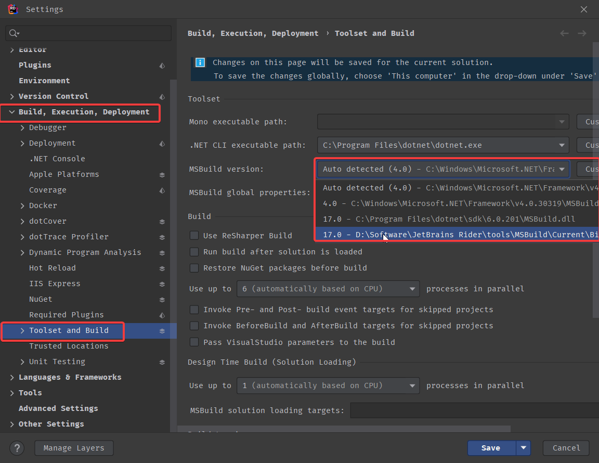

## Problem

On building a project created with Unity 2021.3 in Rider, you get a language version error which looks similar to

```
Invalid option '9.0' for /langversion; must be ISO-1, ISO-2, 3, 4, 5 or Default
```

However, you don't see any errors when building inside the unity editor.

## Solution

This is because the API Compatability level in Unity is set to **_.NET Standard 2.1_**. This, in turn, sets the LangVersion property in the csproj to **_9.0_**.

But, Rider puts the MSBuild version to .NET Framework 4.

The solution is to change the MSBuild version (in Rider) from Auto Detected to the embedded JetBrains path.



Remember to save it to the team-shared layer.

## Conclusion

We can eliminate the language error by updating the project's MSBuild version Rider uses.
