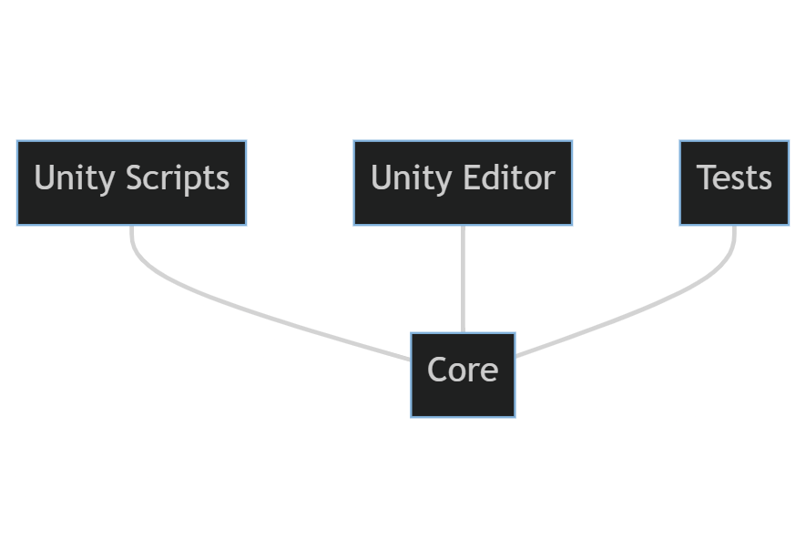

When we create a project in Unity, Unity groups all the scripts into a single Assembly predefined by **_Unity_** as _Assembly-CSharp.dll_. This allows all of our scripts to have direct access to each other, which makes prototyping and implementation of functionality in Unity very easy.

However, by making parts of our code entirely dependent on each other, we risk creating spaghetti code, especially as the project grows.

To remove this risk of falling into a big bowl of spaghetti code, we need to remove the mono behaviours from the program logic. We can achieve this by creating our own Assembly definitions and references.

## Splitting into assemblies

In my unity projects, I have a **Core** assembly which contains all the program logic. The classes in this assembly do not inherit from `Monobehaviour` or `ScriptableObject`. This is where the meat of the code lives.

3 other assemblies depend on Core

- **Scripts** contains all the mono behaviours and scriptable objects. The classes expose the properties that a designer might want to edit. They pass those values to the appropriate functions in **Core**
- **Editor** contains all our custom inspectors and Editors. It only supports the Editor platform
- **Tests** contains all our tests. Since the **Scripts** and **Editor** do not contain any logic, we can write unit tests against the classes in **Core** and make sure they are modular.

Besides making our code more organized and testable, splitting our code into assembly definitions helps compile times. With a single assembly definition, every time we make a change to any script, Unity has to compile every single script. By moving our code into assemblies, Unity only has to recompile the scripts that are only inside that **_Assembly_**.

As each assembly becomes more extensive, I split it into smaller assemblies.

## Conclusion

Unity, by default, puts all the scripts in a single assembly. This might be fine for small projects. But, by putting in a little effort and splitting our code into multiple assemblies, we can make our code more organized and testable. 
