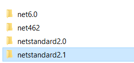

NuGet is indispensable for working in .NET. Unfortunately, it takes a bit of work to get it working with Unity.

Unity only recognizes DLLs placed under the _Assets_ folder, so we need a way to get the DLLs into the Assets folder. We cannot add the Nuget packages to the project files as we would for other .NET projects because Unity generates the sln and project files. This means that any NuGet packages that we have installed using the IDE will get wiped out by Unity.

There is an [older guide](https://www.what-could-possibly-go-wrong.com/unity-and-nuget/) that I found, which helped me figure out how to add NuGet packages into Unity. But, it had many steps that were irrelevant to Unity 2021.

As an example, we will look at installing Installing _Microsoft.Extensions.DependencyInjection_ into an assembly definition.

## Step 1: Install Nuget Package

Select the  _Manage NuGet Packages for Solution_ in your IDE.

Search and install the _Microsoft.Extensions.DependencyInjection_ package

This will do a few things.

1. Create an `app.config` file. This file can be deleted.
2. Create a packages.config file. This file can be committed
3. Download the Nuget package and its dependencies to the `$(Solutiondir)/packages` folder. This folder should be added to .gitignore

## Step 2: Make the DLL available to Unity

In the _packages\Microsoft.Extensions.DependencyInjection.6.0.0/lib_ folder, you might see folders for different targets.

Copy the DLL from the _netstandard2.1_ folder into the _Assets/Plugin/DI_ folder. Remember how Unity needs DLLs to be inside the Assets folder. I prefer to put the DLL into nested folders under _Assets_, so it's easier to manage multiple DLLs.

## Step 3:  Turn off  Auto reference

By default, all predefined assemblies and assembly definitions can automatically reference the DLL. In most cases, we want a DLL to be exposed only to specific assembly definitions.

Turn off Auto reference in the import settings for the DLL and click Apply.

## Step 4: Add the DLL as a reference to the assembly definition

Select override references in the assemblies that need this package and add the DLLs to the assembly references.

## TroubleShooting

### Error: Unloading broken assembly Assets/Plugins/DI/Microsoft.Extensions.DependencyInjection.dll, this assembly can cause crashes in the runtime

Copy the DLL from _packages\Microsoft.Extensions.DependencyInjection.Abstractions.6.0.0\lib\netstandard2.1_ to the _Assets/Plugin/DI_ folder. It is because Unity needs the _Microsoft.Extensions.DependencyInjection.Abstractions.dll_.

## Bonus: Installing _Moq_ into an assembly definition for Tests

Repeat the steps for Moq and make the appropriate changes

After Unity recompiling, you will see an error in the unity console.

To fix this, copy the Castle.Core.dll from the packages folder and put it in the same folder as Moq.dll.

## Conclusion

NuGet allows us to install useful DLLs. I have shown how you can install NuGet packages into Unity 2021.

## References

- [Configuring plugins in Unity](https://docs.unity3d.com/Manual/PluginInspector.html)
