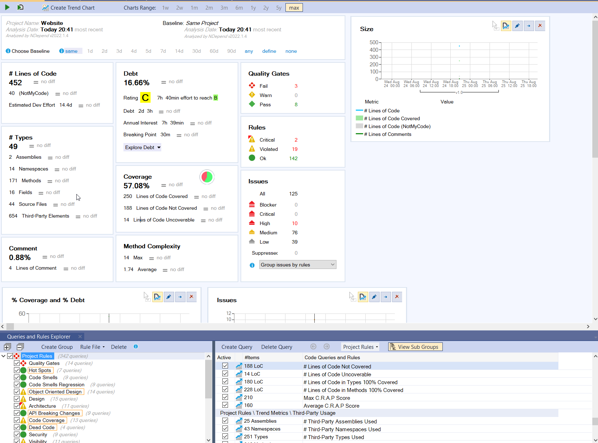
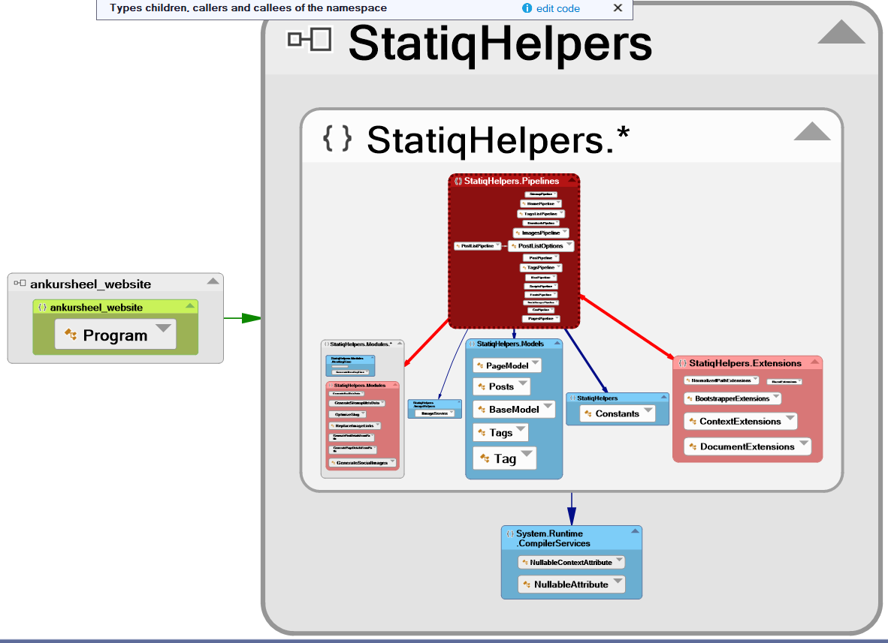
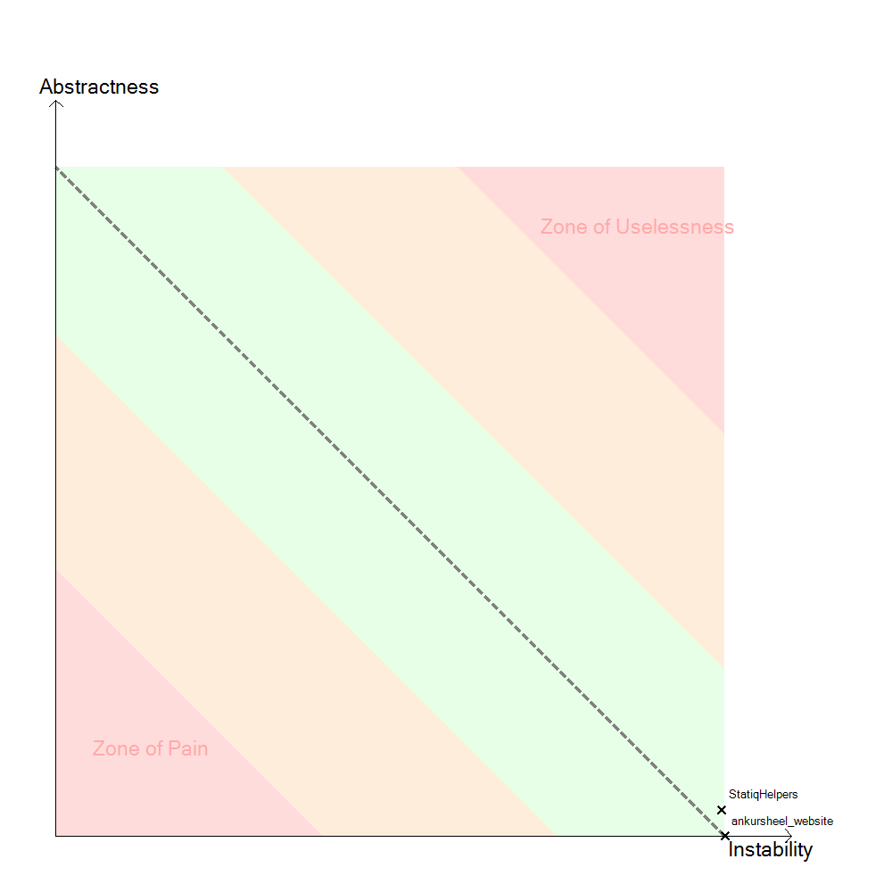
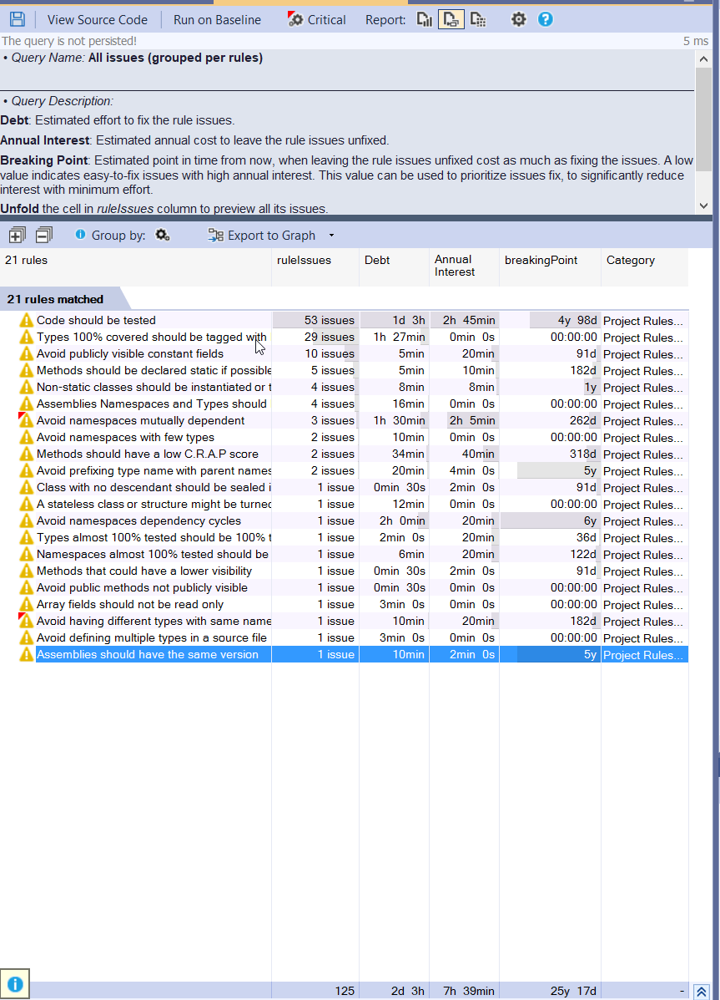
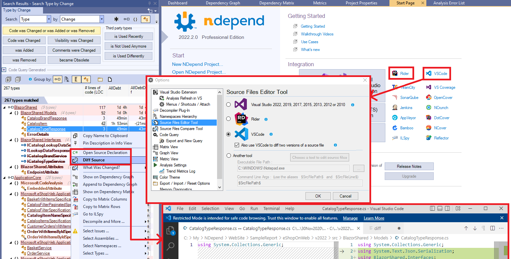

[NDepend](http://www.NDepend.com) is a static code analyser for .Net developers. It is billed as a "Swiss Army knife for developers" on its feature page, and I agree it comes with a chockful of features.

_Disclaimer: I was given a year-long license to evaluate NDepend by Patrick Smacchia, the creator and lead dev. I agreed to write an article on the condition that the article would be an honest opinion of the software._

But is it worth adding to your tool belt? Let's find out.

## Impressions

The installation process is a little clunky. I downloaded a zip file and had to extract the contents into a folder. I received the license file in a separate email and was able to register the product with a single command.

### Installation and Getting Started

You can use NDepend as a Visual Studio extension or a standalone application. Since I use Rider as my IDE and there is no support for Rider (yet), I used the standalone application. This makes it harder to integrate into your daily workflow as it's not integrated with the IDE.

It's pretty easy to get started. You pick a solution to analyse and let NDepend do its thing. Once the analysis is completed, it will generate a summary report and populate the different views in the application. The HTML reports are more accessible, but the application's views are more interactive.

### Dashboard

NDepend gives an incredibly informative overview of the application in a dashboard containing key metrics, rule violations and the evolution over time of some metrics. To see coverage results, you can provide a directory with the coverage file, and NDepend will find it automatically.

### Dependency Graph View

The dependency graph view is exceptionally detailed. Besides providing a simple-to-read view of the dependencies in your project and .Net assemblies, it's interactive. It lets you drill down to the method and field. The graph is coloured, which makes it easy to see what is happening. The searching capabilities are great as well.

You also get a related view with a table-based dependency matrix, but I found it hard to understand and use.

### Abstractness vs Instability

NDepend also creates an interesting graph which plots Abstractness vs Instability. It can indicate which assemblies are painful to use because they are used by many other types but lack abstractness. An assembly is painful to use if it is used by many different types but lacks abstractness. An assembly is useless if it has a lot of abstractions but is used by no one. I can see this being useful on larger projects to find non-modular and over-engineered code.

### Baseline and Trend Metrics

One feature I am excited to use is Trend Metrics. Trend metrics, in theory, allow you to compare the code evolution over time. It will do this by plotting standard and custom metrics over time.

By setting a baseline, you can detect if you are introducing debt or reducing it. It will show the new/fixed issues etc., since the last baseline. You can also set the baseline for the comparison, so it does not have to be the 1st time you ran the analysis on your project.

### Rules

NDepend has a lot of default rules(which can be edited) used to analyse the project. Each rule has a description that helps you understand why you should fix it and how to fix it. However, it can't fix your code automatically, which is a shame because some of the rules, especially around naming, feel as if they could be handled by the tool.

I found the default ruleset to be a little too generalised. The 1st time you run the tool, chances are you will get a lot of warnings to the point of it being overwhelming. In the screenshot above, you can see that even for a small project like this website, it detected 125 issues. Although, the tool does indicate that only 10 of them are high severity and the rest are medium or low severity. Once you have a baseline, you can see how many new issues were introduced (on a subsequent analysis). You can then fix just the latest issues, which should be much easier to handle.

You can manually disable the rule to match your coding style. Alternatively, you can suppress an issue by using an attribute. I am not a big fan of littering my code with "suppress " attributes, so being able to do that using a global suppression file was a pleasant surprise. However, I stumbled on it by chance as it was hidden in a context menu and not shown as part of the message.

You can also navigate from rule violations to your code. This felt a little inconsistent in that sometimes it took me to the line causing the breach of the rule, but other times it took me to the top of the file. Sometimes it just errored out, and I had to manually go to the file.

It also kept trying to open Visual Studio for me. I was eventually able to configure it to open Rider. It would have been nice if it had asked me to select my IDE of choice on startup.

_I sent an early draft of this article to Patrick, who, after reading this suggestion, implemented it within a few days. It will be available in version 2022.2, to be released next month. Here is a sneak peek just for you._ :)

Even though it has its quirks, this feature is powerful because you can add custom rules. It uses a variation of LINQ called CQLinq(Code Query over LINQ), which should be easy for a C# developer to pick up.

### Misc

I quite liked that everything is customisable. If you want to, you can precisely define heuristics for your organisation which is a shortcoming in many tools. You can also share your rules & settings across your NDepend projects with rule files.

I found the learning curve for NDepend quite steep. The UI is a bit confusing and cluttered - it requires significant amounts of screen space to work comfortably. However, almost everything has a tooltip, and the documentation on the website is top-notch.

## Final Thoughts

NDepend is a great product, and it's fast, a must for a tool you expect to use regularly.

Like with any similar tool, it's easy to fall into the trap of getting the perfect metrics. We need to be careful - after all, is there any point in refactoring a method rarely touched when you could be shipping more valuable features?

Although it's a powerful analysis tool, I am not sure how valuable it is for smaller teams and projects. The licensing cost is a decent chunk of change.

After using NDepend for a few weeks, I am using the Dependency Graph and Rules Explorer the most. A Lite/Community version with just these features and a lower price point would be helpful for smaller projects/teams. I would have also preferred a per-user licensing model rather than a per-machine license to be able to install it on both my desktop and laptop.

However, if you work in a larger organisation with a fair amount of legacy code and struggle to get your tech debt in control. In that case, this just might be the right tool for you. The graphs and metrics can probably help make a business case for upper management to invest in improving code quality. Almost everything is customisable, so you can update the values and thresholds to what makes sense for your business.

You can get a free trial from the [NDepend download page](https://www.ndepend.com/download).
