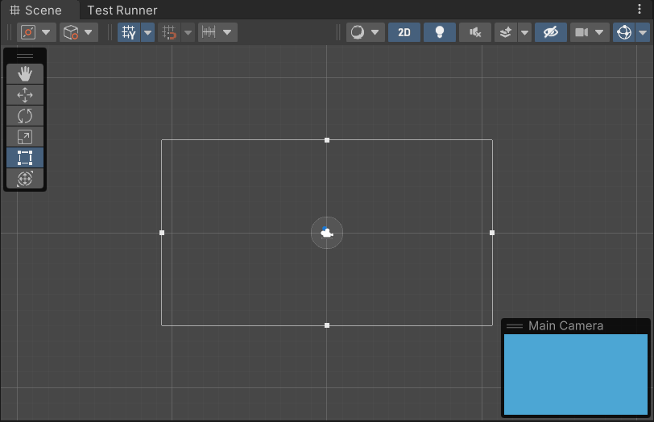
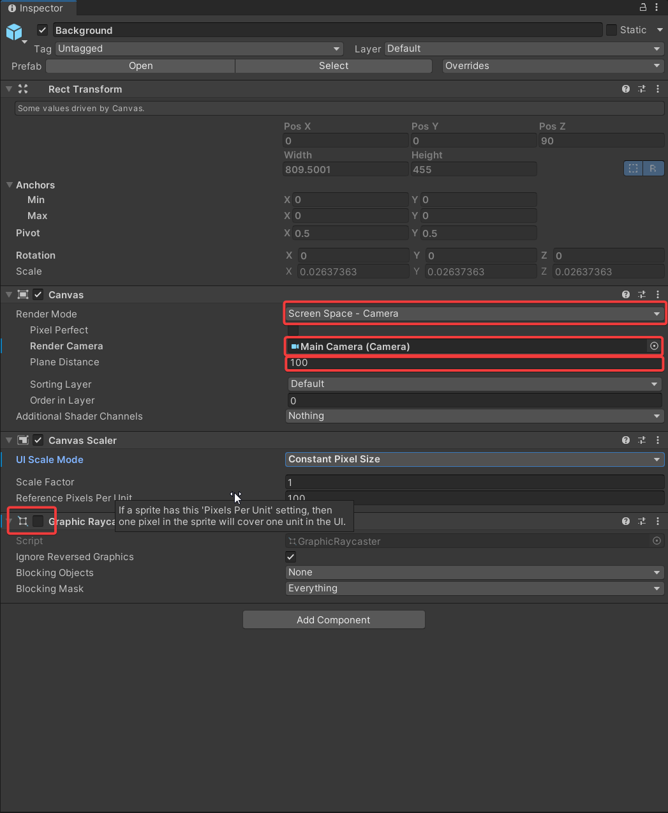
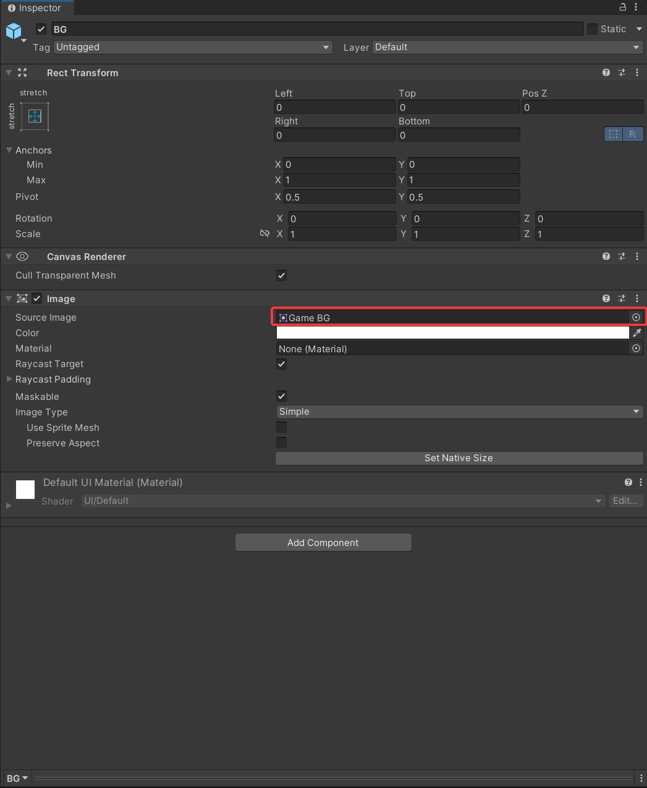
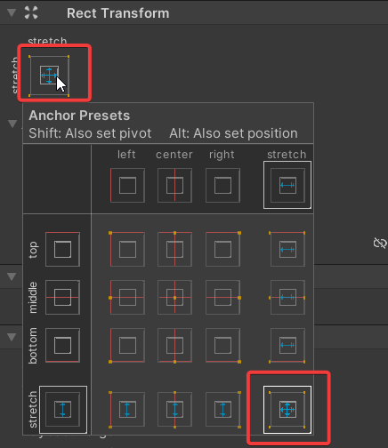
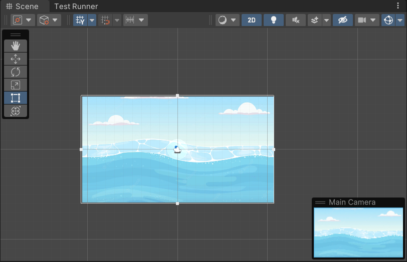

The camera in Unity allows the setting of the background as a solid colour but not as an image. The camera is currently rendering the image below.

Let's look at how we can set it up to render a background image instead of a plain colour.

## Adding a Canvas

1. Start by creating a new canvas.
2. Update the properties
    1. Update **Render Mode** to `Screen Space - Camera`:
        - `Screen Space - Overlay` should be used only for the foreground UI. It renders the canvas on top of everything else, including the camera view.
        - `Screen Space - Camera` will render the canvas on a plane object in front of the camera. It will also automatically rescale to fit the view.
    2. Set the **Render Camera**
        - Drag and drop the camera from the scene.
    3. Update **Plane Distance** (if needed):
        - **Plane Distance** is used to set the z-position for the canvas. You can increase it if some scene objects are hidden behind it.
    4. Remove/Disable the **Graphics Raycaster**
        - Disabling the **Graphics Raycaster** makes the canvas non-interactive, i.e. it will not capture clicks etc.

## Add the background image

1. Create an **Image** inside of the canvas.
2. Set the **Source Image** to the background sprite.

3. Stretch your image to fill the (canvas) container.

- You can do this by clicking the grey square in the **Rect Transform**. In the window that opens, hold down **Alt** and click the most **bottom-right** square.

## Conclusion

Now the image will show as the background.

