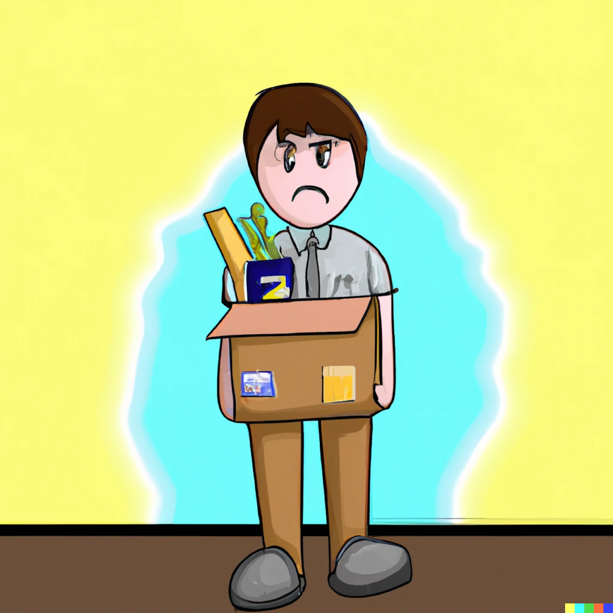

_**I initially started writing to process my feelings about getting laid off. When I wrote this, I didn't know if I would ever publish it.
I was inspired to clean it up and post it after reading [The Future of Quality at Instrument was 35 Days Long](https://angelariggs.github.io/articles/thirty-five-days). More importantly, some of my friends have been laid off recently, and after chatting with them, I thought this could be helpful to others. And enough time has passed that I am comfortable publishing this, even though there might still be repercussions.**_

Unfortunately, getting laid off can feel like a personal badge of failure. You might see an open-to-work badge on LinkedIn or hear about the new job someone is starting, but no one talks about their feelings after getting laid off.

Having gone through this multiple times (for different reasons), I can say it's been traumatic every time. Every time I felt like I was the only one struggling when I should be able to move on like the others. And to be honest, that's the face I showed in public every time.

Given the current climate, I would like this post to normalise discussing layoffs and hopefully make people feel less alone.

## Thoughts about the given reason for laying me off

The official reason for disestablishing my role was that the company had too many backend engineers. I was "too senior" (whatever that means) and hence expensive to keep on. By letting me go, they could save more jobs.

Although this reasoning might have a grain of truth, it doesn't make sense to me.

- The engineering team retained multiple (backend) engineers who were more senior to me.
- They also retained others with different titles who were supposed to be getting the same compensation as me.

It was also not a problem with my work ethic or performance, given that I had met with my lead to discuss the upcoming performance review, and no concerns were raised.

If the company wanted to keep me on, they could have allowed me to work in an area where they needed more engineers. I have on multiple occasions shown that I can pick up new technologies relatively fast, so it would have been low risk. They could also have asked me(or others) to work reduced hours. 

I had written a lot of the backend code. I also had a lot of historical context about some engineering decisions in the Product and Engineering team, so I could have easily continued to provide value.

_Now that I have the benefit of looking back from the future, this reasoning makes even less sense to me because_

- _Less than a month after the layoffs, I saw posts on LinkedIn about some people getting promoted._
- _Around 3 months after the layoffs, I saw posts on LinkedIn hiring for multiple roles, including engineers and some others getting promoted._

## What I think was the actual reason

> It was the easiest way to silence what I think they saw as disruptive dissent

Like other startups I have been a part of, I joined this one early in the company's life before the founders built the leadership team. From the beginning, I openly raised things I disagreed with or thought could be better.

I feel that as the company grew, leadership became increasingly uncomfortable with my standing up for my principles. It's possible that advocating for pay transparency and disagreeing with mandatory in-office days, etc., is what put the final nail in the coffin.

Leadership might have been threatened by my discussions in internal forums around things I felt were incorrect, as they probably felt called out.

## What would I change about my layoff experience

There is no good time to announce layoffs, but doing so just before mid-year reviews was not great. I was also a few weeks away from vesting another 25% of my ESOPs, which worsened the timing.

_In hindsight, the saving grace with the timing was that it was before Big Tech started doing layoffs and other companies started putting a hiring freeze in place._

I was surprised that the company continued hiring and did not explore an across-the-board reduction in pay or voluntary (temporary) quitting, like the last time they were in a similar situation.

I wish, in this regard, they had been more like Apple (who, at the time of publishing) have not resorted to layoffs because [they did not overhire](https://blog.pragmaticengineer.com/apple-job-cuts-tide/). Moreover, [CEO Tim Cook took a pay cut of 40%](https://www.bbc.com/news/business-64258289) to help weather the economic climate.

### Relationships with co-workers

> While you don't have to be everything to everyone in your network, it's human decency 101 to reach out to those you spent 40 hours a week with
> 
> ""Scarlett McCarthy""

This one hurt the most.

It is ironic that when you quit of your own accord, you get a going away present, a card filled with thoughts on how you will be missed and maybe a speech or two extolling your value. You get an exit interview and a place to share your thoughts. Your wins are celebrated.

But in the case of layoffs, all of that vanishes, and you feel like a social pariah.

> Just because it's uncomfortable to have doesn't mean you should avoid it

Some colleagues I thought would reach out didn't. On the flip side, some people I didn't expect reached out. I want to believe that it's not because the relationship did not matter but because it makes for an awkward conversation.

I wish some more of my colleagues had asked how I was doing and if I wanted to catch up. Even some messages that made me feel I had a beneficial impact on them and that I could take with me for the future would have been appreciated and made the experience less painful.

## Light at the end of the tunnel

Everything worked out for me in the end.

I got a month of severance. I also had many annual leaves left over, which got paid out. After I raised my concerns with the founders, they also vested the options I was supposed to receive (that year).

I landed a job almost immediately but took a month to unwind before starting the new position. _Previously, the time for getting a new job has varied from 1 to 6 months, so this was a pleasant surprise._

Nearly all the companies I had worked with previously reached out to see if I wanted to come back, which signals that I was doing something right when I was there. I had also been [interviewing when I didn't need a job](https://www.ankursheel.com/blog/interview-happy-job), so I could reinitiate talks with some of those companies.

## Some Unsolicited Advice

- Have a layoff fund, so you have some runway and can ensure the next job is not just a rebound.
- Every couple of months, update your resume, so you are not scrambling to remember what you did in case of an unplanned exit.
- [Keep interviewing even if you are happy in your job](https://www.ankursheel.com/blog/interview-happy-job) and keep a list of interesting companies. Ask and connect with the interviewers (you resonated with) on LinkedIn.
- Take some me-time. Give yourself time to process your feelings. This is one of the few times in your life when you get to be alone with your thoughts and can truly unwind. Every time I was laid off, it was a coincidence that I was about to go on a holiday. This enabled me to take a step back and recharge before taking a new job.
- A job search is a numbers game, so keep applying and don't take the rejection personally. Most importantly, don't stop applying till you sign an offer letter.
- The company might employ pressure tactics to get you to leave but do not yield. Either negotiate a severance or [talk to a lawyer, or you will most likely get a horrible deal](https://twitter.com/GergelyOrosz/status/1620038048913444866).

## Final Thoughts

I am aware that I am privileged to be able to speak up more than others. I know the risks of speaking up. At all companies I have worked at, I have always chosen to stand up and speak out when I have felt that something is wrong.

In most cases, it has worked out well. For example, at a different company, I advocated for allowing men to wear shorts (at least in the scorching summers) even though I almost always came in in jeans. In another I asked for a one-day-a-week WFH policy.

People have repeatedly told me they appreciated having someone ask questions and say what they were thinking but didn't feel safe saying.

_If you want someone else to tell you why this is a good thing, watch [Why your business needs dissenters by Andrew Millar](https://www.youtube.com/watch?v=dGfcc4Np_Sc)._

That I was on the hit list at this company was both surprising and not surprising. There were subtle and not-so-subtle hints that some people wanted me to leave. And even though I know that employment is a business transaction, I always thought that being with the company as an early engineer, providing value and trying to do the right thing would protect me. However, with the announcement of layoffs, they were able to find an easy way to get me to leave.

The silver lining of all this is that it further shaped my perspective and has informed the [questions I'm asking companies during the interview process](https://www.ankursheel.com/blog/interview-interviewers-must-have-deal-breaker-list).

It's not the first time, and it won't be the last when people are fired/laid off as a silencing tactic. On an even more public scale, look at [what happened at Twitter after the takeover](https://ma.nu/blog/bye-twitter) and [what happened at Apple in 2021](https://twitter.com/JannekeParrish/status/1449066853314224129)

If you were recently laid off, please drop me a note. I might not be able to help, but I know how valuable it is to vent, and I'm happy to lend an ear.

Finally, remember that you are more than your job title and organisation.

Something else you want to know? Ask in the comments.
