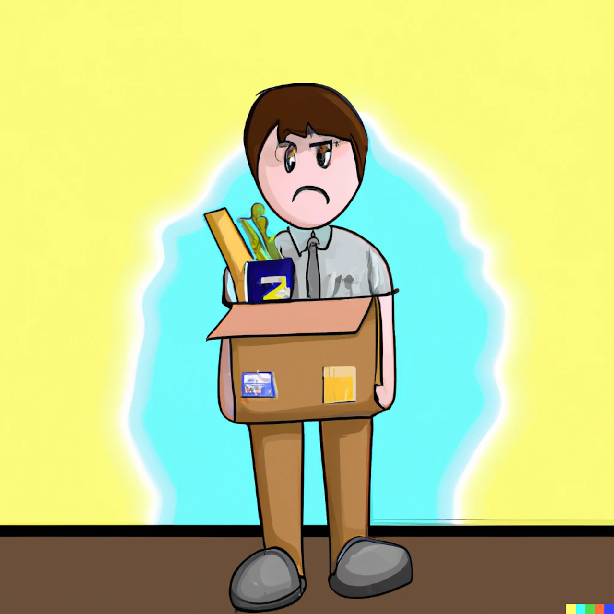

_When I wrote this, I didn't think I would ever publish any part of it. It was a way to process my feelings after getting laid off. But, there are a few factors which changed my mind. I was inspired to clean it up and post it after reading [The Future of Quality at Instrument was 35 Days Long](https://angelariggs.github.io/articles/thirty-five-days). Enough time has passed that I am comfortable publishing this, even though there might still be repercussions. And lastly, some more of my friends have been laid off and after chatting with them I thought this could be helpful to others._

_**Disclaimer: The facts are from my point of view and and the interpretation is educated guesses.**_

Unfortunately, getting laid off can feel like a personal badge of failure. You might see an open-to-work badge on LinkedIn or hear about the new job someone is starting, but no one talks about their feelings after getting laid off.

Having gone through layoffs multiple times, I can say it's been traumatic every time. Especially if I felt I was performing satisfactorily. Every time I felt like I was the only one struggling when I should be able to move on like the others. And to be honest, that's the face I showed in public every time.

Given the current climate, I would like this post to make people feel less alone after getting laid off.

## What would I change about my layoff experience

There is no good time to be laid-off. But getting laid off just before mid-year reviews was not ideal. I was also about a month away from my anniversary and vesting another 25% of my ESOPs, which worsened the timing.

I was surprised that the company continued hiring till before the layoffs and did not explore an across-the-board reduction in pay or voluntary (temporary) quitting, like the last time they were in a similar situation.

I wish, in this regard, they had been more like Apple (who, at the time of publishing) have not resorted to layoffs because [they did not overhire](https://blog.pragmaticengineer.com/apple-job-cuts-tide/). Moreover, [CEO Tim Cook took a pay cut of 40%](https://www.bbc.com/news/business-64258289) to help weather the economic climate.

### Relationships with co-workers

> While you don't have to be everything to everyone in your network, it's human decency 101 to reach out to those you spent 40 hours a week with
>
> ""Scarlett McCarthy""

**This one hurt the most.**

It is ironic that when you quit of your own accord, you get a going away present, a card filled with thoughts on how you will be missed and maybe a speech or two extolling your value. You get an exit interview and a place to share your thoughts. Your wins are celebrated.

But in the case of layoffs, all of that vanishes, and you feel like a social pariah.

> Just because it's uncomfortable to have doesn't mean you should avoid it

Some colleagues I thought would reach out didn't. On the flip side, some people I didn't expect reached out. I want to believe that people did not reach out not because the relationship did not matter but because it makes for an awkward conversation.

I wish some more of my colleagues had asked how I was doing and if I wanted to catch up. Even some messages that made me feel I had a beneficial impact on them would have been appreciated. Anything I could take with me for the future would have made the experience less painful.

If you are on the other side and know someone who has been laid off, don't be a stranger. Drop them an email or a slack message asking if they want to get together for a coffee. Even if they ignore you or say no, that's fine. Everyone deals with this differently. The important thing is that they will remember that you reached out to them.

### Thoughts about the reason for laying me off

That I was on the hit list at this company was both surprising and not surprising. I was one of the 1st engineers to join the company which in theory should have protected. But, there were subtle and not-so-subtle hints that some people wanted me to leave. Probably because of that very reason.

The official reason for disestablishing my role was that the company had too many backend engineers. I was "too senior" (whatever that means) and hence expensive to keep on. By letting me go, they could save more jobs.

Although this might be true, it doesn't make sense to me for various reasons. The most important being that more senior people as well as people on the same level as me but with a different role were not put in the firing line.

If the company wanted to keep me on, they would have asked me to work in an area where they needed more engineers or explored the possibility of working reduced hours/pay. I have on multiple occasions shown that I can pick up new technologies relatively fast, so it would have been low risk.

I had written a lot of the backend code as well as a few utilities for developer productivity. Infact, as far as the github vanity metrics for, I was far ahead of most most people.

I also had a lot of historical context about some engineering decisions in the Product and Engineering team, so I could have easily continued to provide value.

> It was the easiest way to silence what I think they saw as disruptive dissent

Like other startups I have been a part of, I joined this one early in the company's life before the founders built the leadership team. From the beginning, I openly raised things I disagreed with or thought could be better.

I feel that as new people joined the company, they became increasingly uncomfortable with my standing up for my principles. My discussions in internal forums might have threatened leadership, as they probably felt called out. It's possible that disagreeing with mandatory in-office days, [change in team names](./team-name) and advocating for pay transparency/equity etc. is what put the final nail in the coffin.

I don't blame them for not wanting to deal with the questions I was raising.

Since I am not in a country with at-will employment and there was no issue with my performance, I feel that with the decision to announce layoffs, my detractors found an easy way to force me to leave.

## Speaking up is risky, so why do it?

It's not the first time, and it won't be the last when people are fired/laid off as a silencing tactic. Look at [what happened at Twitter after the takeover](https://ma.nu/blog/bye-twitter) by Elon Musk.

But, you should still speak up.

<?# Twitter 1449066853314224129 /?>

It's also good for business.

<?# ResponsiveYouTube dGfcc4Np_Sc Title="Why your business needs dissenters" /?>

## It worked out in the end

Everything worked out for me in the end.

After I raised my concerns with the founders, they agreed to vest 25% of my options. I got a month of severance. I also had many annual leaves left over, which got paid out.

I took a few days to process my feelings before starting the job hunt. Luckily, I landed a job almost immediately once I started looking. Nevertheless, I took a month to unwind before starting the new position.

_Previously, the time for getting a new job has varied from 1 to 6 months, so this was a pleasant surprise._

Nearly all the companies I had worked with previously contacted me to see if I wanted to return. This was a great signal that I was doing something right when I was there. I had also been [interviewing when I didn't need a job](./interview-happy-job), so I could reinitiate talks with some of those companies.

It further shaped my perspective and has informed the [questions I'm asking companies during the interview process](./interview-interviewers-must-have-deal-breaker-list).

## Some unsolicited advice

- Have a layoff fund, so you have some runway and can ensure the next job is not just a rebound.
- Every couple of months, update your resume so you are not scrambling to remember what you did in case of an unplanned exit.
- [Keep interviewing even if you are happy in your job](https://www.ankursheel.com/blog/interview-happy-job) and keep a list of interesting companies. Ask and connect with the interviewers (you resonated with) on LinkedIn.
- Take some me-time. Give yourself time to process your feelings. This is one of the few times in your life when you get to be alone with your thoughts and can truly unwind. Every time I was laid off, it was a coincidence that I was about to go on a holiday. This enabled me to take a step back and recharge before taking a new job.
- A job search is a numbers game, so keep applying and don't take the rejection personally. Most importantly, don't stop applying till you sign an offer letter.
- The company might employ pressure tactics to get you to leave but do not yield. Either negotiate a severance or talk to a lawyer, so that you dont get a horrible deal.

<?# Twitter 1620048899355594752 /?>
 
- Finally, remember that you are more than your job title and organisation.

## Final Thoughts

I know the risks of speaking up. I am aware that I am privileged to be able to speak up more than others and that its not possible for everyone.

At all companies I have worked at, I have always chosen to stand up and speak out when I have felt the need to. In most cases, it has worked out well and the company has acted on the feedback. In some others, not so much.

Regardless of how it went for me, people have repeatedly told me they appreciated having someone ask questions and say what they were thinking but didn't feel safe saying.

If you were recently laid off, please drop me a note. I might not be able to help, but I know how valuable it is to vent, and I'm happy to lend an ear.

To end, I am going to leave you with these 2 songs to inspire you to start speaking up. :)

<?# ResponsiveYouTube QUQsqBqxoR4 Title="Brave" /?>

<?# ResponsiveYouTube CevxZvSJLk8 Title="Roar" /?>

Something else you want to know? Ask in the comments.
