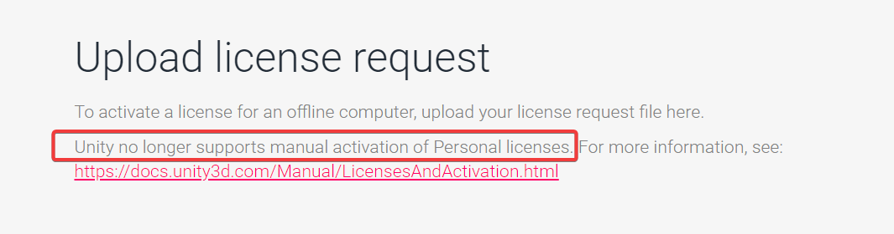
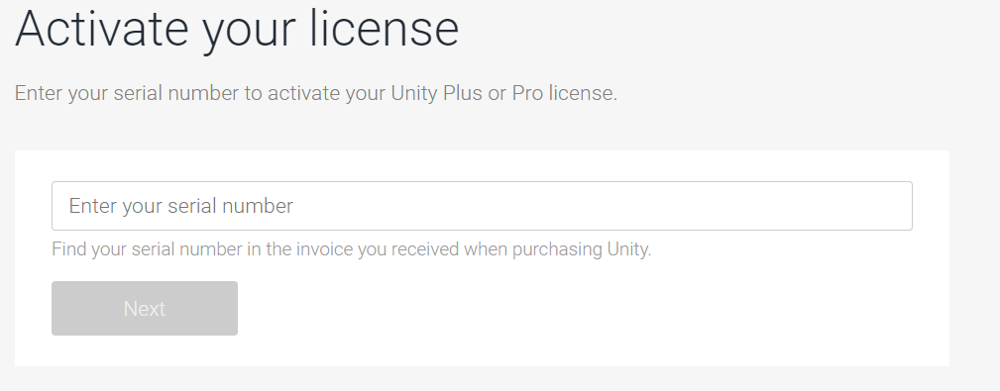
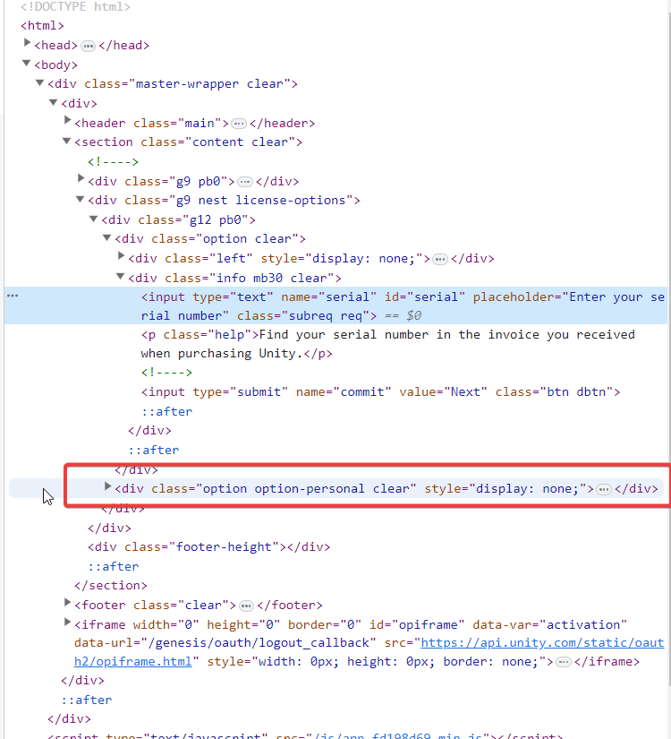
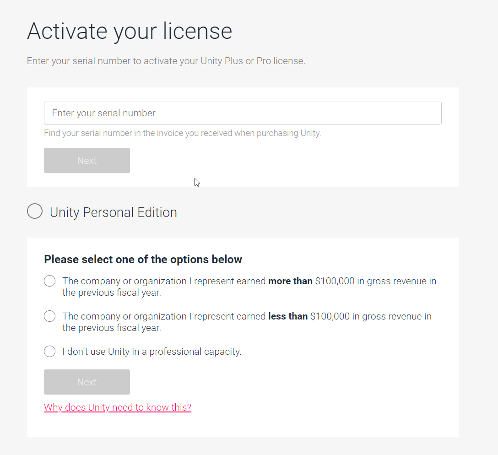

You decided to add a CI/CD pipeline to your Unity Project using [GameCI](https://game.ci/). You are all pumped up and
ready to start.

What's the 1st step? Activating Unity! No biggie, right?

Well, hold on a sec. You generate the **_alf_** file after creating the github action. You carry on with the list and
head to https://license.unity3d.com/manual, all set to create that **_ulf_** file.

## Plot Twist

But hold your horses because here comes the twist.

Unity dropped a bombshell: "Unity no longer supports manual activation of Personal licenses."

Manual activation of Personal licenses? Nope, not happening anymore. Cue the dramatic music. 🎵

But we are not giving up that easily. We disregard the message and upload the **_alf_** file.

Something's fishy. The option to generate an ulf for a personal license? Poof, it's vanished. Instead, it asks us to
type in a serial number.

## Time for a bit of trickery

Right-click and inspect the serial number box

Now, hunt down the `
` section

Guess what? We're deleting that pesky `"display: none;"`.

Boom! Like magic, the Unity Personal Edition option reappears. 🎉

Hopefully, before this hack stops working, GameCI will have an official workaround :)

### Shoutout

And here's a shoutout to [realpepe](https://reallpepe.itch.io/defendron), who cracked the code and shared the wisdom on
Discord. Because in the world of tech, teamwork makes the magic happen.
