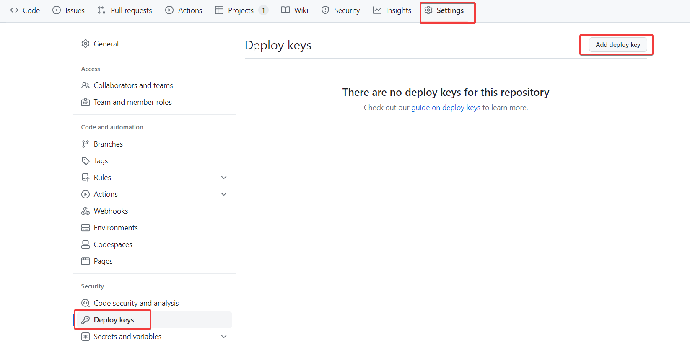
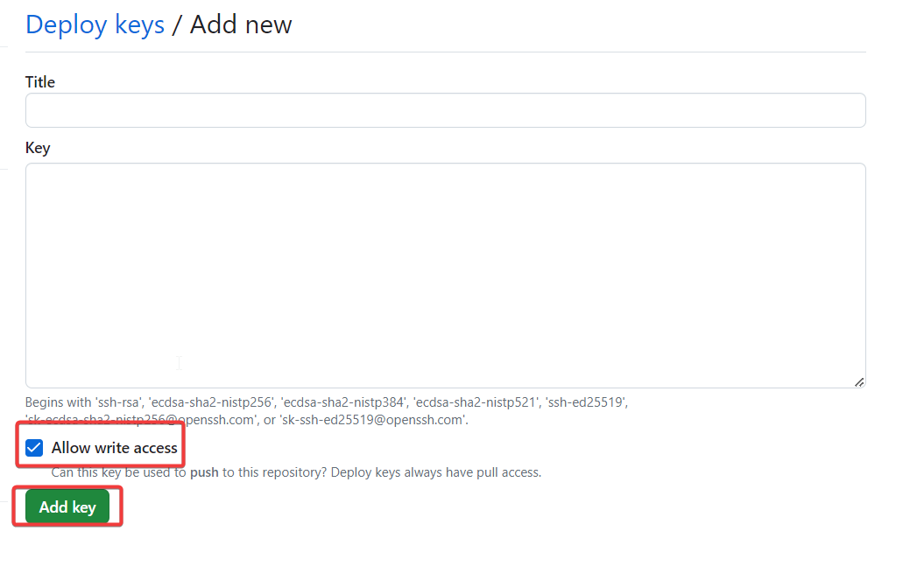
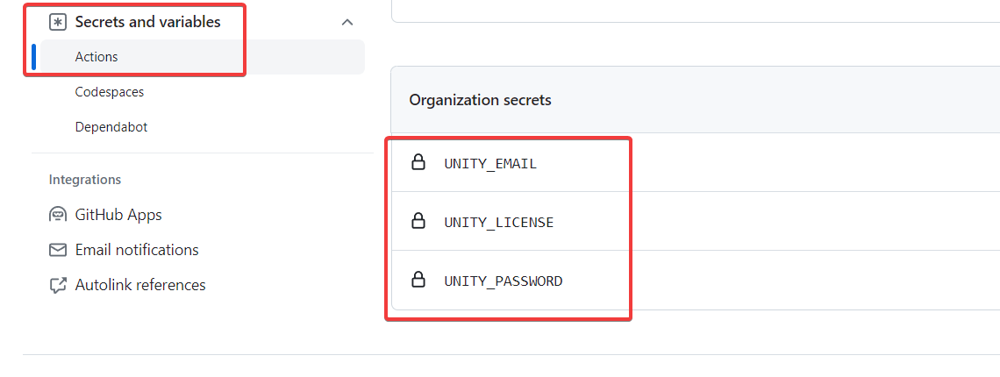

Adding CI/CD to Unity projects is a game-changer, even if you're not a CI/CD enthusiast.

In this series, I'll guide you through setting up a robust CI/CD pipeline for Unity projects using [GitHub Actions](https://github.com/features/actions) and [GameCI](https://game.ci/).

Part 1 of this series covers the essential one-time setup for a successful CI/CD pipeline.

**_Note: These setup steps can be skipped if you've already performed them for a previous project._**

## Acquire an Activation File for GitHub Runners

1. Log into Unity Hub
2. If you havent already created a licence, you need to get a licence by going to _Unity Hub_ > _Manage Licenses_ > _Add_ > _Get a free personal license_.

## Install Ruby

- Install Ruby from [here](https://rubyinstaller.org/downloads/)
- Verify the installation by running `ruby -v`.
- Install _Bundler_ by running `gem install bundler`

## Setup Codesigning with GitHub Actions

- Create a private GitHub repository to store the certificates and code-signing identities we generate.
- In the private repository, navigate to _Settings_ -> _Deploy Keys_ -> _Add Deploy Key_  
  
- Generate an SSH key. You can use 1Password or use the `ssh-keygen` utility.
- Paste the public key (starting with ssh) into the "Key" field.
- Select **_Allow write access_** to enable pushing certificates to the repository.  
  

## Setting up Secrets for GitHub Actions

On GitHub, navigate to _Settings_ -> _Secrets and Variables_ -> _Actions_.

Create the following secrets

- **UNITY_EMAIL**: Your Unity login email address.
- **UNITY_LICENSE**: The contents of the _.ulf_ file which can found at _**C:\ProgramData\Unity\Unity_lic.ulf**_.
- **UNITY_PASSWORD**: Your Unity login password.
- **MATCH_PASSWORD**: This is an additional layer of security required for encrypting/decrypting certificates.
- **MATCH_REPOSITORY**: The name of the private GitHub repository that will store our certificates in the format `organization/repository`.
- **MATCH_DEPLOY_KEY**: This is the private part of the SSH key we created in the private repository to store our certificates. _If using 1Password makes sure the key is unencrypted._

I recommend adding these secrets at the organisation level so that we can reuse them across multiple projects. We can then selectively grant access to each secret for specific repositories.

## Conclusion

This one-time setup paves the way for a streamlined Unity CI/CD pipeline. Stay tuned for the next steps in our journey. Happy coding!!

## References

- [Workflow syntax](https://docs.github.com/en/actions/using-workflows/workflow-syntax-for-github-actions)
- [Workflow dispatch](https://docs.github.com/en/actions/using-workflows/events-that-trigger-workflows#workflow_dispatch)
- [Using secrets in GitHub Actions](https://docs.github.com/en/actions/security-guides/using-secrets-in-github-actions)
- [Setup deploy keys on Github](https://docs.github.com/en/authentication/connecting-to-github-with-ssh/managing-deploy-keys#set-up-deploy-keys)
