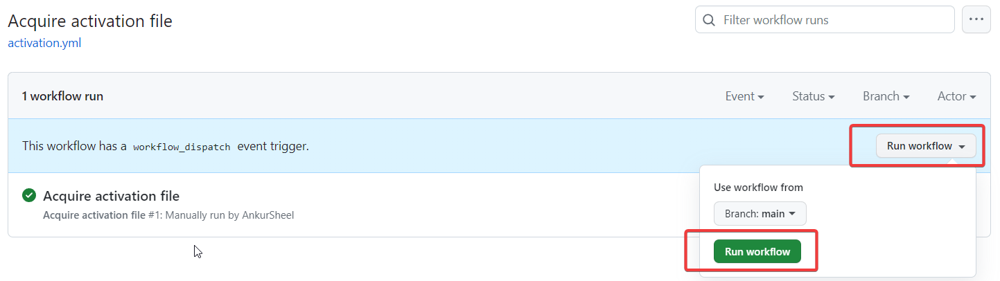
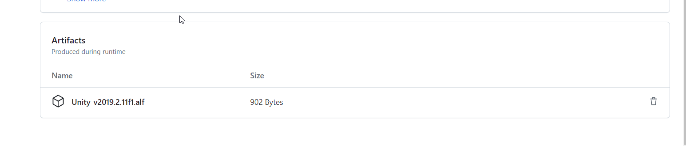
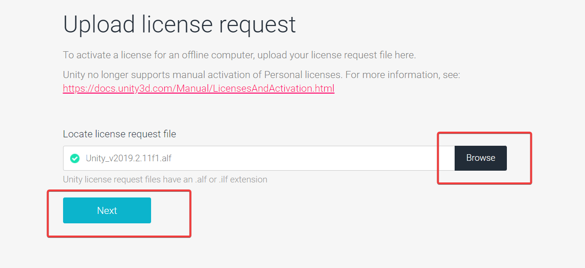
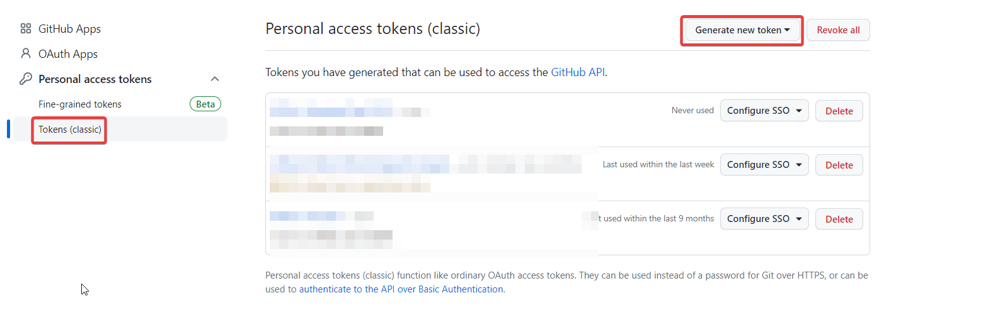
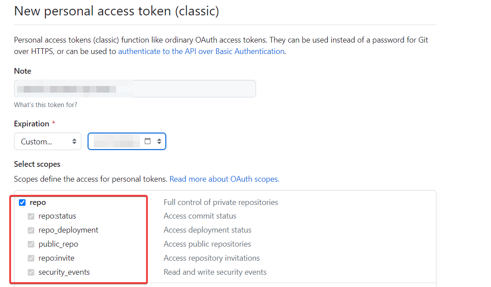

Adding CI/CD to Unity projects is a game-changer, even if you're not a CI/CD enthusiast.

In this series, I'll guide you through setting up a robust CI/CD pipeline for Unity projects using [GitHub Actions](https://github.com/features/actions) and [GameCI](https://game.ci/).

Part 1 of this series covers the essential one-time setup for a successful CI/CD pipeline.

**_Note: These setup steps can be skipped if you've already performed them for a previous project._**

## Acquire an Activation File for GitHub Runners

_**Note: The activation file uses machine identifiers, so we need to generate a license for GitHub runners.**_

1. Create a file named `.github/workflows/activation.yml` and add the following workflow definition:

```yaml
name: Acquire activation file  
on:  
  workflow_dispatch: {}  
jobs:  
  activation:  
    name: Request manual activation file 🔑  
    runs-on: ubuntu-latest  
    steps:  
      # Request manual activation file  
      - name: Unity - Request Activation File  
        id: getManualLicenseFile  
        uses: game-ci/unity-request-activation-file@v2.0.0  
      # Upload artifact (Unity_v20XX.X.XXXX.alf)  
      - name: Expose as artifact  
        uses: actions/upload-artifact@v3
        with:  
          name: ${{ steps.getManualLicenseFile.outputs.filePath }}  
          path: ${{ steps.getManualLicenseFile.outputs.filePath }}
```

In this workflow, we use GameCI to request the activation file and upload it as an artifact. The **workflow_dispatch** event enables manual triggering of this workflow.

2. Manually run the above workflow  
   

3. Download the manual activation file that appears as an artifact and extract the .alf file from the zip  
   

4. Visit [license.unity3d.com](https://license.unity3d.com/manual) and upload the _alf_ file.  
   

_Note: If you do not see the option for activating a "Unity Personal license", follow the steps at [Workaround for Unity Personal License Manual Activation Not Supported](./unity-personal-license-manual-activation-workaround)_.

5. Download the _ulf_ file. _The numbers don't have to match the Unity version exactly._

## Install Ruby

- Install Ruby from [here](https://rubyinstaller.org/downloads/)
- Verify the installation by running `ruby -v`.
- Install _Bundler_ by running `gem install bundler`

## Setup Codesigning with GitHub Actions

- Create a private GitHub repository to store the certificates and code-signing identities we generate.
- In the private repository, navigate to _Settings_ -> _Deploy Keys_ -> _Add Deploy Key_
  
- Generate an SSH key. We can use 1Password or use `ssh-keygen` utility.
- Paste the public key (starting with ssh) into the "Key" field.
- elect **_Allow write access_** to enable pushing certificates to the repository.
  

### Generate a GitHub Personal Access Token

We need a Personal Access Token to enable our Github Actions to access the private GitHub repository where we'll store our certificates.

- Go to _Settings_ -> _Developer Settings_ -> _Personal Access Tokens_ -> _Tokens (classic)_.
- Click _Generate Token_.



- Give the token all **_repo_** permissions.



## Setting up Secrets for GitHub Actions

On GitHub, navigate to _Settings_ -> _Secrets and Variables_ -> _Actions_.


Create the following secrets

- **UNITY_EMAIL**: Your Unity login email address.
- **UNITY_LICENSE**: The contents of the .ulf file.
- **UNITY_PASSWORD**: Your Unity login password.
- **GH_PAT**: The Personal Access Token we generated.
- **MATCH_PASSWORD**: This is an additional layer of security required for encrypting/decrypting certificates.
- **MATCH_REPOSITORY**: The name of the private GitHub repository that will store our certificates, in the format `organization/repository`.
- **MATCH_DEPLOY_KEY**: This is the private part of the SSH key we created in the private repository to store our certificates.
- **APPLE_CONNECT_EMAIL**: Your Apple ID email.
- **APPLE_DEVELOPER_EMAIL**: Your Apple ID email.
- **APPLE_TEAM_ID**: Team Id from your [Apple Developer Account](https://developer.apple.com/account) -> _Membership Details_.

I recommend adding these secrets at the organization level so you can reuse them across multiple projects. You can then selectively grant access to each secret for specific repositories.

## Conclusion

This one-time setup paves the way for a streamlined Unity CI/CD pipeline. Stay tuned for the next steps in our journey. Happy coding!!

## References

- [Workflow syntax](https://docs.github.com/en/actions/using-workflows/workflow-syntax-for-github-actions)
- [Workflow dispatch](https://docs.github.com/en/actions/using-workflows/events-that-trigger-workflows#workflow_dispatch)
- [Using secrets in GitHub Actions](https://docs.github.com/en/actions/security-guides/using-secrets-in-github-actions)
- [Setup deploy keys on Github](https://docs.github.com/en/authentication/connecting-to-github-with-ssh/managing-deploy-keys#set-up-deploy-keys)
