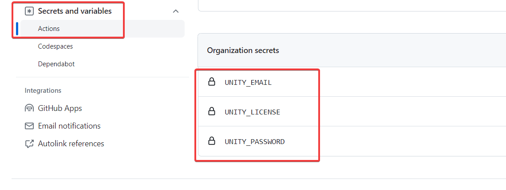

Adding CI/CD to Unity projects is a game-changer, even if you're not a CI/CD enthusiast.

In this series, I'll guide you through setting up a robust CI/CD pipeline for Unity projects using [GitHub Actions](https://github.com/features/actions) and [GameCI](https://game.ci/).

Part 1 of this series covers the essential one-time setup for a successful CI/CD pipeline.

## Preparing the Project

First, let's ensure our project is ready for CI/CD. Follow these steps:

### Update .gitignore

Start by ignoring files generated by GameCI. Update the `.gitignore` file with these lines:

```
/[Aa]rtifacts/  
/[Cc]odeCoverage/
```

### Verify Packages

Ensure that these entries are present in `packages/manifest.json`:

- `com.unity.2d.sprite`
- `com.unity.inputsystem`
- `com.unity.test-framework`
- `com.unity.textmeshpro`

If any of these packages are missing, add them using the Unity Package Manager. Remember to commit the changes in `packages/manifest.json` and `packages/package-lock.json`.

_This is important because things might work in the editor, but the build might fail because of missing packages._

## Acquire an Activation File for GitHub Runners

**Note 1: This step can be skipped if you already have a generated .ulf file from a previous project.**

**Note 2: The activation file uses machine identifiers, so we need to generate a license for GitHub runners.**

1. Create a file named `.github/workflows/activation.yml` and add the following workflow definition:

```yaml
name: Acquire activation file  
on:  
  workflow_dispatch: {}  
jobs:  
  activation:  
    name: Request manual activation file 🔑  
    runs-on: ubuntu-latest  
    steps:  
      # Request manual activation file  
      - name: Unity - Request Activation File  
        id: getManualLicenseFile  
        uses: game-ci/unity-request-activation-file@v2.0.0  
      # Upload artifact (Unity_v20XX.X.XXXX.alf)  
      - name: Expose as artifact  
        uses: actions/upload-artifact@v3
        with:  
          name: ${{ steps.getManualLicenseFile.outputs.filePath }}  
          path: ${{ steps.getManualLicenseFile.outputs.filePath }}
```

In this workflow, we use GameCI to request the activation file and upload it as an artifact. The **workflow_dispatch** event enables manual triggering of this workflow.

2. Manually run the above workflow  
   

3. Download the manual activation file that appears as an artifact and extract the .alf file from the zip  
   

4. Visit [license.unity3d.com](https://license.unity3d.com/manual) and upload the _alf_ file.  
   

_Note: If you do not see the option for activating a "Unity Personal license", follow the steps at [Workaround for Unity Personal License Manual Activation Not Supported](./unity-personal-license-manual-activation-workaround)_.

5. Download the _ulf_ file. _The numbers don't have to match the Unity version exactly._

## Setting up Secrets for GitHub Actions

In the repository on GitHub, navigate to _Settings_ -> _Secrets and Variables_ -> _Actions_.



Create the following secrets

- **UNITY_EMAIL**: The email address used to log in to Unity.
- **UNITY_LICENSE**: Paste the contents of the .ulf file.
- **UNITY_PASSWORD**: The password used to log in to Unity.

I prefer to add them as organisation secrets because I want to reuse these across all the projects.

## Conclusion

This one-time setup paves the way for a streamlined Unity CI/CD pipeline. Stay tuned for the next steps in our journey. Happy coding!!

## References

- [Workflow syntax](https://docs.github.com/en/actions/using-workflows/workflow-syntax-for-github-actions)
- [Workflow dispatch](https://docs.github.com/en/actions/using-workflows/events-that-trigger-workflows#workflow_dispatch)
- [Using secrets in GitHub Actions](https://docs.github.com/en/actions/security-guides/using-secrets-in-github-actions)
