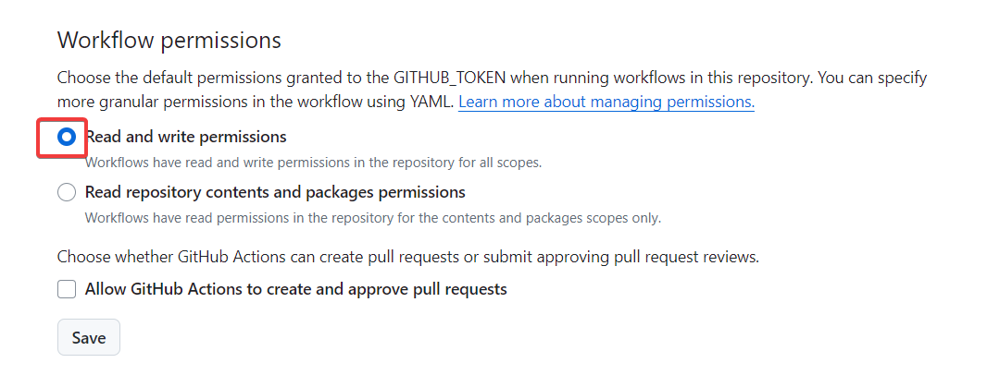

In Part 1, we finished the [setup to start creating our CI/CD pipeline](./unity-cicd-one-time-setup).

In Part 2, we will create a workflow to run our automated tests based on some trigger events.

## Update .gitignore

Before you create your workflow, you need to ignore the files generated by GameCI. Update the `.gitignore` file with these lines:

```
/[Aa]rtifacts/
/[Cc]odeCoverage/
```

## Setting the Trigger Events

Now, you need to define when your pipeline should trigger.

Create `.github/workflows/main.yml` and add the following workflow definition:

```yaml
name: Test, Build, and Deploy with GameCI
on:
  push:
    branches:
      - main
    paths:
      - 'Assets/**'
      - 'Packages/**'
      - 'ProjectSettings/**'
  pull_request:
    types:
      - opened
      - synchronize
    branches:
      - main
    paths:
      - 'Assets/**'
      - 'Packages/**'
      - 'ProjectSettings/**'
      - '.github/workflows/**'
  release:
    types:
      — published
  workflow_dispatch:
    inputs:
      release_platform:
        description: 'release [ios, web, testflight]'
        required: false
        default: 'release '
jobs:
```

A lot is going on here, so let's break it down:

- **on**: Specify the events that trigger the workflow.
    - **push** -> **branches** : push event to the "main" branch
        - **paths**: filter to only changes that happen in the Unity project or the workflows.
    - **pull_request** -> **types**: pull request is opened or updated against the "main" branch.
        - **paths**: filter to only changes that happen in the Unity project or the workflows. _(Same as the push event)._
    - **release** -> **publish**: publish a release.
    - **workflow_dispatch**: manually trigger the workflow using the GitHub Actions interface.
        - **input** -> **release\_platform**: input to specify the platform. Add the default text to "release" so that there is less typing.

## Building and Running Tests

Next, add a new job to build and run the [Unity project tests](https://docs.unity3d.com/Manual/testing-editortestsrunner.html)

```yaml
jobs:

  test:
    name: Build and Run Tests
    runs-on: ubuntu-latest
    steps:
      # Checkout with lfs
      - name: Checkout Repository
        uses: actions/checkout@v4
        with:
          fetch-depth: 1
          lfs: true

      - name: Cache Library
        uses: actions/cache@v4
        with:
          path: Library
          key: Library-test-${{ hashFiles('Assets/**') }}
          restore-keys: |
            Library-test-${{ hashFiles('Assets/**') }}
            Library-test

      - name: Run Tests
        uses: game-ci/unity-test-runner@v4
        env:
          UNITY_LICENSE: ${{ secrets.UNITY_LICENSE }}
          UNITY_EMAIL: ${{ secrets.UNITY_EMAIL }}
          UNITY_PASSWORD: ${{ secrets.UNITY_PASSWORD }}
        with:
          githubToken: ${{ secrets.GITHUB_TOKEN }}
```

Now, let's look at whats happening in this job:

- **runs-on:** The job should run on an lates Ubuntu-based runner.
- **steps:** The steps to execute for this job.
    - **Checkout Repository:** Check out the code
        - **fetch-depth**: Get only the last commit of the branch.
        - **lfs**: Download files tracked by LFS.
    - **Cache Library**: Cache the "Library" directory, to make subsequent runs faster.
    - **Run Tests:** Runs the Unity tests.
        - **env**:  Set the environment variables
        - **with** -> **githubToken**: Set the GITHUB_TOKEN from the secrets to report the test results.

## Set Workflow Permissions

To view test results as part of the Github Status check, you need to provide write permissions to the workflow

Go to _Settings_ > _Actions_ > _General_ > _Workflow permissions_ and choose _Read and write permissions_.



## Preparing the Project

If the project builds in the editor but fails when you run the workflow, its likely because of missing packages.

Luckily, its a simple fix.

### Verify Packages

Ensure that these entries are present in `packages/manifest.json`:

- `com.unity.2d.sprite`
- `com.unity.inputsystem`
- `com.unity.test-framework`
- `com.unity.textmeshpro`

If any of these packages are missing, add them using the Unity Package Manager. Remember to commit the changes in `packages/manifest.json` and `packages/package-lock.json`.

## Conclusion

In this part, we set up the trigger events for the workflow and added a job to build and run tests. Next, we will add a job to build the project for different platforms.

## References

- [Events that trigger workflows](https://docs.github.com/en/actions/using-workflows/events-that-trigger-workflows)
- [GameCI TestRunner docs](https://game.ci/docs/github/test-runner)
