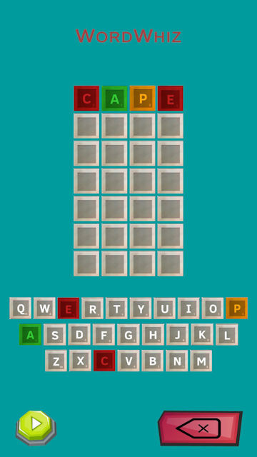
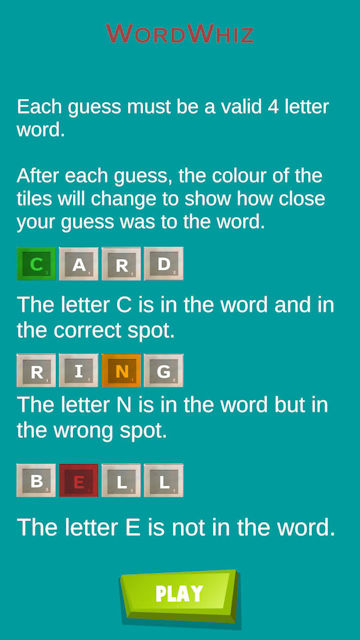

You can see all the related updates [here](/tags/wordxplorer)

I am thrilled to share some updates for the wordxplorer game! 🎉

## 🚀 Testflight Approval

The first version with around 25 words has received the green light for TestFlight! If you registered as beta tester for iOS, watch your inbox for those invites - they're coming soon! 📬 . If you didnt, you can register by filling [the form](https://tally.so/r/wverVQ)

## 🌈 Updated Colors

I have revamped the colors! Let me know if you have any suggestions on better colors. Share your ideas with me! 🎨

## 📜 Instructions Page

I have added a new instructions page at the start of the game for people who are new to Wordle.📘

## 🔮 What's Next

- A public Trello board for the roadmap, so beta testers can vote on what they would like to see next.
- More Words

<?# AppStoreBadges LinkText="Get WordXplorer" AppStoreLinkUrl="wordxplorer-guess-the-word/id6504664783" /?>