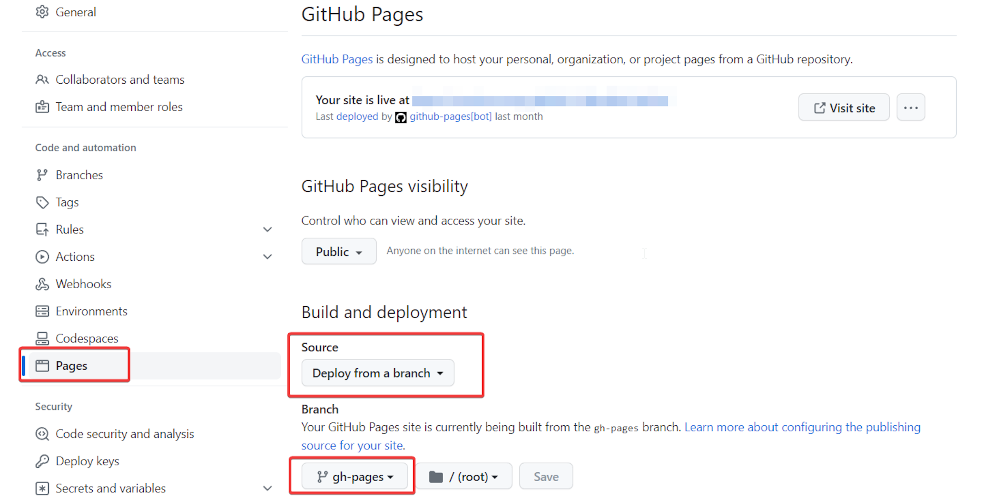

In Part 1, we finished the [setup to start creating our CI/CD pipeline](./unity-cicd-one-time-setup).

In Part 2, we created a workflow to run our [automated tests based on some trigger events](./unity-cicd-trigger-events-tests).

In Part 3, we created a [reusable workflow to build the Unity project](./unity-cicd-linux-build) for various platforms.

In part 4, we will use our reusable workflow to deploy a WebGL build to GitHub Pages.

Start by updating your `.github/workflows/main.yml` file.

## Job 1: Building for WebGL

This job uses our reusable workflow to generate the files needed for hosting the game on a web server.

```yaml
buildForWebGL:
  name: Build for WebGL
  needs: test
  if: |
    github.event_name == 'pull_request' 
    || github.event.action == 'published' 
    || (contains(github.event.inputs.release_platform, 'release') 
          && contains(github.event.inputs.release_platform, 'web'))
  uses: ./.github/workflows/buildWithLinux.yml
  with:
    platform: WebGL
    secrets:
      UNITY_EMAIL: ${{ secrets.UNITY_EMAIL }}
      UNITY_PASSWORD: ${{ secrets.UNITY_PASSWORD }}
      UNITY_LICENSE: ${{ secrets.UNITY_LICENSE }}
```

- **needs**: This step depends on the successful completion of the `test` job, added in Part 2.
- **if**: Defines the conditions for this job to run.
  - push to the main branch or creating a pull request against it.
  - GitHub release.
  - Manually trigger the workflow with the '**_release_**' and '**_web_**' parameters in the `release_platform` field.
- **uses**:Call the reusable workflow from Part 3 with the necessary parameters, setting the `platform` to **_WebGL_**.

## Job 2: Deploying to GitHub Pages

This job copies the WebGL artifact to the correct location for [GitHub Pages](https://pages.github.com/). Once copied, it triggers a GitHub Pages deployment.

```yaml
deployToGitHubPages:
  name: Deploy to GitHub Pages
  runs-on: ubuntu-latest
  needs: buildForWebGL
  if: |
    github.event_name == 'pull_request' 
    || github.event.action == 'published' 
    || (contains(github.event.inputs.release_platform, 'release') 
          && contains(github.event.inputs.release_platform, 'web'))
  steps:
    - name: Echo Build Version
      run: echo ${{ needs.buildForWebGL.outputs.buildVersion }}

    - name: Checkout Repository
      uses: actions/checkout@v4
      with:
        fetch-depth: 1
        lfs: false

    - name: Download WebGL Artifact
      uses: actions/download-artifact@v4
      with:
        name: build-WebGL
        path: build/WebGL

    - name: Deploy to GitHub Pages
      uses: JamesIves/github-pages-deploy-action@v4
      with:
        folder: build/WebGL/WebGL
        commit-message: Deploy
        single-commit: true

    - name: Cleanup to avoid storage limit
      uses: geekyeggo/delete-artifact@v5
      if: always()
      with:
        name: build-WebGL
        failOnError: false
```

- **needs**: This job depends on the successful completion of the `buildForWebGL` job.
- **if**:  It follows the same conditions as the _buildForWebGL_ job.

Next, we have a series of steps:

1. **Echo Build Version**: Prints the build version generated by the `buildForWebGL` job.
2. **Checkout Repository**: Checks out the code repository.
3. **Download WebGL Artifact**: Get the **_build-WebGL**_ artifact produced by the `buildForWebGL` job and put it into the **_build/WebGL**_ directory.
4. **Deploy to GitHub Pages**: Deploy the contents of the **_build/WebGL/WebGL**_ folder to GitHub Pages.
5. **Cleanup to avoid storage limit**: Delete the **_build-WebGL-** artifact.

## Setting up Github Pages

Once the workflow for a WebGL build is triggered, a _**gh_pages**_ branch will be created. Now you can setup Github pages to showcase your game.

In the repository on GitHub, navigate to _Settings_ -> _Pages_.

Set the source to **_Deploy from a branch_** and set the branch to `gh-pages`



## Conclusion

In this part, we deployed our Unity Project to Github pages. Next, we will generate certificates for iOS deployments.

## References

- [Calling a reusable workflow](https://docs.github.com/en/actions/using-workflows/reusing-workflows#calling-a-reusable-workflow)
- [Github Pages Deploy Action](https://github.com/marketplace/actions/github-pages-deploy-action)
- [Delete Artifact Github Action](https://github.com/marketplace/actions/delete-artifact)
