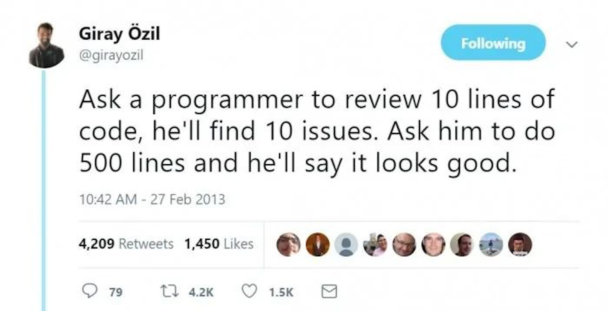
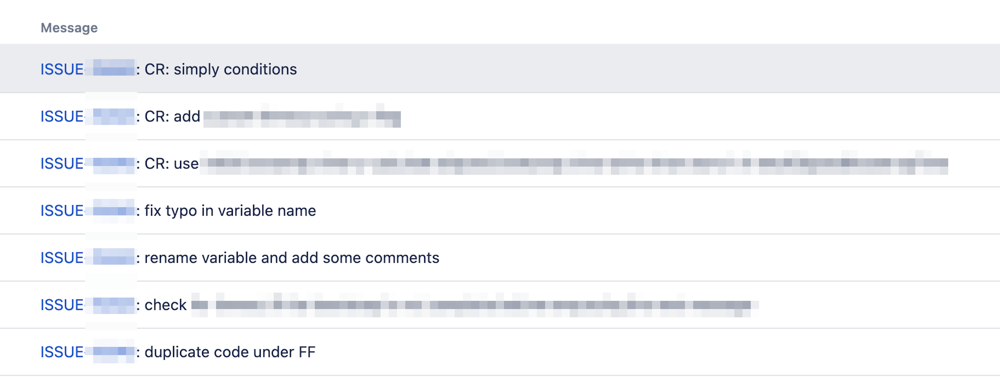

_This is an edited version of an article I originally wrote for the internal blog at Atlassian._

As a Pull Request(PR) reviewer, my main goal is to be as confident as possible about the outcomes once the PR gets merged. To accomplish this, I want to be able to answer 3 questions:

1. Do these changes fulfil the requirements?
2. Do these changes improve the current state?
3. Could these changes potentially lead to an incident?

Achieving a high level of confidence often proves challenging when dealing with a PR that consists of a single commit with a large diff.

If you've ever received such a PR, you've likely stared at it, wondering where to begin. This confusion is often followed by your decision to set it aside for later, only to be reminded by the author again.

<?# Giphy computador-gu-tecnology-bGgsc5mWoryfgKBx1u /?>

What if I told you that this issue could be resolved with a minor adjustment in the way we create a PR?

Split the commit into **small** **individual** commits that make **logical sense**.

> The key is to ensure that each commit makes sense on its own and represents a single logical change.

## Why should you opt for multiple commits instead of a single large commit?

Some might argue that they review all PRs as one comprehensive diff; therefore, spending time creating smaller commits is a waste of time.

Leaving apart the fact that having smaller commits does not preclude reviewing a PR as a single diff, breaking down even a small PR into multiple, well-structured commits is still beneficial.

### Clear and Understandable History

Multiple small commits create a clear and understandable history.

> Just as we aim to follow the single responsibility principle in programming, we should also apply it to our commits.

Each commit should represent a single logical change. This makes it easier for any team member to understand the thought process and the steps taken to arrive at the final code.

It's similar to reading a well-structured book versus a convoluted, rambling essay.

_See “What to Split into its own commit” below._

### Improve Debugging and Trouble-shooting Efficiency

Small commits come to the rescue when bugs creep into the system.

With large commits, finding the issue is like searching for a needle in a haystack. However, with small commits, since each commit represents a single logical change, it's much easier to pinpoint the offending code.

Small commits also work well with tools like `git-bisect`, making the debugging process more efficient and less time-consuming.

### Increase Code Review Efficiency

Multiple commits make code review more manageable and effective.

Reviewers can focus on a single small change at a time, ensuring a more thorough review and reducing the likelihood of overlooking potential issues. It also eases the cognitive load on the reviewer, as they don't have to grasp many changes at once, enabling them to provide more insightful feedback.

### Faster Reviews

Well-structured commits provide reviewers with natural stopping points.

If it's a large PR, the reviewer will have to block a chunk of time to review it. But, with individual commits, they might be able to look at the PR in shorter blocks, leading to a faster turnaround time.

### Promote Work Transparency

Multiple commits offer a transparent view of the work progress. Each commit denotes a step forward, indicating productivity and makes it easy to get preliminary reviews on WIPs.

This ability to get feedback early means that you spend less time going in the wrong direction for too long and avoid expensive rewrites.

### Minimises Risk

Multiple commits help minimise the risk associated with losing work.

You always have a saved version to revert to if something goes awry. This is particularly helpful when introducing new features or making significant changes.

### Enable PR Splitting

Having individual (logical unit) commits will naturally contribute to the ability to split PRs.

### Reduce Annotation Needs

Smaller, well-structured commits also diminish the necessity for annotating a PR with comments to help reviewers understand it better.

Once you have commits that are logical units, it becomes easier to write commit messages that are clear and specific. This allows the reviewer to understand the progression of the changes and sometimes can offer clarity as to why certain changes in the PR were made.

## Example

_**Note:** I have blurred out the images since the code and the commit messages itself are not important._

**First**, Which is more straightforward to understand - A single commit message saying "_**fixed XYZ errors"**_ or this commit history?

Unsurprisingly, I prefer the split commit history.

**Next**, compare and see which diff is simpler to review.

_**Note:** Its the same block of code seen as combined diff view vs commit view._

vs

Personally, even with the code blurred, I can sense that the 2nd diff is going to be easy to reason about.

It's also easy to see that although the PR might have a large diff, the actual change is relatively small.

## What to Split into its own commit

Hopefully, by now, you are convinced that individual commits are beneficial.

But you might be wondering how to split a single giant commit into smaller ones.

Many types of changes should be split into separate commits. Dare I say that some of them should be their own PR?

In general, changes belong to two different types of classes:

- **Refactoring**
  - These changes are very low risk especially since most IDE’s come with automated refactoring tools.
- **Behavioural**
  - These changes require more careful reviews.

The key to breaking up a single commit into smaller commits is identifying the parts needed to deliver a ticket. Some of the more common ones include:

1. Refactoring
2. Reformatting
3. Deleting unused code
4. Test improvements
5. Introduction of feature flags
6. Functional changes
7. Adding Observability

Let's focus on the "_Introduction of Feature Flags_" as an example.

> First make the change easy, then make the easy change
>
> ""Kent Beck""

When working on a ticket, the first step usually involves duplicating existing code and placing it behind a feature flag. This duplication should be its own commit, allowing the reviewer to focus on what has changed in the subsequent commits.

Remember, you can always squash/reorder commits using interactive rebase (`git rebase -i`) or cherry pick
(`git cherry-pick`) to make a cohesive story **before** putting up your changes for review.

## Questions

### Q: Shouldn't the refactorings be their own PR?

Ideally, Yes. But, it might not be possible if you work on a legacy monolith with a considerable build time. It becomes essential to balance complexity and speed.

In this case, combining the refactoring commits into the PR made more sense. If the refactorings were more complex or had a lot of changes, it would be better to split them into their own PR.

### Q: Is `fix typo in variable name` too granular?

In the above screenshot, some might argue that the "_fix typo in variable name_" commit should be grouped into another commit as it is too granular.

However, having it as a separate commit is valuable as it is a refactoring rather than a functional change. It allows the reviewer to quickly identify this as just a typo fix.

If it was in response to a PR review comment, having it as its own commit makes it easier for the reviewer to check that their comment has been addressed.

### Q: What can you understand from “fix typo in variable name” or “rename variable and add some comments”?

Both these commits signal to the reviewer that these are not behavioural changes.

This does not mean that the reviewer should not review these commits, but it lets the reviewer know that it should not take too much cognitive load to review.

## Shouldn't we have smaller PR's not smaller commits?

Yes, it would be better to have smaller PRs.

But, if your team is used to reviewing everything as 1 giant diff, it can be hard to get approval if you split a PR into smaller PRs. It can be hard for people to accept that a lot of those PRs on their own probably wont provide value but also won’t break things due to being disabled through feature flags or for other reasons.

Breaking a PR with one large commit into smaller individual commits that make logical sense provides a nice stepping stone to be able to split into smaller PR's. It is an relatively easier way to build that muscle.

### Q: Isn't the PR the smallest unit to understand why a change is being made, so individual commits are useless?

In an ideal world, yes. But, it's easy to fall into the trap of making multiple changes in the same PR because it takes so much time to deploy a PR to production. Having individual commits gives us a nice balance between complexity and speed.

Taking the analogy of an article, it's like saying we don't need to have sub-headings because the essay must be consumed as one unit. The subheadings/commits make it easier to consume.

If you want your PRs to be one single commit on merge, it can be achieved by enabling squash commits on merge. After getting approval, you can also use interactive rebase to squash the commits manually.

I would still strongly suggest that there is value in keeping the individual commits (as long as each commit is a logical unit) so that you can use tools like `git bisect` or even eyeball the commit messages to make it easier to find the underlying culprit. Alternatively, you can merge each commit as an individual PR.

### Q: Is there a middle ground between having a single commit and “too many” small ones?

Yes. You can go overboard with too many small commits, and a balance needs to be achieved.

Having smaller commits doesn't mean that you show every step or that the commits should reflect the edit history. Each commit should make logical sense on its own.

I have addressed this with the “What to split” section.

### Q: Isn't it problematic to review individual commits, given they can often be part of the developer's journey of changing their mind, refactoring, and gaining insights?

Smaller commits doesn't mean you show every step; each commit should be a logical unit that provides value in production. Otherwise, it's just cruft.

> Drop it or Squash it.

If the author changes their mind, how does that commit provide value to the reviewer or the system in production? The author should be using interactive rebase to squash or drop those commits before putting them up for review.

### Q: Do you have any suggestions for preparing atomic commits?

Proper planning and upfront thinking of how to break the PR helps, but it is not always possible. I use interactive rebase, cherry-picking and changesets in IntelliJ liberally.

**_If this is something you are interested in knowing more about, let me know in the comments._**

### Q: What about making changes based on review comments?

> Every review should be a snapshot.

Once a reviewer has reviewed your PR, you should not be making changes to commits that have been reviewed.

The (new) commits that you make to address the review comments should follow the same rules as above.

Writing a commit message like "_address PR feedback_" and then dumping all the requested changes in 1 commit is not helpful. TBH, even I have been guilty of doing this at times.

You dont want the reviewer to have to revisit the commits that they have already reviewed but you also want to make it easy for them to ensure that their comments have been addressed correctly.

I prefer to prefix such commits with **CR:**.

## In Conclusion

> It’s the author’s responsibility to make the code review easy for the reviewer.

While it may seem tedious to make frequent small commits and tempting to wait until all the work is completed, the advantages of small commits are significant.

However, remember that the size of a commit will depend on the context and the nature of the change.

> The key is to ensure that each commit makes sense on its own and represents a single logical change.

Breaking a PR with one large commit into smaller individual commits that make logical sense provides a nice stepping stone to be able to split into smaller PR's.

Is there any reason why we **shouldn't** be putting in the effort to make smaller commits and writing better commit messages?
