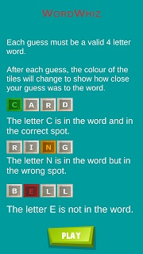
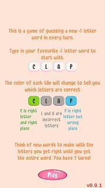
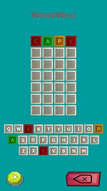
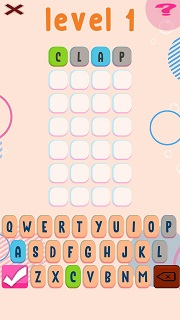
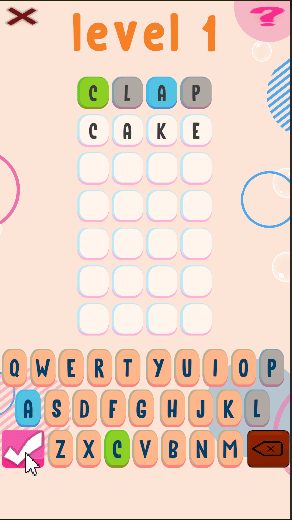
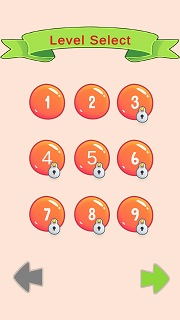

You can see all the related updates [here](/tags/wordxplorer)

It's been a while since the last update, and I wanted to tell you what's been happening. I wanted to get this game out by now, but life events got in the way.

## What happened

The partnership that I had for the first game ended. This meant I had to setup new accounts for various third-party services and redo some of the infrastructural work, which took some time.

After your feedback and some live playtests, it was clear that the game needed something more. Without someone else to help, I was getting overwhelmed with my day job and all the things that needed to be done for wordxplorer. Thankfully, my cousin Manjari stepped in to help with the creative side of things.

## What's New

### Color Matters

Let's face it: The original colours weren't very appealing. The first thing Manjari changed after joining was updating the colours. But don't take my word for it, see for yourself:

|                       Before                       |                       After                        |
|:--------------------------------------------------:|:--------------------------------------------------:|
|  |  |
|           |           |

### Fireworks

Previously, when you found the right word, there was no celebration - just a plain popup that quickly disappeared. Now, there are fireworks and explosions to celebrate your victory.

### Deterministic Levels

The random word selection felt like playing the lottery. Now, there are levels and they are locked! After you complete one, the next one is unlocked, providing a sense of progress. Plus, your progress is saved, so you don’t have to start from Level 1 every time.

### Web Build

For those who didn’t want to install TestFlight or were not on an Apple device, you can now try the game on your browser. The TestFlight app is still the best way to play, so let me know if you want an invite. 😊

---

Test it out by going to [Playable Web Build](https://golden-pony-d2c3f0.netlify.app/) and let me know what you think about the game so far.

Do you know someone who would love to try the game before its official release? Share this [form](https://tally.so/r/wverVQ) with them! ✨

Does your child have a favourite word they’d love to see in the game? Let me know, and I might add it!

Thank you all for your support and patience. Stay tuned for more updates!