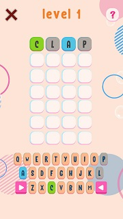
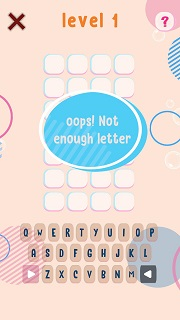
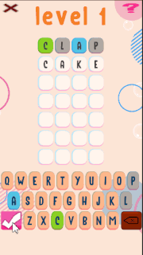
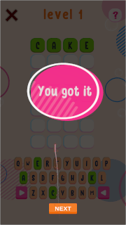

You can see all the related updates [here](/tags/wordxplorer)

Here's whats new since the last update

## Updated game screen

The main game screen now has more negative space, giving it a cleaner look. However, this change means the keyboard buttons are smaller. Give it a try and let me know how it feels!

|                  Before                   |                   After                   |
|:-----------------------------------------:|:-----------------------------------------:|
|  |  |

## Improved Popups

Popups are no longer boring grey rectangles. They now match the color scheme of the rest of the game, making everything look more cohesive.

## Enhanced Fireworks

Last time, I added support for fireworks, but they were a bit hard to see. Now, the screen dims after you complete a level, so the fireworks really stand out. With explosive sound effects, it creates a much better experience!

|                Before                 |                 After                 |
|:-------------------------------------:|:-------------------------------------:|
|  |  |

## Privacy Policy

To prepare the game for the App Store, I needed a privacy policy. Luckily, I’m not capturing any personal information, so it was easy to create one using ChatGPT. If you’re interested, you can check it out [here](/assets/downloads/Privacy_Policy_WordXplore.pdf){target="\_blank"}

---

## Playable Build

~~Test it out by going to [Playable Web Build](https://golden-pony-d2c3f0.netlify.app/) and let me know what you think
about the game so far. The TestFlight app is still the best way to play, so let me know if you want an invitation. 😊~~

**_Update 26th December 2024:_** You can now download the game.

<?# AppStoreBadges LinkText="Get WordXplorer" AppStoreLinkUrl="wordxplorer-guess-the-word/id6504664783" /?>

Does your child have a favourite word they’d love to see in the game? Let me know, and I might add it!

Thank you all for your support and patience. Stay tuned for more updates!