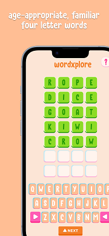
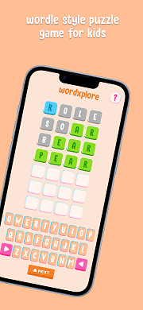
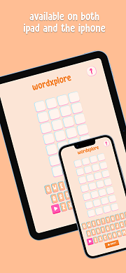

You can see all the related updates [here](/tags/wordwhiz)

Since we last spoke, it’s been full steam ahead with bug fixes and getting the game ready for the App Store! We’re thrilled to be just around the corner from giving your kids a fun and educational experience they’ll love!"

## New Name and Icon

The name of the game has been updated from WordWhiz to WordExplorer.

We’ve replaced the generic grey boxes with a vibrant, colorful icon that better reflects the fun and educational nature of WordExplorer.

## Bugfixes

Kids are great testers; they always manage to do things you’d never expect. So, what did they discover this time?

- Previously, pressing keyboard keys while a popup was displayed could cause issues, as you couldn’t see the word you were entering. We’ve now disabled the keyboard when a popup is shown to prevent this.
- You could also press keyboard keys after completing a level, but before starting the next. This led to unintended effects, like having a prefilled row when the new level started. The keyboard is now disabled when the level is complete.
- That was not the only problem when a level ended. Did you know, you could press the Next Level button before the popup finished? Unsurprisingly, this caused issues. Now, the next level button only appears after the popup has fully disappeared. It also lets the kids enjoy the fireworks for a tad more time.

We also fixed feedback about the Next Level button not being centered on the iPad.

These fixes ensure that your gameplay is smooth and frustration-free, with no more accidental key presses or misaligned buttons on the iPad, making your experience more enjoyable.

## Infrastructural changes

To generate TestFlight and web builds, I have been using a combination of GitHub Actions, GameCI, and Fastlane.

I’m excited to share that we’re now able to create builds ready for the App Store release. We’re making solid progress and are committed to delivering the final version of the game soon.

Fastlane can update the App Store metadata, but I haven’t managed to get it working yet. It’s on my list to figure out. For now, we are manually updating the metadata in the portal. This isn’t ideal, but it is a minor issue that won’t affect our overall progress.

## Updating Metadata for the App Store

To get the game ready for the App Store, a lot of metadata needs to be added. This includes the app name, subtitle, and a description.

We also need to upload at least three screenshots for various device form factors.

Here's a sneak preview

|                                     |                                     |                                     |
|-------------------------------------|-------------------------------------|-------------------------------------| 
|  |  |  |

These may end up in the final version, but we are not sure yet.

## Submitting for review

Once we updated all the metadata, we decided to submit the game for an App Store review. The intention was not to get the current version released but to ensure we can go through the approval process and be ready when the final version is prepared.

We’ve encountered some challenges with Apple's approval process, but we're addressing them head-on.

The 1st hurdle was related to analytics and data capturing. This has been easy enough to address as we are not capturing any PII, and the data that we capture for analytics is aggregated so we don't know anything about any specific individual.

The next challenge we’re facing is Apple’s concern with our use of "Wordle" in the metadata and screenshots. Apple has guidelines to prevent copycat games and apparently using the Wordle goes against it. This was unexpected as we could see other games in the app store using Wordle. The plan is to resolve this by updating the metadata to remove any references to "Wordle" and providing a small blurb of why it's not just a copy.

Hopefully, with the changes we’re making, Apple will see that our game is unique and far from a copycat.

## What's Next

Aside from getting a build that adheres to Apple’s guidelines and squashing bugs, we’re working on determining the price point and considering the option of preorders.

Based on survey feedback, we’re leaning towards a price point of NZD 5.99 / USD 2.99 / INR 299 for approximately 20-25 levels.

We’re also contemplating theming the words in the game. Two themes we’re considering are food and animals. If we proceed with this, we plan to release one theme now and the other later. Do you have a preference for which theme we should choose first?

---

## Playable Build

We’re excited for you to test out the [Playable Web Build](https://golden-pony-d2c3f0.netlify.app/). Share your feedback, and if you want the full experience, just ask for a TestFlight invite—I’ll send it over right away!. 😊

Know someone who’d love to try the game before its official release? Share this [form](https://tally.so/r/wverVQ) with them—they’ll thank you!! ✨

Does your child have a favourite word they’d love to see in WordExplorer? Let me know, and I’ll do my best to add it to the game!

Thank you for being a part of this journey with me! I’m eager to hear your thoughts and feedback. Stay tuned for more updates!