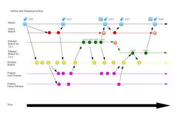

Feature flags give developers the ability to turn features on or off without deploying new code. This flexibility is key for managing the release of new features while allowing for controlled and incremental deployments.

I still have conversations with several teams that are using development methods that don’t include feature flags. Some of them want to move to feature flags but are unsure how to start while others have never heard of them or don't think it's worth adopting.

Let’s explore how feature flags work, and their pros and cons compared to some other approaches.


## Other Approaches

Before diving into feature flags, let’s look at some ~~traditional~~ ahem alternative approaches I’ve seen teams use.

To better understand the differences, let’s consider a scenario where you’re working on a new feature that will allow users to edit the title of their uploaded documents.

This feature requires changes to the frontend, backend, and database and can be broken down into several tasks:

1. Update the database schema to store the new title.
2. Update the backend API to accept the new title.
3. Update the backend to save the new title.
4. Add an audit trail for the updates.
5. Update the backend to return the new title.
6. Update the frontend to display the new title.
7. Update the FE to allow users to edit the title.
8. Add validation to the backend to ensure the new title is valid.
9. Add validation to the frontend to ensure the new title is valid.

### Approach 1: Feature Branches

A long, long time ago, when SVN was a thing (and even much later) most teams used **Feature Branches
** to manage new features. Typically, each feature would be developed on a separate branch, tested, and then merged into the
`main` branch.

In our example, you would create a branch for the new title feature, and each task would be developed on this branch. Once all tasks are complete, the branch would be merged into
`main`.


Feature branches were popular because they were straightforward to use and possibly because that was the best we had at that time. They still work well for small-scale projects.

However, in larger teams, feature branches can create technical debt. Tasks may overlap, and keeping branches in sync becomes more challenging, slowing down the development process.

Here are some other downsides:

- Since code in feature branches must be fully completed before merging, it often leads to large, complex pull requests with significant changes.
- Common changes like the same typo being fixed in two different branches can cause conflicts.
- Working on features in separate branches can hinder collaboration.
- Rolling a change back is difficult due to the intertwined nature of multiple features in the `main` branch.
- Moving on to a new feature before the previous one is merged can result in forgotten branches and ToDo's.
- As branches are long-lived and diverge over time, refactoring becomes challenging.
- Continuous Integration/Continuous Deployment (CI/CD) becomes difficult due to the fragmented nature of feature branches.

Most teams I know start by using feature branches when they are just 1 or 2 developers. But as the team grows, managing multiple branches becomes increasingly complex, leading to merge conflicts and lower productivity.

### Alternative 2: Git Flow

An evolution of feature branches is **Git Flow**, a branching model I’ve also used with success for certain projects.

Git Flow uses two main branches (`main` and `develop`). Feature branches are created off
`develop`, and once a feature is stable, it is merged into `develop`. When `develop` is stable, it is merged into
`main`, which is always production-ready. A `release` branch is created from `main` for each release and
`hotfix` branches are created to fix production issues.

In our example, you would create one or more feature branches off
`develop` for the new title feature. Once the feature is complete, it would be merged into `develop`. When
`develop` is stable, it would be merged into `main`.



Git Flow offers several advantages compared to Feature Branches.

- It ensures the main branch remains stable and production-ready, aiding in scheduled release cycles.
- It supports different versions, useful for desktop and mobile apps requiring hotfixes or patches
- It works well for Waterfall or Waterfall-Pretending-to-be-Agile methodologies.

But it’s not without its downsides.

- Merge conflicts can still occur in the `develop` branch.
- Multiple features might be coupled together, preventing the release of any feature until all are complete.
- Continuous Deployment (CD) becomes challenging as it requires all features in the
  `develop` branch to be stable before merging into `main`.

In my experience, Git Flow is less effective for SaaS and applications where supporting older versions isn’t necessary.

## Feature Flags


With feature flags, you can deploy code at any time, keeping features behind a switch that you control. This enables a smoother, more flexible development and release process.

In its simplest form, a boolean flag determines whether a feature is active or not. This flag can be toggled on or off without redeploying the code.

### Pros of Feature Flags

- Production code closely mirrors the development version, reducing integration issues.
- Allows for smaller, isolated changes to be merged, minimizing merge conflict risks.
- Features can be released in line with marketing or launch timelines.
- Smaller pull requests make bug fixes easier, with more confidence in the changes.
- They allow for A/B testing and canary releases, where a feature is gradually rolled out to a subset of users.
- It acts as a kill switch, allowing you to quickly turn off a feature if it causes issues in production.
- Turning a feature on for users carries low risk since it has already been thoroughly tested in a controlled environment.
- Shipping the features to users is a trivial config change.
- Easy to sunset features
- Frontend and backend teams can work in parallel since the feature is not live until the flag is activated.

### Cons of Feature Flags

While feature flags offer many benefits, they come with their own set of challenges:

- The codebase accumulates immediate technical debt with numerous if-else statements and duplicated code paths.
- You have to test both the flag-on and flag-off paths.
- You have to remember to remove the flag and associated code once the feature is fully deployed.
- Inter-dependencies between flags can lead to complex configurations.
- Feature flags on the client side may reveal in-development features.
- It is difficult to apply flags for specific users for changes available before login.
- Managing feature flags at scale can become complex, particularly when dealing with numerous flags across different environments and user segments. Effective management requires robust tooling and practices to keep configurations organized and manageable. However, tools like LaunchDarkly can streamline this process, making it easy to track and control your flags.

### When to Use Feature Flags

Alright, let's play a little game. I'll list a few scenarios, and you tell me if you should use feature flags or not...

- Low risk minor bug fix
- Copy changes
- New Feature
- Adding functionality to an existing feature
- Removing a feature
- Refactor

This was a trick question.

Feature flags are your safety net for almost every scenario above.

The only exception is refactoring — where your automated tests should catch any issue. You are writing tests right?

### Feature Flags in Practice

To use feature flags, start with a configuration per environment that defines the flags and their state. This could be a simple JSON file or a more complex system like LaunchDarkly.

Here’s a basic config example in JSON:

```json
{
  "FeatureFlags": {
    "feature1": {
      "enabled": true
    },
    "feature2": {
      "enabled": false
    }
  }
}
```

Having a JSON configuration file per environment, allows you to define and manage feature flags across different environments. By toggling the
`enabled` status, you can control feature visibility and rollout without redeploying code.

Initially, the flag would be off in all environments - dev, QA and prod. This allows you to develop the feature in isolation.

The code has `if-else` statements to check if the feature is enabled or not.

```csharp
// Check if the feature flag is enabled before executing new logic
if(_featureFlagProvider.IsFeatureEnabled(AvailableFlags.Feature1))
{
    // new logic
}
else
{
    // old logic
}
```

_Note: Developing while the feature is on the dev environment can impact other devs._

Once the feature is ready, you can turn the flag on in the dev and test environment for QA testing without exposing it to end users.

After thorough testing, you can activate the feature flag in production. The feature is now live, but since it was already tested in a controlled environment, the risk is minimal.

Finally, after the feature has been successfully deployed, and you’re confident it’s stable, it’s important to remove the feature flag and any associated code to prevent technical debt.

In our example, you would create a feature flag for the new title feature. Each task would be developed behind a feature flag in isolated branches. As each task is completed, it would be merged into the
`main` branch. Once all tasks are complete, the feature flag would be turned on in the test environment for QA testing. After thorough testing, the feature flag would be activated in production, making the feature live.

### Best Practices with Feature Flags

- While embracing duplication might seem counterintuitive, it’s crucial for managing feature flags effectively. This is not the time to worry about keeping your code DRY. Duplication makes it easier to remove flags later.
- Optimize for removal. Code reviews of feature flag removal should be trivial and the reviewer should be just seeing deleted code.
- Define flags with enums or other types rather than strings to simplify management.
- Set up a process to regularly audit and remove outdated flags.
- Maintain a shared configuration for flags affecting both backend (BE) and frontend (FE) teams.
- Allow turning flags on/off using a FE widget tied to a user.
- Consider creating tools to manage feature flags effectively. Automation can help with flag updates and removal.
    - A widget that allows a developer/QA to toggle flags on/off just for themselves in dev/test environments is immensely useful.
    - _At FirstAML, I developed an
      open-source [helper app that simplified updating feature flag files from the console](https://github.com/AnkurSheel/FeatureFlagHelper)._
- Abstract the feature flag logic from the rest of the codebase to simplify future changes

### Removal Strategies

Old feature flags can clutter your codebase and create headaches down the line. By implementing strategic removal practices, you can keep your code clean and efficient.

Here are a few strategies to consider:

- Add a removal task when you introduce a feature flag.
- Add expiration dates to feature flags that either fail a test once expired or alert the team without failing.
- Limit the number of active feature flags in the system so that before adding a new one you have to clean up an older one.

## Conclusion: Are Feature Flags Right for You?

Feature flags are a powerful tool that should be present in every modern teams toolkit. They offer flexibility, reduce risk, and allow for a more controlled release process. Despite their challenges, they provide significant benefits that often outweigh the drawbacks.

Feature flags can be particularly advantageous for larger teams or projects with multiple stages of development. For smaller teams or projects, they help manage risk and allow for more flexible deployment strategies, reducing the chances of introducing bugs into production.

When I joined FirstAML, (even though we were just 2 developers at the time) one of the first things I built was a basic feature flag system. This allowed us to test features in isolation, minimizing risks and enhancing our development process by enabling more controlled releases. They’re not just for big teams — they’re for anyone who values agility and controlled risk.

If you’re not already using feature flags, I highly recommend exploring them. They can be a game-changer for your development process, enabling you to release features with confidence and control.

For further reading, check out [Martin Fowler’s article on feature toggles](https://martinfowler.com/articles/feature-toggles.html).