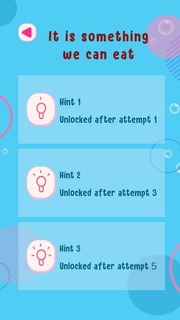
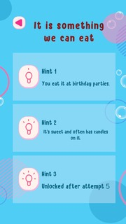
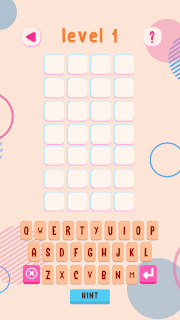

title: "WordXplorer Update #8"
excerpt: "WordXplorer Update 8 introduces a new hint system with contextual clues to help kids learn and solve words more effectively"
coverImage: "./unlocked_hints.jpg"
category: "project updates"
tags:
- "project updates"
- "wordxplorer"

---

You can see all the related updates [here](/tags/wordxplorer)

## New Hint System

We're excited to introduce our new hint system! This feature helps players when they're stuck, making the game more accessible while still maintaining the challenge.

The hint system provides contextual clues about the word. 

Here's how the hints look when locked and unlocked:

| The hint popup at the start of the game, showing all hints are locked | The hint popup after 2 hints have been unlocked, showing the available clues |
|-----------------------------------------------------------------------|------------------------------------------------------------------------------|
|                                    |                                       |

And here's how it works in action:

These clues help kids think about the word in a different way, making the game both educational and fun. They can use them strategically to learn and improve their word-solving skills.

---

## Get WordXplorer

WordXplorer is available on the iOS App Store 

<?# AppStoreBadges LinkText="Get WordXplorer" AppStoreLinkUrl="wordxplorer-guess-the-word/id6504664783" /?>

Want to try before you buy? Check out our [web demo](https://wordxplorer.ankursheel.com/)

Thank you for being a part of this journey with me! I'm eager to hear your thoughts and feedback. Stay tuned for more updates!