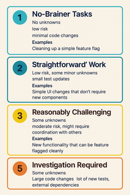
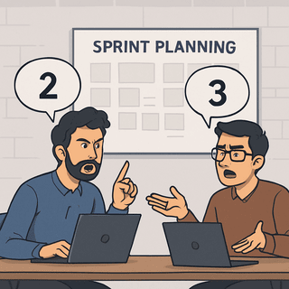

Like many developers, I hate story pointing.

It feels like I’ve wasted _years_ of my life in sprint planning sessions that spiral into arguments over whether something is a 2 or a 3. I’ve also sat through too many sprint planning sessions watching teams treat story points as time estimates, and walk away with no more clarity than when they started. 

It all feels likes a performance that gives ~~management~~ everyone a false sense of control. 

In fact, some people just do away with story points altogether, and I get it. I was once in that camp too.

But, what I if told you

> story points aren't the problem.

I’ve noticed three common mistakes that make story points and the whole sprint planning exercise feel like a giant waste of time. Let's see what they are and how we can fix them to make story-pointing not suck.

## Mistake #1: Treating Story Points as a Proxy for Time

How often have you heard this in a sprint planning session -

> This should take 1 week, so… five story points?

That’s not how story points work. They’re not about time.

A 3-point story might take one day or more than a week. I know you dont want to hear it but it doesn't matter.

Story points should reflect the **complexity** of the task.

Here’s a better way to think about them:

### 1 Point

**Potential Traits:** No unknowns, low risk, minimal code changes.

**Examples**

- Adding logs to existing code
- Trivial changes behind a feature flag
- Cleaning up a simple feature flag
- Mechanical refactoring

### 2 Points

**Potential Traits:** Low risk, some minor unknowns, small test updates.

**Examples**

- Simple changes behind a feature flag
- Creating a new dashboard with existing data
- Cleaning up a complex feature flag

### 3 Points

**Potential Traits:** Some unknowns, moderate risk, might require coordination with others.

**Examples**

- Fixing a bug with a known root cause
- New functionality that can be feature flagged cleanly
- Work that involves coordination with another developer

### 5 Points

**Potential traits:** Some unknowns, large code changes, lots of new tests, external dependencies

**Examples**

- Technical investigation for new features or bugs
- Work that's difficult to feature flag
- Cross-team coordination

These are good candidates to split into smaller tickets once the investigation is done.

### 8 Points

**Potential traits:** Many unknowns, risky changes, hard to estimate confidently.

If you’re estimating something at 8 points, you probably need a spike first. Timebox it, then use what you’ve learned to create smaller, pointable stories.

_Note: You can download the full sized infographic from [Printable Infographic](/assets/images/posts/story-points-arent-problem/infographic_original.png)_

## Mistake #2: Estimating in Isolation

Ever had a product owner or a tech lead show up to planning with stories already estimated?

Estimation is a team sport. Different people catch different risks, assumptions, and edge cases. Getting everyone involved builds shared understanding and better team cohesion.

> The number matters less than the conversation.

Here’s what to do:

- The feature lead fleshes out the ticket ahead of planning.
- They give a 30-second overview during the session and answer questions.
    - No need to dive into every detail - but enough for the team to understand the **why**, the **approach**, and have the **confidence** to estimate complexity.
- Then use Planning Poker to uncover different perspectives.

## Mistake #3: Arguing Over 2 vs 3 Points

You know the moment. One person says it’s a 2. Another insists it’s a 3. Suddenly, you’re 20 minutes deep into a conversation that doesn’t matter.

> You’re optimizing for precision in a system designed for approximation.

That’s not just wasteful — it completely misses the point (pun unintended).

**Timebox these debates.** If you can't agree in 1-2 minutes, pick the higher number and move on. It's not worth derailing the whole session.

However, if there’s a big delta — say, someone thinks it’s a 2 and someone else thinks it’s a 5 — that is worth unpacking. Someone’s probably missing something.
  
---  

## Final Thoughts

Story points aren't about precision. They're about shared clarity. 

Used well, they build shared context. Used poorly, they fuel endless debates. 

So next time you're estimating ask yourself:

> Do we actually understand the scope, complexity, and purpose of this work?

If the answer’s yes, the number doesn't matter. 

**What’s your biggest frustration with story points — and how have you worked around it?** 

Drop a comment and send this to someone who’s still fighting over 2 vs 3.