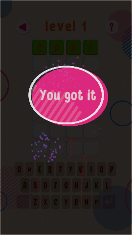

It’s been a while since I wrote an update on this blog.  
  
Not because there were no update. Well, for some time that was true. You know work and life and all that. But the good news is that I have finally figured out a sustainable schedule, and updates have been going out in the app/Play Store. However, they didn't feel "blog-worthy." And let's be honest: once you miss one update, it’s surprisingly easy to miss the next one too.  
  
Anyway, here’s what’s changed.  
  
## More fireworks  
  
I added more fireworks on level completion.  
  
It sounds trivial when I write it out like that. But you can never have too many fireworks.

## Scene transitions  
  
I also added scene transitions between screens.  
  
This is another one of those trivial changes. But, it makes the game feel less like a collection of screens and more like... well, a game.  

  
## Level select now opens at your highest unlocked level  
  
The level selection screen now opens on the page with your highest unlocked level.  
  
This is mostly just convenience (less clicking is always a win). This wasnt so much of an issue when it was just 3 screens but as I add themes and more levels to the game, this will make it much easier to navigate.  
  
## 6 more levels  
  
Since there are 12 levels on the level selection screen, ensuring each theme has a multiple of 12 levels makes the transitions much smoother. It's a little design hack that's going to make it much easier to add themes. But, you get 6 more levels while you wait for the next update.  
  
## Behind the scenes: refactoring + automated tests  
  
Alongside the visible changes, I’ve been refactoring the code and adding automated tests to make themes possible without turning every future change into a risky one.  

There was a point where I realised I was spending more time manually clicking through the app to make sure I hadn't broken anything than I was actually building new features. You know the drill: change one line of code, spend 20 minutes tapping screens to ensure everything still works.  
  
It was exhausting. And frankly, it was boring. And worst of all, it was leading me to procrastinate.  
  
Automated tests give me the confidence to move fast without that constant fear that I'm breaking something. If you’ve ever maintained a side project alone, you probably know exactly what I mean.  
  
## What theme should I build next?  
  
I’ve been promising this for a while, and it’s finally (almost) here. I’ve made nearly all the changes needed to support more themes. I am just testing it out before I release it to everyone.  
  
The frontrunner for me right now is **body parts**. It feels like a good “kid vocabulary” theme, and I think it could lead to levels that are fun without being too hard.  
  
But, I need your help. If you were picking a theme, what would you want to see?  
  
- Body parts  
- Animals  
- Nature  
- Sports  
- Transportation  
- In the house  
- Action words  
- Something else  
  
What would you pick (and why)?