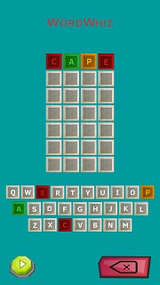
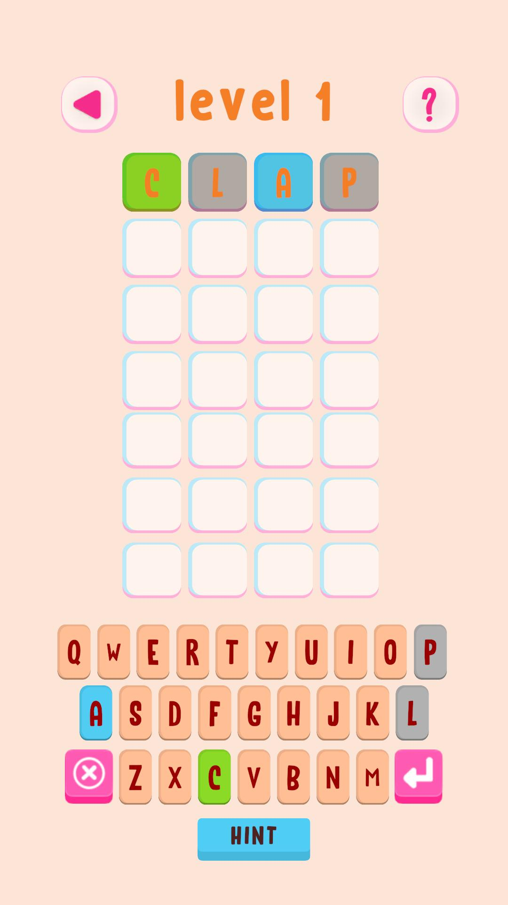
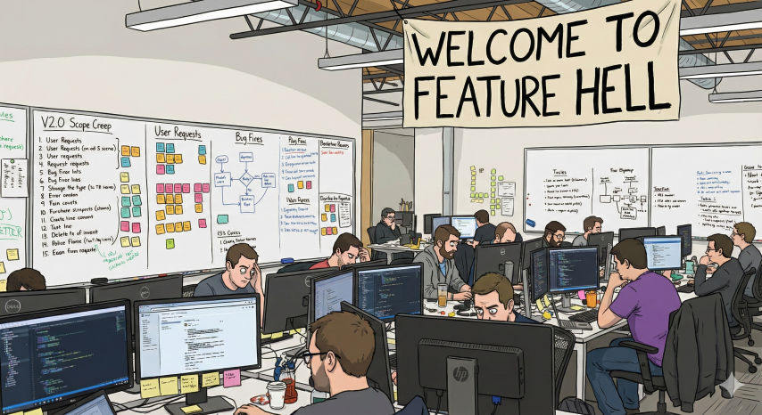

It's been just over a year since I released WordXplorer - a Wordle-inspired game for kids built in Unity. Available on the App Store and Play Store, this has been an interesting adventure.  
  
The million-dollar question that is on everyone's mind:  
  
> Are you a millionaire yet?  
  
Not quite. But I've crossed a few items off my [impossible list](/impossible-list).  
  
Most importantly, I've validated that people are willing to pay for something I've built. And that feels good.  
  
In this post, I'll share WordXplorer's performance over the past year, the feedback I've received, and the lessons learned along the way.  
  
## A Little Backstory  
  
In June 2024, I started working on a prototype of a Wordle-like game for my daughter. She loved trying to do the New York Times Wordle with us, but it was (at times) just too hard for her. It was also not very enticing for a kid. Greys and black are not the most kid-friendly colours.  
  
Thinking that other kids might want to play along with their Wordle-loving parents, I decided to make it into a paid app and announced a release date of December 1st in early November 2024. I priced it at USD 3.99 - roughly the cost of a coffee.   
  
## What went right  
  
### My daughter still plays it  
  
Seeing my daughter play and enjoy something I built for her - that never gets old. That's why I started this whole thing. She's the 1st tester for all the changes I make and always has some good feedback for me. She's quick to tell me when a word is too hard or when she spots a bug I missed.  
  
Including my daughter, I still have 1-4 other active users on any given day.  
  
### Getting help early on  
  
My artistic chops are average at best (and that's me being extremely generous). Getting Manjari to help me with the non-engineering side of things was one of the best decisions I made.  
  
Even though we are both extremely busy with work and syncs across the timezones were (and still are) challenging, having someone else to shoulder some of the load and talk through ideas made it a lot easier.  
  
The game also looks significantly better than I had made in the prototype phase. See for yourself.  
  
  
|                  Before                   |                         After                          |
|:-----------------------------------------:|:------------------------------------------------------:|  
|  | { width=200 } |
    
### GitHub actions and CI/CD  
  
One of the first things I did was set up GitHub actions to run automated tests on every merge to the master branch. I also set up workflows to deploy to the web and app stores.  
  
Since I don't have a Mac, this made deploying to the iOS App Store much cheaper and easier. I could trigger a deployment at any time. On PRs, I had test builds on the web using Netlify's branch deploy feature. Best of all, I could work in parallel on my local machine while it was building (which took upwards of 20 minutes).  
  
### Pre-orders  
  
I started the App Store pre-order process early. It let me navigate the approval process and work out most of the kinks before the December 1st launch day.  
  
One thing I learned during pre-order: I can't use "Wordle" in the app description or screenshots which kinda sucks since the game is essentially "Wordle For Kids" and would have been the easiest way to get people to buy it.  
  
Imagine being ready to launch and then hearing from the App Store ~~gods~~ reviewers that "Wordle" is not allowed in the description or screenshots and having to delay the launch by a few weeks.  
  
### Making hard calls to ship  
  
When I announced December 1st as the launch date, there was *so much* to be done.  
  
It was fine when it was a free game that I made for my daughter, but a paid app for strangers is a totally different ball game. Deciding which features to cut for launch wasn't easy, but I had to ship, so I made the hard calls.  
  
Too many side projects die in "**_just one more feature_**" hell.  

{ width=300 }

Looking back, it was the right call even though I knew 30 levels wasn't enough and I didn't have all the polish. I had to get it out on time.  
  
### Validation  
  
I didn't go viral. I didn't make life-changing money. But **people paid real money for something I built**. That's something.  
  
Friends and family bought it initially - that's expected.  
  
But then someone else bought it. A complete stranger who had no obligation to support me. It was proof that someone out there thought what I built was worth paying for.  
  
If you're sitting on a side project, waiting for it to be "perfect" before launching - just ship it. Shipping something you know is not finished is scary, but you should still do it. You will learn a lot.  
  
### Natural break patterns  
  
The average session is around **3 minutes**. That's roughly one to two levels, which means most kids play, complete a level or two, and then leave the app to do something else.  
  
Some kids binge multiple levels and go up to 30 minutes, but the typical pattern is short sessions. 

This is great since I didn't want kids getting hooked and be on the screen for hours on end. And since most users have completed all 30 levels, they have clearly come back to play the levels.  
  
The average user has spent about 1 hour on the app total.  
  
## What went wrong, aka lessons learned  
  
### Pre-orders are great (if you actually promote them)  
  
The pre-order strategy was smart for working out the kinks with App Store approval. But not promoting it ~~widely~~ at all? That was dumb.  
  
I fell into the classical engineer's mistake:  
  
> Build it, and they will come.  
  
I didn't publicise the pre-order beyond some posts on this blog. A few days before launch, I directly messaged friends and family, which resulted in a grand total of 4 pre-orders. Two of those were later cancelled.  
  
Yeah. Not exactly a viral launch.  
  
Part of it was discomfort with self-promotion. Part of it was simply not knowing where to start.  
  
If you're going to offer a pre-order, be sure to let people know about it.  
  
### Google's requirements  
  
Google requires 12 people to actively play your game for 10 days before you can even release an app to the store.  
  
And if it's a paid app then **_they have to buy it_** to even test it. It's unclear if they have to buy it again when the app store listing goes live, so to be safe I just made it free for a week so that people could download it without having to pay. Unfortunately promo codes just didn't work for this.    
  
Not just install it - actively play it for 10 days. I didn't know what would happen if someone quit after 2 days or didn't play every day, so I added 15 people to be safe. Getting friends and family to commit to playing for 10 days straight was challenging.  
  
It's a significant hurdle that slowed down the Android launch. It also meant people who otherwise might have bought the game got it for free.  
  
### Promo codes  
  
I gave 12 promo codes on iOS as a thank you for providing early feedback.  
  
The kicker: promo code users can't leave reviews on the App Store. These were my most supportive users - the ones who would have left positive reviews - and the platform prevented them from doing so. 

Even though I didnt know this at the time, I would have still given the promo codes.  
  
### Android refunds  
  
Android allows refunds within 2 hours of purchase, no questions asked. Out of the 20 orders I got, I had **17 refunds**. Ouch.  
  
When I first saw them, I was confused. The game wasn't broken, so what went wrong?  
  
My best guess? A combination of things:  
1. Most people refunded within 15 minutes, so they probably didn't like the look of it or bought it by mistake.  
2. Maybe some played longer and felt 30 levels wasn't enough content for the price.  
3. The description and screenshots might not have communicated what the game actually is and the lack of polish probably didn't help either.  
  
The frustrating part? No feedback. Just money taken back. If they'd told me *why* they didn't like it, I could have fixed it for them or future users.  
  
### Procrastination  
  
Most people have completed all 30 levels. I didn't realise how hard it would be to add a new theme and how much work it would entail. Some of my previous architectural decisions came back to haunt me.  
  
After the Android release in July 2025, the project was put on the back burner for six months. Not because of work and life (though that was a factor). I was procrastinating because building new themes felt too hard. Everything was stuffed into MonoBehaviours with very few abstractions. This made it nearly impossible to write automated tests, and adding features meant testing everything every time I made a change.  
  
Eventually, I bit the bullet and refactored the level selection screen/system and added automated tests. It took over a month. But it gave me confidence to make changes in that area without breaking everything.  
  
### One negative review  
  
I also got **one** negative review.  It seemed the person didn't understand how the game worked, and it didn't meet their expectations. That stung, but it was valuable feedback. Probably, if they were on Android, they would have just gotten a refund.  
  
Based on that review, I updated the description and made the instructions a lot clearer.  
  
## Show me the ~~money~~ numbers  
  
Let's talk numbers.  
  
I built this on nights and weekends with help from Manjari.  
  
**Total cost:** About NZD 550 (dev accounts, IDE, etc).        
**Total proceeds:** About NZD 110 (after Apple's and Google's cut but before taxes, etc)  
  
Forget "retirement money", this is not even "cover your costs money".  
  
**iOS:**  
  
- Total Downloads: 29  
- Total Orders: 17  
- Total Revenue: NZD 127  
- Proceeds (after Apple's cut): NZD 98  
  
**Android (launched July 2025):**  
  
- Total Downloads: 35  
- Total Orders: 20, but 17 refunds :(  
- Total Revenue: NZD 22  
- Proceeds (after Google's cut): NZD 17  
  
**Monthly breakdown:**  
  
| Date      | iOS Units | Android Units |
|-----------|-----------|---------------|
| Nov 2024  | 1         | 0             |
| Dec 2024  | 9         | 0             |
| Jan 2025  | 4         | 0             |
| Mar 2025  | 1         | 0             | 
| May 2025  | 1         | 0             | 
| Jul 2025  | 0         | 1             |  
| Aug 2025  | 0         | 1             | 
| Sep 2025  | 0         | 1             |  
| Dec 2025  | 1         | 0             |
| **Total** | **17**    | **3**         |
    
Most sales happened in the first month (no surprise), but I still got sporadic purchases throughout the year. iOS went completely silent from Jul to Nov - probably because I did no marketing and very few updates.  
  
**Geographic Distribution:**  
  
| Territory      | iOS Sales/Total Downloads | Android Sales/Total Downloads |  
|----------------|---------------------------|-------------------------------|  
| India          | 8/13                      | 1/8                           |  
| United States  | 7/9                       | 2/10                          |  
| New Zealand    | 0/5                       | 0/2                           |  
| Australia      | 1/1                       | 0/1                           |  
| Canada         | 1/1                       | 0/0                           |  
| United Kingdom | 0/0                       | 0/1                           |    

Unsuprisingly, most downloads came from India, USA and New Zealand - those areas are where I focused my (minimal) outreach and gave out promo codes. The download from Canada was unexpected. I didn't speak to anyone there.  
  
Nearly half of my downloads came from organic App Store search. Not bad for zero marketing efforts.  
  
Someone even discovered the game in December 2025, a full year after its launch. I only found out from my monthly report, but that was a nice surprise. Even though I don't know what they were searching for, I am glad they bought it.  
  
## Shipped improvements  
  
Even though updates have been sporadic, watching my daughter play and looking at the analytics showed me what needed fixing. Some of the highlights from the past year:  
  
- **Contextual hints:** Kids were getting stuck. I added clues that unlock as they play, helping them think about the word differently without giving away the answer. Analytics show that this is a very popular feature.  
- **Save progress:** Kids would start a level, leave, and have to start over. Before I added hints, some of them, including my daughter, would quit the level after attempt 6, and restart it essentially having unlimited tries to figure out the word. Kids are smart, and they will find ways to ~~break your game~~ game the system. Saving their progress not only closed this loophole but also allowed them to take breaks and pick up where they left off.  
- **Web demo:** In response to the refunds, low purchase volume, and negative feedback, I added a [web demo](https://wordxplorer.ankursheel.com/) a few months ago so people can try it before committing to buy. I still don't know if it has made any difference.  
- Squashing all the bugs.  
  
## What's Next?  
  
Now that I've refactored some of the code, I can actually add content without spending hours clicking through the screens. I still need to refactor the main game screen though :(  
  
New theme dropping in February - **body parts**. It's already in active testing and I'm working out the kinks.  
  
I'm also going to be adding the things that make it feel like a complete game, not just a prototype that shipped: proper menus, settings, polish. The stuff I cut to hit that December 1st deadline.  
  
I've figured out a sustainable schedule with a plan to write an update post every month. In fact, one has already gone out in January.  
  
## So… Was It Worth It?  
  
Yes. Not because I made a ton of money (I didn't). Not because I have thousands of users (I don't).  
  
Eventually, this might actually be profitable. Even now I can claim some of the expenses to reduce my tax burden.  
  
But even if it never makes me a ton of money, I crossed items off my bucket list, got a creative outlet from professional work, and got to see my daughter play something I built for her. You can't put a price tag on that.  
      
---      

Sitting on a side project that's "almost ready"? Ship it. I'd love to hear what happens.  
  
Lost money on something you built but would do it again? Tell me about it.  
  
Want to be a beta tester and get updates earlier? Let me know!  
  
## Get WordXplorer  
  
<?# AppStoreBadges AppStoreLinkText="Get WordXplorer on App Store" AppStoreLinkUrl="wordxplorer-guess-the-word/id6504664783" GooglePlayLinkText="Get WordXplorer on Play Store" GooglePlayLinkUrl="com.glhf.wordleforkids"/?>    

Want to try before you buy? Check out the [web demo](https://wordxplorer.ankursheel.com/)