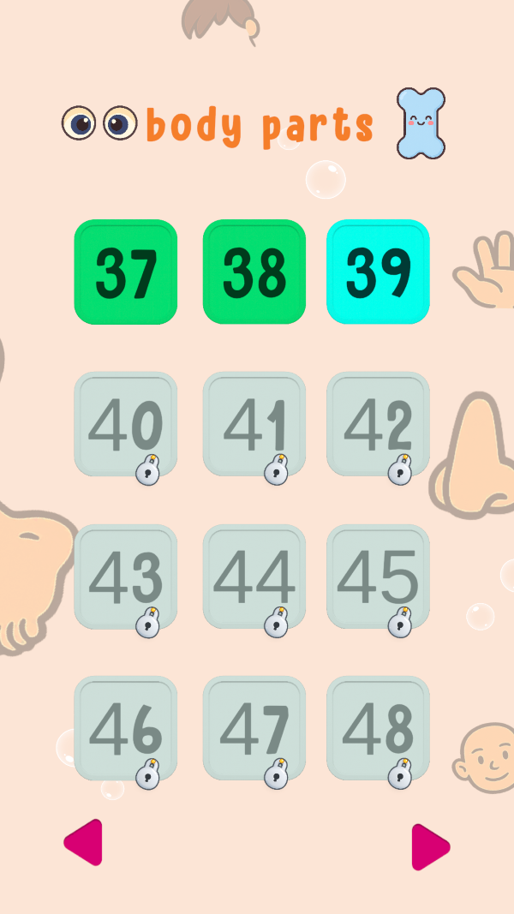
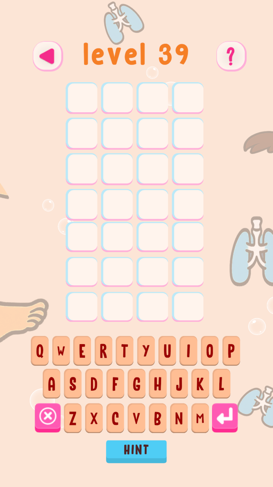
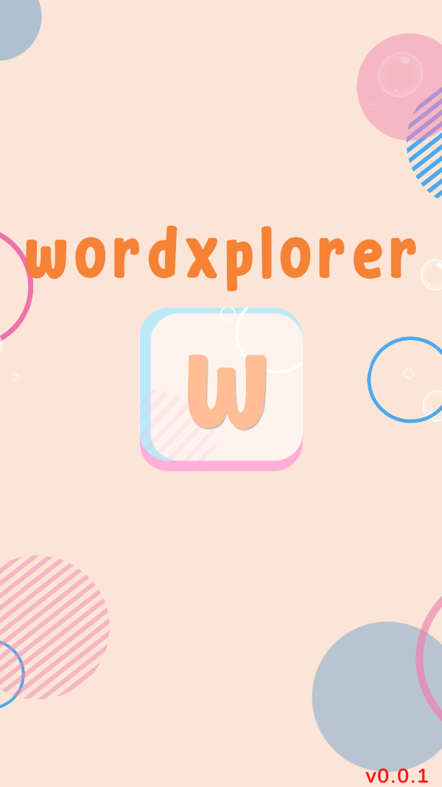
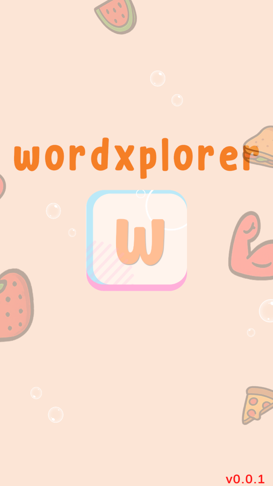
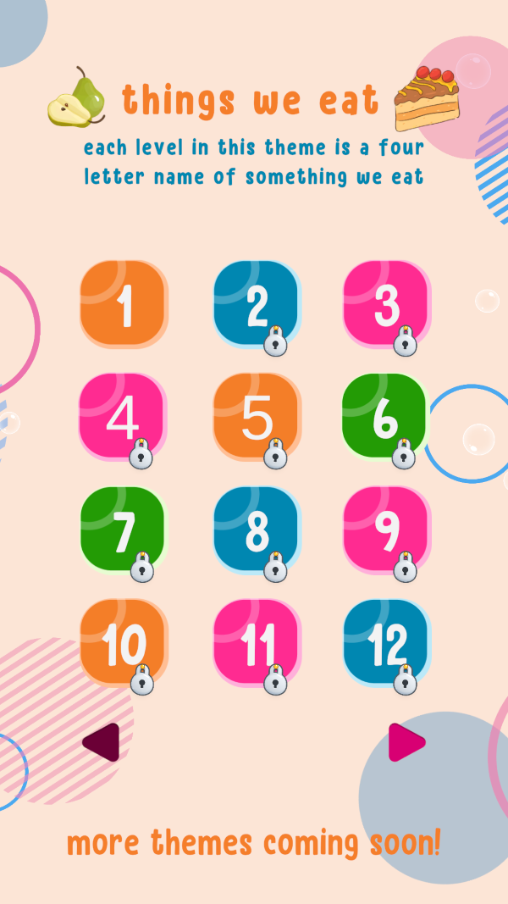
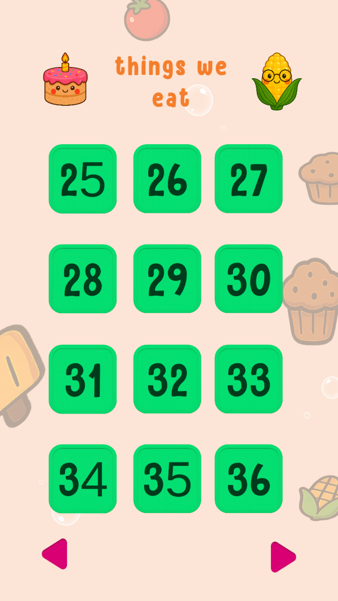
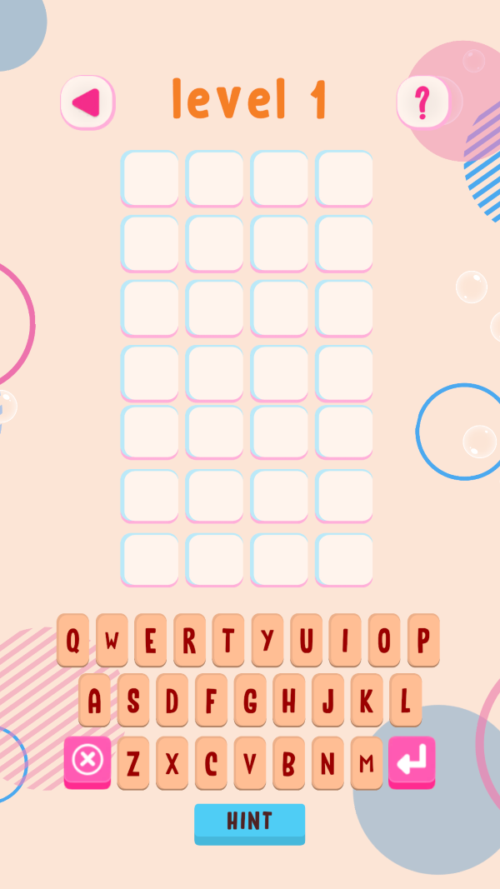
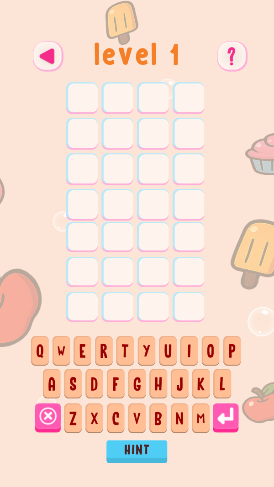

---
title: "WordXplorer Update 11"
excerpt: "New theme, smarter background"
coverImage: "./body_part_level_selection_screen.png"
category: "project updates"
tags:
- "project updates"
- "wordxplorer"

---

## New Theme

Remember when I asked you which theme should come next?  
  
Well, you voted. And here it is.  
  
I've added a brand-new theme with 24 levels focusing on **body parts**. 

Hands, feet, eyes – the classics and a few tricky ones. It's the kind of vocabulary that actually helps kids describe their world.  
 
|                                  Level Selection Screen                                  |                              Game Screen                               |
|:----------------------------------------------------------------------------------------:|:----------------------------------------------------------------------:|  
| { width=200 } | { width=200 } |

## Dynamic Backgrounds   
  
Some of the more eagle eyed readers might have noticed that the background is a little different in the above 2 screen shots.

There are no more generic bubbles. No more one-size-fits-all backgrounds. The backgrounds now change based on the theme.  
  
If you're playing the _Things We Eat_ theme, you see food. If you're in _Body Parts_, you see... well, you know. It sounds simple, and it is. But, it gives kids an instant visual clue about what the theme is.  
  
To be honest, this works best on a tablet where you can really see the new elements.  
  
On a phone? It's more subtle – due to the lack of screen space. But if kids need a reminder of the theme, the hint screen has them covered.  
  
|                                       Before                                       |                                      After                                       |
|:----------------------------------------------------------------------------------:|:--------------------------------------------------------------------------------:|  
|          { width=200 }          |          { width=200 }          |
| { width=200 } | { width=200 } |
|            { width=200 }            |            { width=200 }            |
  
  
## Beta Testers Save the Day  
  
Before I released this update to everyone, the beta testers found a couple of nasty bugs.   
  
One was particularly gnarly: if you completed the last level and then tried to click "next level," the game would crash. When you reopened it, the level selection screen would be completely borked.  
  
**I'm so glad we caught it before release.**  
  
If that had made it to a paying user? Ooof. That would have sucked.
  
### Want to Be a Beta Tester?  
  
If you're interested in helping me catch bugs before they reach everyone else, I'd love to have you on board. All you need to do is send me a screenshot of a review (to prove you've got the app). That's it.  As an added bonus, I will give you a free copy of the app to give to your friends.

## Level Button Updates   
  
Before the level selection screen, the level buttons were just random colors. They looked colorful but didn't give a clear indication of what level is completed and which one is newly unlocked. Now the level buttons can only have 1 of 3 colors - depending on the level status.

|                                       Before                                       |                                        After                                         |
|:----------------------------------------------------------------------------------:|:------------------------------------------------------------------------------------:|  
| { width=200 } | { width=200 } |
  
  
## What's Next?  
  
I'm adding a proper menu screen. It's not flashy – just polish and table stakes. Things that I had cut for the intial release.
  
More updates coming soon. Can't wait to share what's next.

## Get WordXplorer  
  
WordXplorer is available on the iOS App Store and Google Play store.

<?# AppStoreBadges AppStoreLinkText="Get WordXplorer on App Store" AppStoreLinkUrl="wordxplorer-guess-the-word/id6504664783" GooglePlayLinkText="Get WordXplorer on Play Store" GooglePlayLinkUrl="com.glhf.wordleforkids"/?>

Want to try before you buy? Check out our [web demo](https://wordxplorer.ankursheel.com/)

Thank you for being a part of this journey with me! I'm eager to hear your thoughts and feedback. Stay tuned for more updates!